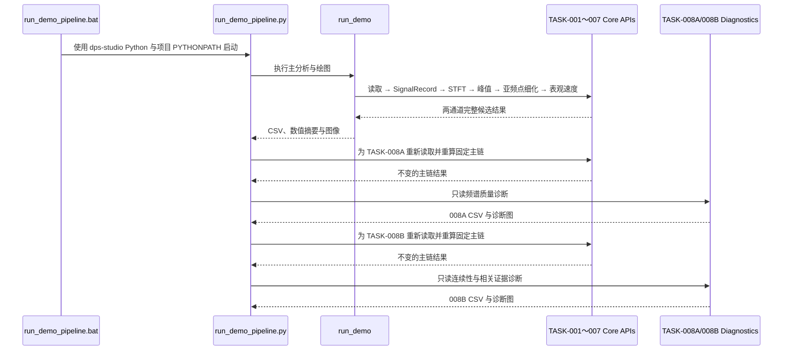

# TASK-009 当前真实调用链报告

*生成日期：2026-07-14｜仓库：DPS Studio｜审计范围：TASK-001～TASK-008B*

---

## 🔎 结论

当前双击入口 `run_demo_pipeline.bat` 进入 `scripts/run_demo_pipeline.py`，随后分别执行主分析、TASK-008A 频谱质量诊断和 TASK-008B 连续性/相关证据诊断。TASK-001、002、003、005、006、007 均存在于真实主数值链上；TASK-008A、008B 各自重新读取同一原始 CSV 并重算固定主链，再只读地评估结果。TASK-004 在 `src/`、`scripts/`、`tests/` 和 `docs/` 中均无实现、公开 API、直接调用者或当前入口痕迹。

`scripts/plot_real_stft.py` 与 `scripts/plot_real_velocity.py` 未被当前 BAT 或编排器导入、调用，属于独立旧预览脚本，不是当前主链组成部分。

## 🔗 调用时序

## 🧭 任务映射

| TASK | 当前核心文件 | 公开 API / 对象 | 直接调用者 | 进入默认 BAT | 影响数值 | 仅影响展示 | 旧预览/遗留 |
|---|---|---|---|---|---|---|---|
| TASK-001 | `src/dps_studio/core/models/signal.py` | `SignalRecord` | `_build_signal_records`，随后由 `compute_stft` 消费 | 是 | 是：保存时间、电压及采样元数据 | 否 | 否 |
| TASK-002 | `src/dps_studio/core/io/delimited.py` | `read_delimited_signals` | 主分析、008A、008B 三个运行器 | 是 | 是：严格读取原始信号 | 否 | 否 |
| TASK-003 | `src/dps_studio/core/time_frequency/stft.py` | `compute_stft` | `_analyze_configuration` | 是 | 是：生成唯一 STFT 来源 | 否 | 否 |
| TASK-004 | 未找到 | 未找到 | 未找到 | 否 | 否 | 否 | 当前范围无实现证据 |
| TASK-005 | `src/dps_studio/core/ridge/peak.py` | `extract_peak_ridge` | `_analyze_configuration` | 是 | 是：逐帧提取基线 ridge | 否 | 否 |
| TASK-006 | `src/dps_studio/core/physics/velocity.py` | `convert_ridge_to_apparent_velocity` | `_analyze_configuration` | 是 | 是：逐点计算候选表观速度 | 否 | 否 |
| TASK-007 | `src/dps_studio/core/ridge/refinement.py` | `refine_peak_ridge_subbin` | `_analyze_configuration` | 是 | 是：同帧三点亚频点细化 | 否 | 否 |
| TASK-008A | `src/dps_studio/core/ridge/spectral_quality.py` | 频谱质量评估 API | `run_spectral_quality_demo` | 是 | 是：生成只读诊断数值，不回写主链 | 否 | 否 |
| TASK-008B | `src/dps_studio/core/ridge/diagnostics.py` | 连续性与相关证据 API | `run_ridge_diagnostics_demo` | 是 | 是：生成只读诊断数值，不回写主链 | 否 | 否 |
| 独立预览 | `scripts/plot_real_stft.py` | 脚本入口 | 无当前调用者 | 否 | 不影响当前链 | 仅自身输出 | 是：legacy standalone preview |
| 独立预览 | `scripts/plot_real_velocity.py` | 脚本入口 | 无当前调用者 | 否 | 不影响当前链 | 仅自身输出 | 是：legacy standalone preview |

## 🧱 数值链与展示链边界

主数值链的唯一顺序为：原始 CSV → 严格读取 → `SignalRecord` → STFT → 离散峰值 → 同帧亚频点细化 → 离散/细化候选表观速度。TASK-008A 和 TASK-008B 不回写、不修改、不融合任何主链数组。

展示层只消费已经得到的完整数组。事件前零线仅属于显示速度；候选表观速度与显示速度分开保存，事件外显示位置保持 `NaN`。本轮细线化只改变 `Line2D` 样式、局部固定视窗和保存时的路径简化设置，不改变上述顺序或任何数值结果。

## ⚠️ 边界与遗留项

- TASK-004 的结论是“当前审计范围内无实现证据”，不是对仓库外历史版本的断言。
- 两个 `plot_real_*` 脚本可独立运行，但没有当前入口调用证据。
- 旧软件截图只提供形状级视觉参照；其 FFT、窗长、重叠和拟合参数与当前链不一致，不能作为逐点数值基准。
- 当前链没有 LiF 正式修正、自动跟踪、跨帧平滑、插值、删除、补点、双通道融合或分支选择。
