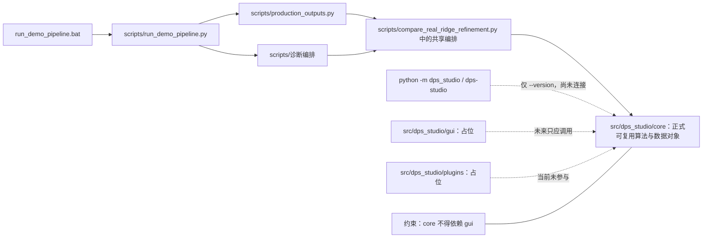
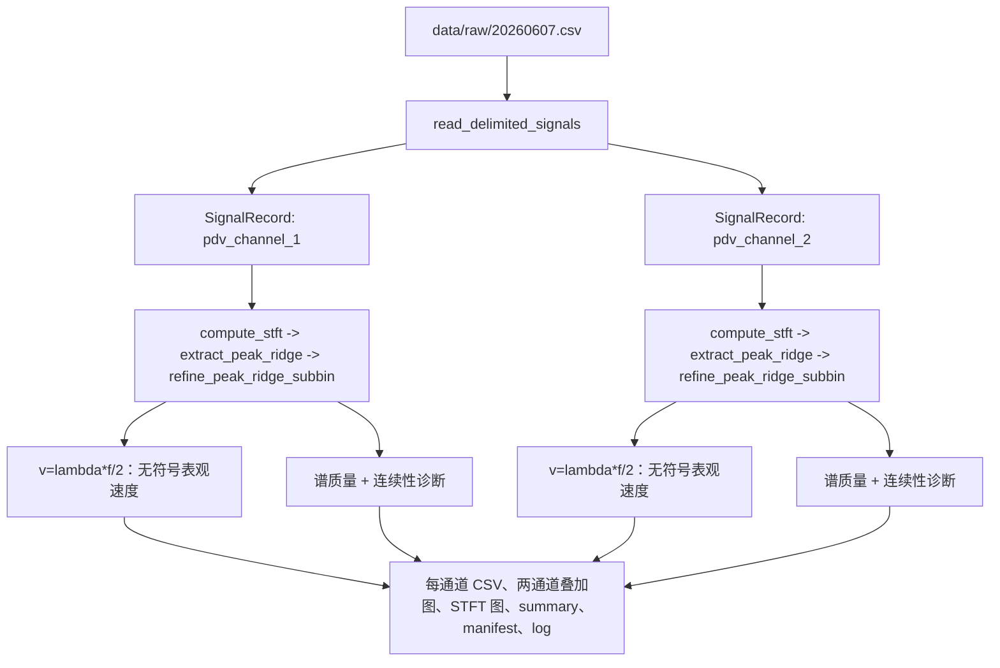

# DPS Studio 项目结构与参数定位审计

> **TASK-012A-R 更新（2026-07-23）**：本文第 1–16 节保留 TASK-012A-R
> 修改前的审计快照和当时行号。当前正式入口、依赖方向、搜索范围、配置和输出
> 契约以新增的第 17 节为准；旧文中“workflow 仅占位”“production 依赖 compare
> 私有 API”“正式下限 0.1 GHz”“单 Profile 八文件”等描述不再代表当前实现。

> 审计日期：2026-07-22（Asia/Shanghai）  
> 审计对象：`D:\Code\Python_Projects\DPS_Studio` 的当前工作树  
> 核心结论：当前可双击的真实主入口是 `run_demo_pipeline.bat`，它固定选择 Balanced profile 和 production 输出模式；`python -m dps_studio` 与 `dps-studio` 目前只提供版本参数解析，尚未连接真实分析工作流。

## 1. 审计基线

### 1.1 仓库与解释器状态

| 项目 | 实测值 | 证据或说明 |
| --- | --- | --- |
| 仓库根目录 | `D:\Code\Python_Projects\DPS_Studio` | PowerShell 当前工作目录 |
| 当前分支 | `main` | `git branch --show-current` |
| HEAD | `95f47d3247f289e8503290aec09890d0e6319615` | `git rev-parse HEAD` |
| 审计日期 | 2026-07-22 | Asia/Shanghai |
| 工作区 | **不干净** | 已有跟踪文件修改和未跟踪文件；本报告基于包含这些修改的当前工作树，而不是纯 HEAD |
| 行号依据 | 当前工作树 | 下列行号包括审计开始时已有的未提交修改 |
| 当前 shell 默认 Python | `D:\miniconda3\python.exe`，Python 3.9.1 | 不满足 `pyproject.toml` 的 `>=3.12,<3.14` |
| 项目/BAT Python | `D:\miniconda3\envs\dps-studio\python.exe`，Python 3.12.13 | BAT 固定解释器见 `run_demo_pipeline.bat:L8`；质量门使用此解释器 |
| 原始数据 SHA-256 | `AB9F656E3563AB96D0E842DB88510076F6368E246853FD3427D8FD7DB68F7353` | 审计中只读计算；完成后再次核验 |

> **行号稳定性说明**：本报告中的行号仅对应上述 commit 和本次记录的工作树状态；后续修改代码后应优先通过“参数名 + 文件路径”搜索，而不是只依赖旧行号。

### 1.2 审计开始时的 Git 证据

`git status --short`：

```text
 M run_demo_pipeline.bat
 M scripts/assess_real_ridge_diagnostics.py
 M scripts/assess_real_ridge_quality.py
 M scripts/compare_real_ridge_refinement.py
 M scripts/plot_real_velocity.py
 M scripts/run_demo_pipeline.py
 M src/dps_studio/core/__init__.py
?? docs/
?? outputs/
?? scripts/plot_real_stft.py
?? scripts/production_outputs.py
?? src/dps_studio/core/analysis_profiles.py
?? tests/fixtures/test.csv
?? tests/unit/test_analysis_profiles.py
?? tests/unit/test_production_outputs.py
?? tests/unit/test_run_demo_pipeline_modes.py
```

`git diff --stat`：

```text
 run_demo_pipeline.bat                    |  10 +-
 scripts/assess_real_ridge_diagnostics.py |  33 +++---
 scripts/assess_real_ridge_quality.py     |  33 +++---
 scripts/compare_real_ridge_refinement.py |  77 ++++++++------
 scripts/plot_real_velocity.py            |   2 +-
 scripts/run_demo_pipeline.py             | 169 ++++++++++++++++++++++++++-----
 src/dps_studio/core/__init__.py          |  24 ++++-
 7 files changed, 259 insertions(+), 89 deletions(-)
```

`git diff --cached --stat` 无输出，说明审计开始时暂存区为空。上述状态是**用户原有状态**；本轮不整理、不回退、不暂存、不提交。

### 1.3 审计方法与边界

本报告逐行检查了顶层入口、配置、`scripts/`、`src/dps_studio/`、`tests/unit/`，并检查了空目录、占位包、文档参考材料、现有输出目录和旧软件参考数据。调用链结论来自导入和实际函数调用；没有依据 README 或历史任务说明补写不存在的能力。由于本轮禁止新增分析输出，未实际运行 BAT 或数据分析脚本；真实数据仅通过正式读取器进行只读采样信息核验。质量门尽量关闭字节码和工具缓存；mypy 的 Windows 无缓存设备尝试失败后按用户要求改跑标准命令，因此既有忽略缓存的时间戳可能被工具触及，见第 13.3 节。

### 1.4 审计期间的工作树变化

初始基线记录之后、最终复核之前，工作树被本报告以外的编辑改变：`.gitignore` 新增为 modified，`scripts/compare_real_ridge_refinement.py` 的开发默认搜索下限变为 `0.05e9`，同时 `.gitignore` 开始忽略 `/outputs/`。这两项都不是本审计写入；本审计没有回退或覆盖它们，而是重新读取当前内容并刷新本报告。因此：

- 第 1.2 节保留的是**开始时真实基线**，可解释为何当时有 `?? outputs/`；
- 后续职责、参数和风险结论依据**最终当前工作树**；
- HEAD 和分支没有改变，暂存区仍为空；
- 最终 `git status --short` 见第 13.3 节。

## 2. 当前项目目录树

以下树忽略 `.git/`、`__pycache__/`、`.pytest_cache/`、`.mypy_cache/`、`.ruff_cache/` 的内部内容，也折叠 `outputs/` 的既有产物明细。所有重要 Python、配置、BAT 和测试文件均展开。

```text
DPS_Studio/
├── .agents/                              # 当前为空
├── .codex/
│   └── tasks/TASK-001-data-model.md      # 历史任务说明，不是运行配置
├── .vscode/settings.json                 # IDE 搜索路径与 pytest 设置
├── configs/                              # 当前为空
├── data/
│   ├── examples/.gitkeep
│   ├── processed/.gitkeep
│   ├── raw/
│   │   ├── .gitkeep
│   │   └── 20260607.csv                  # 当前主链真实输入，80,000 行
│   ├── reference/legacy/
│   │   ├── README.md
│   │   └── legacy_velocity_time.csv      # 旧软件参考，227 行
│   └── synthetic/.gitkeep
├── docs/
│   ├── PROJECT_STRUCTURE_AND_PARAMETER_AUDIT.md
│   ├── 原始数据.csv                       # 与 raw 数据内容对应的参考副本
│   ├── 旧软件速度时间数据.csv             # 与 legacy 参考内容对应
│   ├── 旧软件生成数据.png
│   └── 屏幕截图 2026-07-11 165607.png / 171237.png
├── logs/.gitkeep
├── notebooks/                            # 当前为空
├── outputs/                              # 现有脚本产物；最终当前 .gitignore 已忽略
│   ├── demo_pipeline/                    # 9 个文件
│   ├── ridge_refinement_preview/         # 7 个文件
│   ├── stft_preview/                     # 8 个文件
│   ├── task007_demo_runs/                # 119 个文件
│   ├── task008a_demo_runs/               # 68 个文件
│   ├── task008b_demo_runs/               # 36 个文件
│   ├── task009_linewidth_audit/          # 81 个文件
│   ├── task010_legacy_velocity_audit/    # 25 个文件
│   └── task011b_validation/              # 57 个文件
├── resources/                            # 当前为空
├── results/.gitkeep                      # 代码未使用；内容被 .gitignore 忽略
├── scripts/
│   ├── assess_real_ridge_diagnostics.py
│   ├── assess_real_ridge_quality.py
│   ├── audit_legacy_velocity_reference.py
│   ├── compare_real_ridge_refinement.py
│   ├── plot_real_stft.py
│   ├── plot_real_velocity.py
│   ├── production_outputs.py
│   ├── run_demo_pipeline.py
│   ├── build/                            # 当前为空
│   └── dev/setup_env.ps1
├── src/dps_studio/
│   ├── __init__.py
│   ├── __main__.py
│   ├── cli.py
│   ├── core/
│   │   ├── __init__.py
│   │   ├── analysis_profiles.py
│   │   ├── io/{__init__.py,delimited.py,exceptions.py,models.py}
│   │   ├── models/{__init__.py,exceptions.py,signal.py}
│   │   ├── physics/{__init__.py,exceptions.py,models.py,velocity.py}
│   │   ├── ridge/{__init__.py,diagnostic_models.py,diagnostics.py,
│   │   │          exceptions.py,models.py,peak.py,quality_models.py,
│   │   │          refinement.py,spectral_quality.py}
│   │   ├── time_frequency/{__init__.py,exceptions.py,models.py,stft.py}
│   │   ├── preprocessing/__init__.py     # 仅占位 docstring
│   │   ├── quality/__init__.py           # 仅占位 docstring
│   │   └── workflow/__init__.py          # 仅占位 docstring
│   ├── gui/__init__.py                   # 仅占位 docstring
│   └── plugins/
│       ├── __init__.py                   # 仅占位 docstring
│       └── window_models/__init__.py     # 仅占位 docstring
├── tests/
│   ├── fixtures/
│   │   ├── .gitkeep
│   │   └── test.csv                      # 未被测试引用；实为 OLE 复合二进制文件
│   ├── integration/                      # 当前为空
│   └── unit/
│       ├── test_analysis_profiles.py
│       ├── test_apparent_velocity.py
│       ├── test_delimited_io.py
│       ├── test_demo_plot_rendering.py
│       ├── test_legacy_velocity_audit.py
│       ├── test_package.py
│       ├── test_peak_ridge.py
│       ├── test_production_outputs.py
│       ├── test_ridge_diagnostics.py
│       ├── test_ridge_refinement.py
│       ├── test_ridge_spectral_quality.py
│       ├── test_run_demo_pipeline_modes.py
│       ├── test_signal.py
│       ├── test_stft.py
│       └── test_window_length_diagnostics.py
├── .gitignore
├── AGENTS.md
├── environment.yml
├── pyproject.toml
├── README.md
└── run_demo_pipeline.bat
```

额外发现：`tests/fixtures/test.csv` 的前 8 字节为 OLE 复合文档签名 `D0 CF 11 E0 A1 B1 1A E1`，不是文本 CSV，且当前没有源码或测试引用它；本轮只报告，不改名或删除。

## 3. 项目分层与依赖方向

### 3.1 正确依赖方向



纯文本等价关系：

```text
run_demo_pipeline.bat
  -> scripts/run_demo_pipeline.py
     -> production: scripts/production_outputs.py
        -> scripts/compare_real_ridge_refinement.py 的共享编排
           -> src/dps_studio/core/* 正式算法
     -> diagnostic: TASK-007/008 开发诊断脚本
        -> 同一批 core 正式算法

python -m dps_studio / dps-studio -> cli.py -> 目前只处理 --version
gui/、plugins/ -> 当前无实现、无调用
core/ -> 没有导入 gui/；依赖方向符合“core 不依赖 GUI”规则
```

### 3.2 `src/` 与 `scripts/` 的区别

- `src/dps_studio/core/` 是可安装包的一部分，包含验证过的数据模型、读取、STFT、脊线、精修、诊断和表观速度换算。它不固定本次实验路径，不负责批量落盘，也不绘图，适合 GUI、CLI 或其他程序复用。
- `scripts/` 是仓库级编排与开发工具。这里固定了 `20260607.csv`、实验时间区间、临时 1550 nm、输出目录、图形样式，并包含大量 CSV/PNG/JSON 写出逻辑。即使脚本调用正式 core，它自身也不等于正式核心算法。
- 当前 production 编排仍复用 `scripts/compare_real_ridge_refinement.py` 的私有函数 `_analyze_configuration` 和 `ChannelAnalysis`。因此“正式输出”在编排层仍依赖开发脚本，尚未形成独立的 `src/dps_studio/core/workflow`。

### 3.3 `src/dps_studio/core/` 与 `src/dps_studio/gui/` 的依赖方向

`src/dps_studio/core/` 没有任何 `dps_studio.gui` 导入；`src/dps_studio/gui/__init__.py` 只有占位 docstring。正确的未来方向是 `gui -> core`，不能出现 `core -> gui`。当前代码满足后半条，但 GUI 尚未实现，因此不存在“GUI 已可运行”的事实。

## 4. 每个重要目录的职责

| 目录 | 中文职责与性质 | 当前实现 | 当前主链调用 | GUI/打包程序是否宜直接依赖 |
| --- | --- | --- | --- | --- |
| `src/dps_studio/core/` | 正式核心层：数据对象、读取、STFT、脊线、诊断、物理换算 | 有实际实现 | 是 | 是，首选依赖层 |
| `src/dps_studio/core/io/` | 文本分隔信号读取与文件级结果模型 | 有实际实现 | 是 | 是 |
| `src/dps_studio/core/models/` | `SignalRecord`（信号记录）及基础异常 | 有实际实现 | 是 | 是 |
| `src/dps_studio/core/time_frequency/` | `STFTResult` 与 SciPy STFT 包装 | 有实际实现 | 是 | 是 |
| `src/dps_studio/core/ridge/` | 离散峰脊线、三点亚频点精修、谱质量、连续性/相关频率诊断 | 有实际实现 | production 用峰/精修/谱质量/连续性；diagnostic 另用相关频率 | 是 |
| `src/dps_studio/core/physics/` | 未修正、无符号表观速度 `v=lambda*f/2` | 有实际实现 | 是 | 是，但调用者必须显式提供已确认波长 |
| `src/dps_studio/core/preprocessing/` | 预处理规划位置 | **仅占位** | 否 | 否，当前无 API |
| `src/dps_studio/core/quality/` | 质量模块规划位置；实际质量代码在 `src/dps_studio/core/ridge/` | **仅占位** | 否 | 否，当前无 API |
| `src/dps_studio/core/workflow/` | 正式工作流规划位置 | **仅占位** | 否 | 否；当前工作流仍在 scripts |
| `src/dps_studio/gui/` | GUI 规划位置 | **仅占位** | 否 | 否 |
| `src/dps_studio/plugins/` | 插件规划位置 | **仅占位** | 否 | 否；没有注册、加载或入口 |
| `scripts/` | 开发演示、production 输出编排、诊断、旧软件审计和绘图 | 有实际实现 | BAT 直接依赖其中 4 个脚本 | 不宜作为稳定 GUI API；可临时复用编排 |
| `scripts/dev/` | 环境创建/更新与开发检查 | 有实际脚本 | 否 | 否；会修改环境 |
| `configs/` | 预留配置目录 | 空 | 否 | 否；当前不存在配置文件 |
| `tests/unit/` | 正式 core、脚本编排和回归指纹测试 | 有实际实现 | 运行时不调用 | 不应作为产品依赖 |
| `tests/integration/` | 预留集成测试目录 | 空 | 否 | 否 |
| `data/raw/` | 不可覆盖的原始实验数据 | 有真实 CSV | 是 | 只读访问；绝不能随便删除 |
| `data/reference/legacy/` | 旧软件只读参考，不是物理真值 | 有 README 与 CSV | 仅旧审计脚本 | 不应进入正常生产算法 |
| `docs/` | 人工参考、旧软件截图/导出与本审计报告 | 有内容 | 否 | 不应作为计算输入；截图参数不是当前代码参数 |
| `outputs/` | 各开发/验证脚本的运行产物 | 有大量现存产物 | 写出目标 | 产品可展示但不应作为算法依赖；最终当前 `.gitignore:L61-L62` 已忽略 |
| `results/` | 预留结果目录 | 只有 `.gitkeep` | **没有代码引用** | 当前不要依赖；其内容被 `.gitignore` 忽略 |
| `logs/` | 预留日志目录 | 只有 `.gitkeep` | 否；production 的日志写到每次 `outputs/.../run.log` | 当前不要依赖 |
| `notebooks/`、`resources/` | 预留研究/资源目录 | 空 | 否 | 当前无可复用内容 |

### 4.1 `__init__.py`、`src/dps_studio/__main__.py`、缓存和字节码

- `__init__.py` 把目录标记为 Python 包，并可集中导出公共名称。例如 `src/dps_studio/core/ridge/__init__.py:L3-L51` 汇总脊线公共 API；它不是算法实现，必须继续查看实际模块。
- `src/dps_studio/__main__.py` 定义 `python -m dps_studio` 的入口；当前仅转调 `cli.main`，见 `src/dps_studio/__main__.py:L1-L2`。
- `__pycache__/` 是 Python 自动生成的字节码缓存目录，`.pyc` 是其中的编译字节码；都不是源代码，可在程序停止时删除，随后会重新生成。
- `.pytest_cache/`、`.mypy_cache/`、`.ruff_cache/` 也是工具缓存，可删除但会影响下次运行速度；删除前应确认工具未运行。
- 不能随便删除：`.git/`、`src/`、`scripts/`、`tests/`、`pyproject.toml`、`environment.yml`、`data/raw/`、`data/reference/legacy/`，以及尚未确认是否需要的用户文档和 `outputs/` 产物。尤其 `data/raw/` 受项目规则明确保护。

## 5. 每个重要文件的职责

### 5.1 顶层入口与配置

| 文件及定位 | 性质 | 真实职责、输入与输出 | 读/写/绘图/公式 | 调用关系与评价 |
| --- | --- | --- | --- | --- |
| `README.md:L1-L15` | 项目说明 | 说明目标和计划结构；提到 window correction/export，但当前 core 没有这些实现 | 无 | 规划与源码冲突时以源码为准 |
| `AGENTS.md:L1-L12` | 项目规则 | 规定 SI、原始数据保护、表观/修正速度分离、无可靠信号返回 NaN/标志、禁止未核验 LiF 公式 | 无 | 约束所有开发，不是运行配置 |
| `pyproject.toml:L1-L46` | 打包/工具配置 | 包版本、依赖、脚本入口、pytest/ruff/mypy 参数 | 无 | `dps-studio=dps_studio.cli:main` 见 `L29-L30`；要求 Python 3.12–3.13 |
| `environment.yml:L1-L14` | Conda 环境配置 | 创建 `dps-studio` 环境并安装 Python 3.12、pip 依赖 | 写环境，不写分析数据 | 仅环境管理；本轮未执行 |
| `.gitignore:L1-L104` | Git 忽略规则 | 忽略缓存、环境、构建物、raw/processed、legacy CSV、outputs、results、logs 等 | 无 | `/outputs/` 规则见 `L61-L62`；这是审计期间出现的外部工作树修改 |
| `run_demo_pipeline.bat:L1-L89` | Windows 双击入口 | 固定解释器、raw 路径、输出根，创建随机运行目录，调用 production，成功后打开 Explorer | 写新输出目录；不做算法 | 当前最直接主入口；固定 Balanced/production，见 `L37` |

### 5.2 正式核心文件

| 文件及定位 | 性质与公开 API | 输入 -> 输出 | I/O / 绘图 / 物理公式 | 被谁调用；它调用什么；职责评价 |
| --- | --- | --- | --- | --- |
| `src/dps_studio/core/analysis_profiles.py:L23-L209` | 正式参数模型；`AnalysisProfileId`、`OutputMode`、`AnalysisProfile`、Balanced/High profile | profile id -> 冻结配置对象 | 不读写、不绘图、无物理公式 | 被 daily/production/诊断脚本和测试调用；当前唯一集中分析 profile，但不含路径、时间、波长、质量参数 |
| `src/dps_studio/core/io/delimited.py:L27-L515` | 正式读取器；`read_delimited_signals` | 路径、列映射、缩放 -> `DelimitedSignalLoadResult` | **读文件**；不写、不绘图 | 调 `csv.reader` 和 `SignalRecord`；主链及所有真实数据脚本调用；验证职责较多但集中于单一读取用例 |
| `src/dps_studio/core/io/models.py:L14-L36` | 文件级数据模型；`DelimitedSignalLoadResult` | records/header/列信息 -> 不可变结果 | 无 I/O | 由读取器构造；调用者读取 |
| `src/dps_studio/core/models/signal.py:L28-L338` | 原始信号模型；`SignalRecord` | `time_s`、`voltage_v` -> 不可变数组与采样信息 | 不读写、不绘图 | 读取器和测试构造；STFT 消费；负责验证、采样率/奈奎斯特派生与全 `.base` 链不可变存储 |
| `src/dps_studio/core/time_frequency/stft.py:L19-L164` | 正式 STFT 算法；`compute_stft` | `SignalRecord` + STFT 参数 -> `STFTResult` | 不直接读写、不绘图；信号处理公式由 SciPy 实现 | 调 `scipy.signal.get_window/stft`；所有分析脚本调用 |
| `src/dps_studio/core/time_frequency/models.py:L21-L185` | STFT 数据模型；`STFTResult` | 时间、频率、复谱和可复现元数据 -> 不可变结果 | 无 I/O | 由 STFT 构造；脊线与绘图消费 |
| `src/dps_studio/core/ridge/peak.py:L18-L161` | 正式离散脊线；`extract_peak_ridge` | `STFTResult` + 闭频带/时间窗 -> `RidgeResult` | 无 I/O/绘图/物理公式 | 每帧 `argmax`；无平滑、阈值、连续性或 DP；所有主/旧脚本调用 |
| `src/dps_studio/core/ridge/refinement.py:L23-L224` | 正式亚频点精修；`refine_peak_ridge_subbin` | STFT + 离散脊线 -> `RefinedRidgeResult` | 无 I/O/绘图；含三点对数幅值二次插值 | 主链调用；边界/失败返回 NaN 和状态，不回退成离散值 |
| `src/dps_studio/core/ridge/spectral_quality.py:L31-L413` | 正式谱质量诊断；`assess_ridge_spectral_quality` | STFT + 精修结果 + guard/count -> `RidgeSpectralQualityResult` | 无 I/O/绘图；含 `20 log10` 幅值比 | production/质量/诊断/旧审计调用；只诊断，不删除或修改脊线 |
| `src/dps_studio/core/ridge/diagnostics.py:L26-L669` | 正式脊线诊断；`assess_ridge_continuity`、`assess_related_frequency_evidence` | 精修结果；后者另需 STFT、谱质量和半宽 -> 诊断结果 | 无 I/O/绘图；含一/二阶差分、局部 2f/f/2 幅值比 | production 只用连续性；diagnostic/旧审计同时用相关频率 |
| `src/dps_studio/core/ridge/models.py:L21-L513` | `RidgeQualityFlag`、`RidgeRefinementStatus`、`RidgeResult`、`RefinedRidgeResult` | 脊线数组/状态 -> 不可变模型 | 无 | 峰值、精修和下游共同契约 |
| `src/dps_studio/core/ridge/quality_models.py:L26-L544` | 谱质量状态/结果模型 | 质量数组/状态 -> 不可变模型 | 无 | 谱质量函数构造，production/诊断消费 |
| `src/dps_studio/core/ridge/diagnostic_models.py:L23-L705` | 连续性/相关频率状态与结果模型 | 诊断数组/状态 -> 不可变模型 | 无 | 诊断函数构造；模型较长主要因逐帧一致性验证，不是算法重复 |
| `src/dps_studio/core/physics/velocity.py:L18-L123` | 正式表观速度换算；`convert_ridge_to_apparent_velocity` | `RidgeResult` + 真空波长 m -> `ApparentVelocityResult` | 含 `v=lambda*f/2`；无 I/O/绘图 | 主链/预览/旧审计调用；无 LiF、折射率、角度或符号恢复 |
| `src/dps_studio/core/physics/models.py:L21-L208` | 表观速度结果模型 | 速度、频率、质量标志 -> 不可变结果 | 无 | 传播 NaN/质量标志；明确 `is_signed=False` |
| 各 `exceptions.py` 与 `__init__.py` | 异常类型和公共导出 | 无数值变换 | 无 | 不应误称为算法；为稳定导入和错误边界服务 |

### 5.3 脚本、输出和开发工具

| 文件及定位 | 精确性质 | 主要输入 -> 输出 | 读/写/绘图/公式 | 调用与被调用；职责风险 |
| --- | --- | --- | --- | --- |
| `scripts/run_demo_pipeline.py:L34-L188` | 日常运行编排 | 固定 raw + profile/mode -> 新运行目录文件列表 | 读 raw、写输出；自身不绘图 | BAT 调用；production 转 `production_outputs`，diagnostic 串行调用三个开发脚本；不是核心算法 |
| `scripts/production_outputs.py:L39-L532` | production 输出编排 | 两通道 `SignalRecord` + profile/时间/波长 -> 恰好 8 文件 | 写 CSV/PNG/JSON/log、绘图 | 复用 `_analyze_configuration`；做谱质量和连续性；职责包括验证、绘图、清单、Git/版本记录，偏重但未重复数值算法 |
| `scripts/compare_real_ridge_refinement.py:L39-L2254` | TASK-007 开发演示和共享分析编排 | raw/profile -> 多种比较 CSV/PNG | 读写、绘图、临时波长换算 | 被 production、质量、诊断脚本导入私有对象；含大量图形/窗口/NFFT 诊断，职责明显过重，是维护风险中心 |
| `scripts/assess_real_ridge_quality.py:L40-L528` | TASK-008A 开发谱质量诊断 | raw/profile -> 质量 CSV/PNG/控制台统计 | 读写、绘图 | 调正式谱质量算法并复用 compare 脚本；百分位只是描述，不是可信阈值 |
| `scripts/assess_real_ridge_diagnostics.py:L53-L887` | TASK-008B 开发脊线诊断 | raw/profile -> 连续性、相关频率 CSV/PNG | 读写、绘图 | 调正式连续性/相关频率并复用质量/compare；不改变脊线 |
| `scripts/audit_legacy_velocity_reference.py:L57-L2934` | 旧软件输出指纹与已知真值开发审计 | raw + legacy CSV +候选网格 -> CSV/JSON/PNG/报告 | 大量读写、绘图；自带分批 RFFT 和合成信号 | 部分调用正式 core，部分逻辑只在大脚本；不在 BAT 主链；不能把 legacy 当物理真值 |
| `scripts/plot_real_stft.py:L19-L321` | 旧版 STFT 预览脚本 | raw -> 6 张谱图等 | 读写、绘图 | 调正式 IO/STFT/离散脊线；使用 1024/768/2048，不是当前 Balanced |
| `scripts/plot_real_velocity.py:L21-L327` | 旧版未精修速度预览 | raw -> 两通道 CSV/PNG | 读写、绘图、表观速度公式由 core | 使用离散脊线和 1024/768/2048；不在主链，1550 nm 注释与非空常量存在矛盾 |
| `scripts/dev/setup_env.ps1:L1-L45` | 开发环境脚本 | environment.yml -> 创建/更新环境并安装包 | 会改全局/用户环境 | 本轮未执行；不是分析算法 |

## 6. 当前真实运行入口

### 6.1 入口 A：双击 `run_demo_pipeline.bat`

| 步骤 | 调用者 | 被调用内容及定义 | 输入 -> 输出 | 磁盘行为 |
| ---: | --- | --- | --- | --- |
| 1 | `run_demo_pipeline.bat:L5-L20` | 切仓库根，固定 Python/raw/output root，生成随机 `run_%RANDOM%_%RANDOM%` | 环境变量 -> 空运行目录 | `mkdir` 新目录，不覆盖既有目录 |
| 2 | `run_demo_pipeline.bat:L37` | `scripts/run_demo_pipeline.py --profile balanced --output-mode production` | 命令行 -> Python 主函数 | 无额外文件 |
| 3 | `scripts/run_demo_pipeline.py:L162-L177` | `get_analysis_profile` -> `run_pipeline` | 字符串 profile/mode -> `AnalysisProfile`/`OutputMode` | 读取 `DPS_DEMO_OUTPUT_DIR` |
| 4 | `scripts/run_demo_pipeline.py:L77-L93` | `read_delimited_signals` | `20260607.csv`、列 0/1/2 -> 两个 `SignalRecord` | 只读 raw；哈希前后核验 |
| 5 | `scripts/production_outputs.py:L93-L104` | `_analyze_configuration` | records + profile + 1550 nm +时间窗 -> 每通道 `ChannelAnalysis` | 无落盘 |
| 6 | `scripts/compare_real_ridge_refinement.py:L1064-L1070` | `compute_stft`，定义 `src/dps_studio/core/time_frequency/stft.py:L19-L112` | `SignalRecord` -> `STFTResult` | 无落盘 |
| 7 | `scripts/compare_real_ridge_refinement.py:L1071-L1077` | `extract_peak_ridge`，定义 `src/dps_studio/core/ridge/peak.py:L18-L141` | STFT -> `RidgeResult` | 无落盘 |
| 8 | `scripts/compare_real_ridge_refinement.py:L1078` | `refine_peak_ridge_subbin`，定义 `src/dps_studio/core/ridge/refinement.py:L23-L141` | STFT +离散脊线 -> `RefinedRidgeResult` | 无落盘 |
| 9 | `scripts/compare_real_ridge_refinement.py:L1079-L1090` | 离散/精修表观速度与显示零平台 | Ridge/Refined -> 数值速度 +显示速度 +来源标签 | 无落盘；production 最终 CSV 使用精修表观速度 |
| 10 | `scripts/production_outputs.py:L108-L122` | `assess_ridge_spectral_quality` + `assess_ridge_continuity` | STFT/精修 -> 谱质量 +连续性 | 无落盘；**不运行 2f/f/2 相关频率诊断** |
| 11 | `scripts/production_outputs.py:L124-L197` | CSV、PNG、summary、manifest、log 写出 | 结果对象 -> 恰好 8 文件 | 写 `%OUTPUT_DIR%` |
| 12 | `run_demo_pipeline.bat:L41-L47` | 成功打印并打开 Explorer | 输出目录 -> Windows Explorer | 不改分析数据 |

八文件契约定义在 `scripts/production_outputs.py:L39-L48`：

```text
pdv_channel_1_apparent_velocity.csv
pdv_channel_2_apparent_velocity.csv
two_channel_apparent_velocity_comparison.png
pdv_channel_1_stft_with_ridge.png
pdv_channel_2_stft_with_ridge.png
quality_summary.csv
run_manifest.json
run.log
```

### 6.2 入口 B：Python 主入口与命令入口

- `python -m dps_studio`：`src/dps_studio/__main__.py:L1-L2` 调 `src/dps_studio/cli.py:L8-L19`。
- 安装后的 `dps-studio`：`pyproject.toml:L29-L30` 也直接指向同一个 `cli.main`。
- `cli.main` 只有 `--version`，无输入路径、profile、STFT 或输出参数；不传参数时只完成解析并返回 0。
- **目前尚未连接真实工作流。** GUI 也尚未连接；不能把 `scripts/run_demo_pipeline.py` 的能力写成 CLI 已有能力。

### 6.3 入口 C：旧软件参考审计

`scripts/audit_legacy_velocity_reference.py` 是独立开发入口，不被 BAT、daily pipeline 或 CLI 调用。其流程为：

1. 读取 `data/reference/legacy/legacy_velocity_time.csv`，要求四列 `time_us, velocity_m_s, velocity_km_s, data_flag`，只允许 `measured`/`zero_masked`，见 `scripts/audit_legacy_velocity_reference.py:L270-L348`。
2. 读取当前 raw 两通道，调用正式 IO、Balanced STFT、峰脊线、亚频点精修、表观速度、谱质量、连续性和相关频率，生产回归快照见 `scripts/audit_legacy_velocity_reference.py:L787-L898`。
3. 对 legacy 与当前结果做**整数帧偏移**搜索，不插值、不拉伸；指标为 bias、MAE、RMSE、最大绝对误差、Pearson 相关，见 `L351-L490`。
4. 大脚本自己的 `estimate_frequency_series`（`L581-L705`）按帧执行分批 RFFT，扫描窗函数、窗长、NFFT 和离散/亚频点方法；这部分不是 `src/dps_studio/core/time_frequency/stft.py` 的正式工作流。
5. 生成固定种子合成信号、已知真值指标和多准则推荐，见 `L952-L1024`、`L1449-L1584`、`L2216-L2325`。推荐规则仍只属于审计脚本，没有自动修改 profile。
6. 写入 `outputs/task010_legacy_velocity_audit/`；默认目录允许已存在，脚本会对同名产物写出，因此不具备 production 的“空目录八文件”契约。

`legacy_velocity_time.csv` 是旧软件输出指纹，不是物理真值；其 README 也明确要求实验团队确认来源，见 `data/reference/legacy/README.md:L3-L9`。

## 7. 原始数据到最终输出的调用链

### 7.1 端到端关系图



纯文本版本：

```text
CSV -> DelimitedSignalLoadResult
    -> pdv_channel_1 SignalRecord -> 独立 STFT -> 独立脊线 -> 独立精修 -> 独立表观速度
    -> pdv_channel_2 SignalRecord -> 独立 STFT -> 独立脊线 -> 独立精修 -> 独立表观速度
每个通道另做谱质量和连续性诊断
最后并列写两个 CSV、两个 STFT 图和一张两通道叠加图；没有电压平均、自动择优或融合
```

### 7.2 每一步的类型和磁盘边界

| 阶段 | 定义位置 | 输入类型 | 输出类型 | 是否读/写磁盘 |
| --- | --- | --- | --- | --- |
| 分隔文件读取 | `src/dps_studio/core/io/delimited.py:L27-L90` | `Path` +列/缩放参数 | `DelimitedSignalLoadResult` | 读 CSV；不写 |
| 信号记录 | `src/dps_studio/core/models/signal.py:L28-L183` | 1D time/voltage | `SignalRecord` | 不读写 |
| STFT | `src/dps_studio/core/time_frequency/stft.py:L19-L112` | `SignalRecord` | `STFTResult` | 不读写 |
| 离散脊线 | `src/dps_studio/core/ridge/peak.py:L18-L141` | `STFTResult` | `RidgeResult` | 不读写 |
| 亚频点精修 | `src/dps_studio/core/ridge/refinement.py:L23-L141` | STFT + Ridge | `RefinedRidgeResult` | 不读写 |
| 表观速度 | `src/dps_studio/core/physics/velocity.py:L18-L105` | Ridge +波长 | `ApparentVelocityResult` | 不读写 |
| 谱质量 | `src/dps_studio/core/ridge/spectral_quality.py:L31-L186` | STFT + Refined +参数 | `RidgeSpectralQualityResult` | 不读写 |
| 连续性 | `src/dps_studio/core/ridge/diagnostics.py:L26-L144` | Refined | `RidgeContinuityResult` | 不读写 |
| production 写出 | `scripts/production_outputs.py:L124-L207` | 上述对象 | 8 个路径 | 写到每次运行的新目录 |

## 8. 数据对象及其转换关系

| 对象 | 定义 | 关键字段与单位 | 来源 -> 去向 | 不可变/NaN/状态语义 |
| --- | --- | --- | --- | --- |
| `DelimitedSignalLoadResult`（分隔信号加载结果） | `src/dps_studio/core/io/models.py:L14-L36` | records、header、列数、未选列 | reader -> pipeline | records 映射不可变 |
| `SignalRecord`（信号记录） | `src/dps_studio/core/models/signal.py:L28-L183` | `time_s`、`voltage_v`、sample rate Hz | CSV -> STFT | 复制输入并使用 bytes-backed 数组；非均匀数据保留但标记 |
| `STFTResult`（短时傅里叶变换结果） | `src/dps_studio/core/time_frequency/models.py:L21-L101` | time s、frequency Hz、complex spectrum、参数元数据 | STFT -> ridge/quality/plot | 数组不可变；记录 one-sided/scaling/detrend/padding |
| `RidgeResult`（离散脊线） | `src/dps_studio/core/ridge/models.py:L41-L157` | 频率 Hz、幅值、bin index、quality flags | peak -> refinement/velocity | PRE_EVENT/OUTSIDE 用 NaN/-1；候选不代表物理正确分支 |
| `RefinedRidgeResult`（精修脊线） | `src/dps_studio/core/ridge/models.py:L159-L333` | discrete/refined Hz、offset bin、refinement status | refinement -> velocity/quality/diagnostics | 精修失败保持 NaN 和明确状态，不静默回退 |
| `ApparentVelocityResult`（表观速度） | `src/dps_studio/core/physics/models.py:L21-L136` | apparent velocity m/s、波长 m、频率 Hz | velocity -> CSV/plot | 无符号；NaN 和 quality flags 传播；没有 corrected velocity 字段 |
| `RidgeSpectralQualityResult` | `src/dps_studio/core/ridge/quality_models.py:L40-L253` | peak/background/competitor magnitude、dB、status | quality -> CSV/summary | 诊断量，不是正式 SNR，不裁剪脊线 |
| `RidgeContinuityResult` | `src/dps_studio/core/ridge/diagnostic_models.py:L53-L157` | step Hz、slope Hz/s、second difference Hz | continuity -> CSV/summary | 无阈值；只在连续成功精修帧上计算 |
| `RelatedFrequencyEvidenceResult` | `src/dps_studio/core/ridge/diagnostic_models.py:L159-L335` | 2f/f/2 局部峰、offset、20log10 比值、status | diagnostic/legacy audit | production BAT 不生成；只作证据，不自动换分支 |
| `ChannelAnalysis` | `scripts/compare_real_ridge_refinement.py:L91-L101` | 将 STFT/Ridge/Refined/速度/显示值装在一起 | 脚本私有编排对象 | 不是 core 公共 API；production 目前依赖它 |

## 9. 完整参数总表

### 9.0 计数口径

本节把“一个可独立修改的定义、一个重复硬编码入口、一个影响结果的固定行为或一个派生量”计为一项。相同物理量若在不同文件重复硬编码，分别列项；纯粹用于构造某个单元测试输入、且不锁定产品行为的任意数字不计入。总计 **192 项**：原始文件与列映射 21、STFT 34、脊线搜索 16、亚频点精修 7、表观速度 9、谱质量 14、连续性/相关频率诊断 13、双通道 6、绘图 23、输出 15、旧软件审计 34。

“手动修改”列中的“是”仅表示代码层面可改，不代表实验上已经确认；波长、时间窗、搜索带等必须先由实验条件确认。`—` 表示当前未发现直接锁定该参数的自动测试。

### 9.1 原始文件与列映射参数（21 项）

| ID / 参数或变量名 | 当前值 | 单位 | 参数类别 | 定义位置 | 精确行号 | 被哪些代码使用 | 物理/算法含义 | 修改后影响 | 手动修改 | 推荐修改入口 | 对应测试 |
| --- | ---: | --- | --- | --- | ---: | --- | --- | --- | --- | --- | --- |
| I01 `DATA_PATH`（共享主数据） | `data/raw/20260607.csv` | 路径 | 输入参数 | `scripts/compare_real_ridge_refinement.py` | L40 | daily/production/质量/诊断共享导入 | 当前真实输入 | 改变全部脚本数据源 | 是，先核验文件 | 未来应进入单一运行配置；当前改此常量 | `tests/unit/test_legacy_velocity_audit.py:L284-L338` 锁定当前 raw 指纹 |
| I02 `DATA_FILE`（BAT） | `%CD%\data\raw\20260607.csv` | 路径 | 输入参数 | `run_demo_pipeline.bat` | L13 | BAT 仅用于存在性检查和显示 | BAT 认为的输入 | 若未同步 I01，BAT 检查与 Python 实际读取可不一致 | 是但必须同步 I01 | BAT 与 I01 同改 | 无直接同步测试 |
| I03 `DATA_PATH`（旧 STFT 图） | `data/raw/20260607.csv` | 路径 | 输入参数 | `scripts/plot_real_stft.py` | L20 | 该旧预览脚本 | 旧 STFT 预览输入 | 只影响旧预览 | 是 | 该文件 | — |
| I04 `DATA_PATH`（旧速度图） | `data/raw/20260607.csv` | 路径 | 输入参数 | `scripts/plot_real_velocity.py` | L22 | 该旧预览脚本 | 旧速度预览输入 | 只影响旧预览 | 是 | 该文件 | — |
| I05 `RAW_DATA_PATH` | `data/raw/20260607.csv` | 路径 | 审计输入 | `scripts/audit_legacy_velocity_reference.py` | L58 | 旧软件审计 | 当前信号源 | 改变审计和 raw 哈希门 | 是，需同步 SHA | 审计脚本 | `tests/unit/test_legacy_velocity_audit.py:L27-L31,L284-L338` |
| I06 `LEGACY_REFERENCE_PATH` | `data/reference/legacy/legacy_velocity_time.csv` | 路径 | 审计输入 | `scripts/audit_legacy_velocity_reference.py` | L59-L61 | `read_legacy_reference`/main | 旧软件输出参考 | 改变指纹比较，不改变主链 | 是，须确认来源 | 审计脚本 | `tests/unit/test_legacy_velocity_audit.py:L63-L100` 用临时同结构文件 |
| I07 `time_column`（读取器） | **必填，无默认值** | 0-based 列号 | 读取配置 | `src/dps_studio/core/io/delimited.py` | L29 | 所有 reader 调用 | 时间列 | 选错会改变采样轴或报错 | 是 | 调用层显式传入 | `tests/unit/test_delimited_io.py:L30-L107,L233-L253` |
| I08 `voltage_columns`（读取器） | **必填，无默认值** | 名称→0-based 列号 | 读取配置 | `src/dps_studio/core/io/delimited.py` | L30 | 所有 reader 调用 | 通道名和电压列 | 改变通道数据；重复列会拒绝 | 是 | 调用层显式传入 | `tests/unit/test_delimited_io.py:L30-L153,L242-L253` |
| I09 `delimiter` 默认 | `,` | 字符 | 读取配置 | `src/dps_studio/core/io/delimited.py` | L32 | 未显式覆盖时 | CSV 分隔符 | 解析结构改变 | 是 | 优先由运行配置传入 | `tests/unit/test_delimited_io.py:L30-L78` |
| I10 `has_header` 默认 | `False` | 布尔 | 读取配置 | `src/dps_studio/core/io/delimited.py` | L33 | 未显式覆盖时 | 第一行是否标题 | 错误会丢首行或解析标题为数值 | 是 | 运行配置 | `tests/unit/test_delimited_io.py:L78-L96,L333-L350` |
| I11 `encoding` 默认 | `utf-8` | 编码名 | 读取配置 | `src/dps_studio/core/io/delimited.py` | L34 | 所有主链调用使用默认；旧图显式同值 | 文本解码 | 非 UTF-8 文件可能失败 | 是 | 运行配置 | `tests/unit/test_delimited_io.py:L352-L360` |
| I12 `time_scale` 默认 | `1.0` | 输入时间单位→s | 数值分析参数 | `src/dps_studio/core/io/delimited.py` | L35 | 主链使用默认 | 时间缩放到 SI | 改变采样率、全部时间和频率结果 | 仅确认单位后 | 单一输入配置 | `tests/unit/test_delimited_io.py:L97-L112` |
| I13 `voltage_scales` 默认 | `None`，内部每通道 `1.0` | 输入电压单位→V | 数值分析参数 | `src/dps_studio/core/io/delimited.py` | L36,L203-L205 | 主链使用默认 | 通道独立电压缩放 | 线性改变谱幅值/质量量，峰频通常不变但竞争关系可能变 | 仅确认标定后 | 单一输入配置 | `tests/unit/test_delimited_io.py:L97-L112,L255-L273` |
| I14 主 production 列映射 | `0; {ch1:1,ch2:2}; ','; False` | 列/字符/布尔 | 重复硬编码 | `scripts/run_demo_pipeline.py` | L77-L83 | BAT production | 主链真实映射 | 直接改变主输出 | 是 | 当前主入口首选位置；还应同步 I15–I20 | `tests/unit/test_run_demo_pipeline_modes.py:L20-L24`; 映射由 production/legacy 指纹间接覆盖 |
| I15 compare/demo 列映射 | 同 I14 | 同上 | 重复硬编码 | `scripts/compare_real_ridge_refinement.py` | L2057-L2063 | TASK-007 与 diagnostic | 开发主分析映射 | diagnostic 与 production 可分叉 | 是，须同步 | 该文件 + I14/I16/I17 | `tests/unit/test_legacy_velocity_audit.py:L284-L338` 间接锁定 |
| I16 质量脚本列映射 | 同 I14 | 同上 | 重复硬编码 | `scripts/assess_real_ridge_quality.py` | L440-L446 | TASK-008A | 质量诊断输入 | 可与主链读到不同列 | 是，须同步 | 与 I14 同步 | — |
| I17 诊断脚本列映射 | 同 I14 | 同上 | 重复硬编码 | `scripts/assess_real_ridge_diagnostics.py` | L768-L774 | TASK-008B | 连续性/相关频率输入 | 可与主链读到不同列 | 是，须同步 | 与 I14 同步 | — |
| I18 旧审计列映射 | 同 I14 | 同上 | 重复硬编码 | `scripts/audit_legacy_velocity_reference.py` | L2655-L2661 | TASK-010 | 当前数据审计输入 | 可使审计比较不同信号 | 是，须同步 | 审计脚本 | `tests/unit/test_legacy_velocity_audit.py:L284-L293` |
| I19 旧 STFT 图映射/缩放 | `0; ch1=1,ch2=2; ','; False; utf-8; scale=1` | 列/缩放 | 重复硬编码 | `scripts/plot_real_stft.py` | L52-L69 | 旧 STFT 预览 | 显式展开 reader 默认 | 只影响旧预览 | 是 | 该文件 | — |
| I20 旧速度图映射/缩放 | 同 I19 | 同上 | 重复硬编码 | `scripts/plot_real_velocity.py` | L48-L65 | 旧速度预览 | 显式展开 reader 默认 | 只影响旧预览 | 是 | 该文件 | — |
| I21 `DEFAULT_UNIFORMITY_RELATIVE_TOLERANCE` | `1e-6` | 相对量 | 输入质量参数 | `src/dps_studio/core/models/signal.py` | L36,L61 | `SignalRecord`; STFT 读取 `is_uniformly_sampled` | 判定近似等间隔；不重采样 | 放宽可让更不均匀数据进入 STFT，收紧可拒绝当前数据 | 谨慎 | `SignalRecord` 构造参数 | `tests/unit/test_signal.py:L121-L168`; 当前 raw 实测偏差 `4.34e-9` |

读取器**没有**“保留未选列数据”的开关：它只保存 `unselected_column_indices` 元数据，不把未选列数值放入结果；同时任何空字段即便未选中也会拒绝，见 `src/dps_studio/core/io/delimited.py:L276-L380` 和 `tests/unit/test_delimited_io.py:L114-L181`。

### 9.2 STFT 参数（34 项）

| ID / 参数或变量名 | 当前值 | 单位 | 参数类别 | 定义位置 | 精确行号 | 被哪些代码使用 | 物理/算法含义 | 修改后影响 | 手动修改 | 推荐修改入口 | 对应测试 |
| --- | ---: | --- | --- | --- | ---: | --- | --- | --- | --- | --- | --- |
| S01 `compute_stft.window_name` 默认 | `hann` | SciPy 窗名 | 数值分析参数 | `src/dps_studio/core/time_frequency/stft.py` | L25 | 未显式传入时 | 周期 Hann 窗 | 改变谱泄漏/主瓣 | 是 | profile 的 `window_name` | `tests/unit/test_stft.py:L41-L57,L175-L199` |
| S02 `compute_stft.nfft` 默认 | `None -> window_length_samples` | samples | 派生量 | `src/dps_studio/core/time_frequency/stft.py` | L24,L141-L150 | core 调用者 | 不额外零填充 | 改变 FFT 网格，不改变窗限物理分辨力 | 是 | profile `nfft`；不要独立误解为分辨率 | `tests/unit/test_stft.py:L81-L97` |
| S03 Balanced `window_length_samples` | `768` | samples | 数值分析参数 | `src/dps_studio/core/analysis_profiles.py` | L140 | 主 production 默认 | 时间支持 | 改变时间平均、窗限频率尺度、质量 guard | 是 | **首选：Balanced profile** | `tests/unit/test_analysis_profiles.py:L17-L30` |
| S04 Balanced `overlap_samples` | `640` | samples | 数值分析参数 | `src/dps_studio/core/analysis_profiles.py` | L141 | 主 production 默认 | 相邻窗重叠 | 与窗长共同决定 hop/帧密度 | 是 | Balanced profile | `tests/unit/test_analysis_profiles.py:L17-L30` |
| S05 Balanced `hop_samples` | `128` | samples | 派生校验量 | `src/dps_studio/core/analysis_profiles.py` | L142 | profile 校验/manifest | 必须等于 `768-640` | 不能独立改；不一致会在构造时拒绝 | **否，派生量** | 同步由窗长-overlap 推导 | `tests/unit/test_analysis_profiles.py:L21-L24,L75-L107` |
| S06 Balanced `nfft` | `4096` | samples | 数值分析参数 | `src/dps_studio/core/analysis_profiles.py` | L143 | 主 production 默认 | 零填充后的 FFT 点数 | 改变频率网格和计算量 | 是 | Balanced profile | `tests/unit/test_analysis_profiles.py:L17-L30` |
| S07 High `window_length_samples` | `512` | samples | 数值分析参数 | `src/dps_studio/core/analysis_profiles.py` | L157 | 显式 `--profile high_time_resolution` | 较短时间支持 | 时间支持更短、窗限频率尺度更宽 | 是 | High profile | `tests/unit/test_analysis_profiles.py:L32-L43,L117-L120` |
| S08 High `overlap_samples` | `384` | samples | 数值分析参数 | `src/dps_studio/core/analysis_profiles.py` | L158 | High profile | 保持 hop 128 | 改变帧密度 | 是 | High profile | 同上 |
| S09 High `hop_samples` | `128` | samples | 派生校验量 | `src/dps_studio/core/analysis_profiles.py` | L159 | profile 校验/manifest | `512-384` | 不应独立改 | 否 | 由窗长-overlap 推导 | 同上 |
| S10 High `nfft` | `4096` | samples | 数值分析参数 | `src/dps_studio/core/analysis_profiles.py` | L160 | High profile | 与 Balanced 同网格 | 改变网格/计算量 | 是 | High profile | 同上 |
| S11 legacy compare `WINDOW_LENGTH_SAMPLES` | `768` | samples | 重复硬编码 | `scripts/compare_real_ridge_refinement.py` | L43 | 部分开发诊断/旧常量 | Balanced 同值 | 修改不一定影响 profile 驱动主分析 | 不推荐单改 | 优先 profile；检查调用是否引用此常量 | `tests/unit/test_window_length_diagnostics.py:L13-L79` 仅诊断行为 |
| S12 legacy compare `OVERLAP_SAMPLES` | `640` | samples | 重复硬编码 | 同上 | L45 | 开发诊断 | Balanced 同值 | 单改可能不影响主入口 | 不推荐单改 | profile | — |
| S13 legacy compare `NFFT` | `4096` | samples | 重复硬编码 | 同上 | L46 | 开发诊断 | Balanced 同值 | 单改可能不影响 profile 主入口 | 不推荐单改 | profile | — |
| S14 `NFFT_STABILITY_VALUES` | `(2048,4096,8192)` | samples | 开发诊断参数 | 同上 | L47 | NFFT 稳定性扫描 | 比较零填充网格 | 只改变 diagnostic 额外产物 | 是 | compare 脚本 | — |
| S15 `WINDOW_LENGTH_CONFIGURATIONS` | `((512,384),(768,640),(1024,896))` | samples | 开发诊断参数 | 同上 | L50 | 窗长敏感性扫描 | 三组均保持 hop 128 | 只改变 window diagnostics；daily 明确关闭该扫描 | 是 | compare 脚本 | `tests/unit/test_window_length_diagnostics.py:L13-L79` 不锁定元组本身 |
| S16 `SPARSE_OVERLAP_SAMPLES` | `768` | samples | 未使用常量 | 同上 | L44 | 当前未发现引用 | 名称暗示旧实验 | 当前修改**无运行影响** | 否，应先确认后清理 | 不作为参数入口 | — |
| S17 旧 STFT `WINDOW_LENGTH_SAMPLES` | `1024` | samples | 旧预览参数 | `scripts/plot_real_stft.py` | L24 | 旧图脚本 | 非当前 Balanced | 改变旧图数值 | 是 | 只在运行旧脚本时改 | — |
| S18 旧 STFT `OVERLAP_SAMPLES` | `768` | samples | 旧预览参数 | 同上 | L25 | 旧图脚本 | hop=256 | 改变旧图帧时间网格 | 是 | 同上 | — |
| S19 旧 STFT `NFFT` | `2048` | samples | 旧预览参数 | 同上 | L26 | 旧图脚本 | 比当前网格更粗 | 改变旧图频率网格 | 是 | 同上 | — |
| S20 旧 STFT `WINDOW_NAME` | `hann` | 窗名 | 旧预览参数 | 同上 | L27 | 旧图脚本 | 周期 Hann | 改变旧图谱 | 是 | 同上 | — |
| S21 旧速度 `WINDOW_LENGTH_SAMPLES` | `1024` | samples | 旧预览参数 | `scripts/plot_real_velocity.py` | L26 | 旧速度脚本 | 非当前 Balanced | 改变旧速度数值 | 是 | 只在旧脚本改 | — |
| S22 旧速度 `OVERLAP_SAMPLES` | `768` | samples | 旧预览参数 | 同上 | L27 | 旧速度脚本 | hop=256 | 改变旧速度时间网格 | 是 | 同上 | — |
| S23 旧速度 `NFFT` | `2048` | samples | 旧预览参数 | 同上 | L28 | 旧速度脚本 | 频率网格 | 改变离散峰量化 | 是 | 同上 | — |
| S24 旧速度 `WINDOW_NAME` | `hann` | 窗名 | 旧预览参数 | 同上 | L29 | 旧速度脚本 | 周期 Hann | 改变谱与速度 | 是 | 同上 | — |
| S25 `detrend` | `False` | 布尔 | 固定算法行为 | `src/dps_studio/core/time_frequency/stft.py` | L79 | SciPy STFT | 不去均值/趋势，保留 DC | 改为其他值会改谱 | 当前无公开参数 | 若需要应新增受测 core 参数 | `tests/unit/test_stft.py:L41-L57,L99-L106` |
| S26 `return_onesided` | `True` | 布尔 | 固定算法行为 | 同上 | L81 | SciPy STFT | 只保留非负频率 | 改双边会影响脊线/速度符号契约 | 不宜手改 | 需整体设计变更 | `tests/unit/test_stft.py:L71-L78`; `tests/unit/test_apparent_velocity.py:L70-L80` |
| S27 `boundary` | `None` | — | 固定算法行为 | 同上 | L82 | SciPy STFT | 不做边界扩展 | 改变首尾帧和时间轴 | 当前无公开参数 | 需新增配置与测试 | `tests/unit/test_stft.py:L59-L68` |
| S28 `padded` | `False` | 布尔 | 固定算法行为 | 同上 | L83 | SciPy STFT | 尾部不补齐 | 改变帧数与尾部数据 | 当前无公开参数 | 需新增配置与测试 | `tests/unit/test_stft.py:L59-L68` |
| S29 `scaling` | `spectrum` | SciPy 枚举 | 固定算法行为 | 同上 | L84 | SciPy STFT | 谱幅标度 | 改变幅值及质量 dB 的基准关系 | 不宜局部手改 | 需更新模型契约 | `tests/unit/test_stft.py:L41-L57` |
| S30 `fftbins` | `True` | 布尔 | 固定算法行为 | 同上 | L64 | `scipy.signal.get_window` | 周期窗而非对称窗 | 改变窗响应 | 不宜局部手改 | 需更新测试/说明 | `tests/unit/test_stft.py:L41-L57` 间接覆盖 |
| S31 采样率来源 | `1/median(diff(time_s))` | Hz | 派生量 | `src/dps_studio/core/models/signal.py` | L281-L337 | STFT、guard、相关半宽、manifest | 由真实时间列派生，不是 40e9 常量 | 时间缩放/数据变化会连锁影响全部频率参数 | 否 | 修正输入单位/数据，不硬改 fs | `tests/unit/test_signal.py:L18-L35,L121-L143`; `tests/unit/test_production_outputs.py:L75-L88` |
| S32 FFT 网格间距 | `sample_rate_hz/nfft` | Hz/bin | 派生量 | `src/dps_studio/core/time_frequency/stft.py` | L73-L86 | SciPy 频率轴、绘图、审计 | 零填充后的采样网格 | **不等于真实频率分辨率** | 否 | 由 fs/nfft 推导 | `tests/unit/test_stft.py:L88-L97` |
| S33 STFT 帧时间 | SciPy 窗中心相对时刻 + `record.start_time_s` | s | 派生量 | 同上 | L73-L93 | ridge 时间窗/输出 | 绝对帧中心时间 | boundary/padding/hop 改变帧轴 | 否 | 由 STFT 推导 | `tests/unit/test_stft.py:L59-L68` |
| S34 当前真实数据下的尺度 | Balanced: `19.2000000065 ns` 窗、`3.20000000109 ns` hop、`9.7656249967 MHz` 网格；High: `12.8000000044 ns`、同 hop/网格 | ns/MHz | 报告派生量 | 由 S03–S10 与实测 fs 推导 | — | 仅本报告计算 | 窗限尺度 `fs/N` 约 52.0833 MHz / 78.1250 MHz | 不应独立修改 | 否 | 搜索 profile 参数名重新计算 | 公式由 profile/STFT 测试覆盖；数值未作为生产常量存储 |

### 9.3 脊线搜索参数（16 项）

| ID / 参数或变量名 | 当前值 | 单位 | 参数类别 | 定义位置 | 精确行号 | 被哪些代码使用 | 物理/算法含义 | 修改后影响 | 手动修改 | 推荐修改入口 | 对应测试 |
| --- | ---: | --- | --- | --- | ---: | --- | --- | --- | --- | --- | --- |
| R01 profile `minimum_frequency_hz` | `0.1e9` | Hz | 数值分析参数 | `src/dps_studio/core/analysis_profiles.py` | L144,L161 | production/diagnostic | 闭搜索带下限 | 可排除/纳入低频分支 | 是 | Balanced/High 均需按需求同步 | `tests/unit/test_analysis_profiles.py:L17-L43`; `tests/unit/test_peak_ridge.py:L70-L87` |
| R02 profile `maximum_frequency_hz` | `2.0e9` | Hz | 数值分析参数 | 同上 | L145,L162 | production/diagnostic | 闭搜索带上限 | 可排除/纳入高频分支 | 是 | profile | 同上 |
| R03 `RIDGE_START_TIME_S`（主共享） | `554.668e-6` | s | 数值分析参数 | `scripts/compare_real_ridge_refinement.py` | L54 | daily production 显式传给 output；diagnostic 默认 | 起跳前帧标 PRE_EVENT | 改变候选区、显示零平台、相对时间 | 是，需实验确认 | 当前主时间入口；未来进 run config | legacy/production 指纹间接覆盖；无单值断言 |
| R04 `ANALYSIS_END_TIME_S`（主共享） | `555.45e-6` | s | 数值分析参数 | 同上 | L55 | 同上 | 超出后标 OUTSIDE | 改变分析帧和输出 | 是 | 同 R03 | 同上 |
| R05 旧 STFT `EVENT_START_TIME_S` | `554.668e-6` | s | 重复硬编码 | `scripts/plot_real_stft.py` | L33 | 旧 STFT 图 | 旧预览起跳 | 只影响旧图脊线 | 是，须同步主值 | 旧脚本 | — |
| R06 旧 STFT `PLOT_START_TIME_S` | `554.65e-6` | s | 仅显示参数 | 同上 | L32 | 旧图横轴 | 图的左边界 | 不改 STFT/CSV 数值 | 是 | 旧脚本 | — |
| R07 旧 STFT `ANALYSIS_END_TIME_S` | `555.45e-6` | s | 重复硬编码 | 同上 | L34 | 旧图 | 分析/显示终点 | 改旧脊线与图 | 是，须同步 | 旧脚本 | — |
| R08 旧速度 `RIDGE_START_TIME_S` | `554.668e-6` | s | 重复硬编码 | `scripts/plot_real_velocity.py` | L32 | 旧速度预览 | 起跳 | 只影响旧速度 | 是，须同步 | 旧脚本 | — |
| R09 旧速度 `ANALYSIS_END_TIME_S` | `555.45e-6` | s | 重复硬编码 | 同上 | L33 | 旧速度预览 | 分析终点 | 只影响旧速度 | 是 | 旧脚本 | — |
| R10 `event_start_time_s` core 默认 | `None` | s | 函数默认 | `src/dps_studio/core/ridge/peak.py` | L23 | 直接 core 调用 | 无起跳前屏蔽 | 所有帧可成为候选 | 是，由调用者传 | 运行配置 | `tests/unit/test_peak_ridge.py:L100-L157` |
| R11 `analysis_end_time_s` core 默认 | `None` | s | 函数默认 | 同上 | L24 | 直接 core 调用 | 无结束屏蔽 | 尾部全部候选 | 是，由调用者传 | 运行配置 | 同上 |
| R12 峰值选择 | 每帧闭带内 `argmax(abs(spectrum))`；平手取最低频 bin | — | 固定算法行为 | `src/dps_studio/core/ridge/peak.py` | L64-L115 | 所有脊线调用 | 离散最大幅值 | 可能选择竞争分支 | 当前无参数 | 若改变需新算法与测试 | `tests/unit/test_peak_ridge.py:L61-L98` |
| R13 时间状态边界 | `t < start` PRE_EVENT；`t > end` OUTSIDE；等于边界为 CANDIDATE | s | 固定算法行为 | 同上 | L97-L111 | 全部脊线 | 闭分析时间窗 | 改比较符会变边界一帧 | 不宜手改 | core 行为 | `tests/unit/test_peak_ridge.py:L100-L145` |
| R14 峰幅阈值 | **当前不存在** | — | 缺失能力 | `src/dps_studio/core/ridge/peak.py` | L18-L141 | — | 不以幅值/SNR 剔除峰 | 弱信号仍得到候选离散峰；质量另诊断 | 无参数可改 | 不要在脚本假装有阈值 | `tests/unit/test_peak_ridge.py:L148-L157` |
| R15 连续性/最大跳频/动态规划 | **当前均不存在于提取器** | — | 缺失能力 | 同上 | L26-L31 | — | 无连续性约束、无最大跳、无 DP、无平滑 | 每帧独立，可能跳分支 | 无参数可改 | 后续若开发应进入正式 core 配置 | 源码 docstring 与 `tests/unit/test_peak_ridge.py:L61-L98` |
| R16 compare 开发默认 `RIDGE_MINIMUM_FREQUENCY_HZ` | `0.05e9` | Hz | 重复且不一致的开发默认 | `scripts/compare_real_ridge_refinement.py` | L52 | `_analyze_configuration` 未显式传参时、TASK-007 部分谱图/标题 | 比正式 profile 的 `0.1e9` 更低 | BAT production 显式传 profile，数值仍用 0.1 GHz；但直接私有调用和开发显示可用 0.05 GHz | 不推荐单改 | 优先正式 profile，并同步开发默认/显示 | 当前没有断言该脚本默认必须等于 profile；253 项测试仍通过 |

### 9.4 亚频点精修参数（7 项）

| ID / 参数或变量名 | 当前值 | 单位 | 参数类别 | 定义位置 | 精确行号 | 被哪些代码使用 | 物理/算法含义 | 修改后影响 | 手动修改 | 推荐修改入口 | 对应测试 |
| --- | ---: | --- | --- | --- | ---: | --- | --- | --- | --- | --- | --- |
| F01 `REFINEMENT_METHOD` | `log_magnitude_three_point_quadratic`（模型文字为 log-magnitude three-point quadratic peak interpolation） | 方法名 | 固定算法 | `src/dps_studio/core/analysis_profiles.py`; `src/dps_studio/core/ridge/models.py` | L23; L162-L164 | profile/manifest/精修结果 | 三点局部二次峰插值 | 方法变化会改精修频率 | 当前 profile 只允许该值 | 需新增正式方法实现 | `tests/unit/test_analysis_profiles.py:L17-L30`; `tests/unit/test_ridge_refinement.py:L355-L364` |
| F02 局部点数 | `3`（峰 bin 与左右各 1） | bins | 固定算法 | `src/dps_studio/core/ridge/refinement.py` | L76-L86 | 精修器 | 局部拟合支撑 | 改点数需改公式 | 不宜手改 | 正式算法设计 | `tests/unit/test_ridge_refinement.py:L88-L131` |
| F03 拟合量 | `log(abs(STFT))` | 对数幅值 | 固定算法 | 同上 | L78-L87 | 精修器 | 对数域抛物线 | 改线性幅值会改变 offset | 不宜手改 | 正式算法设计 | `tests/unit/test_ridge_refinement.py:L88-L111` |
| F04 offset 范围 | `[-0.5, +0.5]` | bin | 固定安全边界 | 同上 | L103-L111 | 精修器 | 只接受落在相邻半 bin 内的顶点 | 超界帧改为 NaN/OUT_OF_RANGE | 不宜手改 | core | `tests/unit/test_ridge_refinement.py:L222-L231` |
| F05 边界峰规则 | STFT 轴首尾或搜索带离散首尾 bin 均不精修 | — | 固定安全行为 | 同上 | L61-L68 | 精修器 | 缺一侧邻点时不拟合 | 边界帧 NaN/BOUNDARY_PEAK | 不宜手改 | 调整搜索带优先 | `tests/unit/test_ridge_refinement.py:L154-L181` |
| F06 退化分母容差 | `16*eps*max(abs(alpha),abs(beta),abs(gamma))` | 对数幅值 | 数值稳定参数 | 同上 | L88-L102 | 精修器 | 拒绝近零/向上/非有限曲率 | 改变 INVALID_LOCAL_PEAK 判定 | 不建议直接改 | core +定向数值测试 | `tests/unit/test_ridge_refinement.py:L183-L220` |
| F07 失败回退 | **不回退**；精修频率/offset 为 NaN并记录状态 | — | 固定质量行为 | 同上 | L47-L139 | 速度/诊断 | 避免把离散估计伪装成精修成功 | production 候选数与 NaN 传播受影响 | 不宜手改 | 保持状态契约 | `tests/unit/test_ridge_refinement.py:L133-L231`; `tests/unit/test_ridge_spectral_quality.py:L375-L384` |

### 9.5 表观速度参数（9 项）

| ID / 参数或变量名 | 当前值 | 单位 | 参数类别 | 定义位置 | 精确行号 | 被哪些代码使用 | 物理/算法含义 | 修改后影响 | 手动修改 | 推荐修改入口 | 对应测试 |
| --- | ---: | --- | --- | --- | ---: | --- | --- | --- | --- | --- | --- |
| V01 `DEMO_VACUUM_WAVELENGTH_M` | `1550e-9` | m | **未经实验确认的临时演示值** | `scripts/compare_real_ridge_refinement.py` | L64-L74 | BAT production、diagnostic、精修/离散速度、图/CSV/manifest | 激光真空波长 | 速度与波长线性缩放；所有当前速度输出受影响 | 仅确认后修改 | 当前共享入口；未来必须成为运行必填配置 | production 测试用同值但不证明实验正确：`tests/unit/test_production_outputs.py:L28-L32,L49-L88` |
| V02 旧速度 `VACUUM_WAVELENGTH_M` | `1550e-9` | m | 重复临时值 | `scripts/plot_real_velocity.py` | L36-L44 | 旧速度预览 | 同一物理量 | 只影响旧预览；注释称需确认但常量非 `None`，门不会阻止 | 不推荐使用 | 与 V01 同步或停止运行旧脚本 | — |
| V03 审计 `VACUUM_WAVELENGTH_M` | `1550e-9` | m | 审计参数 | `scripts/audit_legacy_velocity_reference.py` | L76 | legacy 指纹、合成速度 | 旧输出网格推断和速度换算 | 改变指纹推断/NFFT与误差指标 | 仅确认后 | 审计脚本 | `tests/unit/test_legacy_velocity_audit.py:L63-L83` |
| V04 转换公式 | `v = lambda * f / 2` | m/s | 物理公式 | `src/dps_studio/core/physics/velocity.py`; `src/dps_studio/core/physics/models.py` | L18-L105; L24 | 全部速度换算 | 正入射反射 PDV 表观速度 | 改公式会改变所有速度 | 不手改 | 经物理核验后新模型 | `tests/unit/test_apparent_velocity.py:L58-L80` |
| V05 符号/绝对值 | 单边非负频率；不调用 `abs`；结果 `is_signed=False` | — | 固定物理约定 | `src/dps_studio/core/physics/velocity.py`; `src/dps_studio/core/physics/models.py` | L18-L23,L49-L66; L115-L119 | 全部速度 | 无符号表观速度 | 不能表达方向 | 不宜局部改 | 需双边谱和符号设计 | `tests/unit/test_apparent_velocity.py:L70-L80,L276-L293` |
| V06 NaN 与质量传播 | 逐帧保留 NaN；复制 `quality_flags` | — | 固定质量行为 | `src/dps_studio/core/physics/velocity.py` | L31-L48,L67-L104 | production/预览 | 不把不可靠帧变成数值 | 修改会破坏遮罩语义 | 不手改 | core | `tests/unit/test_apparent_velocity.py:L82-L103` |
| V07 起跳前显示零 | PRE_EVENT 的 `display_velocity_m_s=0`，origin=`assumed_pre_event_zero`；数值 apparent 仍 NaN | m/s | **仅显示规则** | `scripts/compare_real_ridge_refinement.py` | L270-L289 | production CSV/图及 diagnostic 图 | 视觉零平台，不是测得零速度 | 只改显示列/图；不改表观速度数值 | 是，需明确语义 | `_display_velocity` | `tests/unit/test_production_outputs.py:L91-L143` |
| V08 LiF/修正速度 | **不存在 LiF 公式；不存在 corrected velocity 字段** | — | 尚未实现 | `src/dps_studio/core/physics/` | 全目录 | 无 | 当前输出只叫 unsigned apparent velocity | 不可通过改参数得到修正速度 | 无 | 等公式核验后单独数据对象/API | `tests/unit/test_apparent_velocity.py:L276-L293`; `scripts/production_outputs.py:L50-L58` |
| V09 离散速度波长调用 | `_analyze_configuration` 的离散速度硬编码 V01；精修速度使用函数参数 | m | 多入口风险 | `scripts/compare_real_ridge_refinement.py` | L1079-L1086 | `ChannelAnalysis` | 同一调用内波长来源不一致 | 若调用者传非 1550 nm，discrete/refined 会用不同波长；production CSV 主要写 refined，但诊断对象仍不一致 | **不要只传参数** | 当前必须同步 V01；后续修复为单一参数（本轮不修） | 当前未发现直接覆盖“非默认波长下两者一致”的测试 |

### 9.6 谱质量参数（14 项）

| ID / 参数或变量名 | 当前值 | 单位 | 参数类别 | 定义位置 | 精确行号 | 被哪些代码使用 | 物理/算法含义 | 修改后影响 | 手动修改 | 推荐修改入口 | 对应测试 |
| --- | ---: | --- | --- | --- | ---: | --- | --- | --- | --- | --- | --- |
| Q01 core guard 参数 | `background_exclusion_half_width_hz` 必填、有限且 >0 | Hz | 数值诊断参数 | `src/dps_studio/core/ridge/spectral_quality.py` | L34-L35,L387-L403 | 所有质量调用 | 从离散峰中心排除的对称半宽 | 改变背景/竞争峰集合和 dB | 是 | 调用层配置 | `tests/unit/test_ridge_spectral_quality.py:L137-L146,L352-L365` |
| Q02 production guard | `2*sample_rate/window_length` | Hz | 派生诊断参数 | `scripts/production_outputs.py` | L108-L117 | BAT production | Hann 主瓣首零点近似开发尺度 | Balanced 约 104.1667 MHz；High 约 156.25 MHz；改变质量值 | 不独立改 | 由 profile/fs 推导；未来进质量配置 | `tests/unit/test_production_outputs.py:L49-L88` 只核验产物，不直接锁公式 |
| Q03 TASK-008A guard | 同 Q02 | Hz | 重复派生定义 | `scripts/assess_real_ridge_quality.py` | L54-L64,L461-L471 | 质量开发脚本 | 同一开发尺度 | 单改可使 diagnostic 与 production 不一致 | 不推荐单改 | 共享正式质量配置 | `tests/unit/test_ridge_spectral_quality.py` 不锁脚本公式 |
| Q04 TASK-008B quality guard | 调用 Q03 helper | Hz | 重复入口 | `scripts/assess_real_ridge_diagnostics.py` | L791-L806 | 诊断脚本中的质量输入 | 与 Q03 同值 | helper 改动会影响相关统计 | 不独立改 | Q03 helper | — |
| Q05 legacy audit guard | `2*sample_rate/window_length` | Hz | 重复硬编码 | `scripts/audit_legacy_velocity_reference.py` | L811-L818 | production snapshot | 同尺度 | 审计指纹可与生产分叉 | 不推荐单改 | 共享配置 | real fingerprint `tests/unit/test_legacy_velocity_audit.py:L284-L338` 间接锁定 |
| Q06 production 最小背景 bin 数 | `2` | bins | 数值诊断参数 | `scripts/production_outputs.py` | L113-L118 | BAT production | 至少两个保留背景频点 | 增大会产生更多 INSUFFICIENT 状态 | 是，需受测 | 未来单一质量配置 | `tests/unit/test_production_outputs.py:L49-L88` 间接 |
| Q07 TASK-008A `MINIMUM_BACKGROUND_BIN_COUNT` | `2` | bins | 重复硬编码 | `scripts/assess_real_ridge_quality.py` | L40,L470-L471 | 质量脚本 | 同 Q06 | diagnostic 可与 production 分叉 | 是但须同步 | 单一质量配置 | `tests/unit/test_ridge_spectral_quality.py:L100-L112,L175-L190` |
| Q08 TASK-008B 最小背景数 | 导入 Q07，值 `2` | bins | 重复入口 | `scripts/assess_real_ridge_diagnostics.py` | L18-L21,L805-L806 | 诊断脚本 | 同 Q06 | 随 Q07 改变 | 不独立 | Q07 | — |
| Q09 legacy 最小背景数 | `2` | bins | 重复硬编码 | `scripts/audit_legacy_velocity_reference.py` | L813-L818 | 审计 snapshot | 同 Q06 | 改变审计回归哈希 | 是但不推荐 | 审计脚本/共享配置 | `tests/unit/test_legacy_velocity_audit.py:L284-L338` |
| Q10 背景/竞争峰方法 | 闭搜索带内排除 `abs(f-f_peak) <= guard`；背景=median，竞争峰=max | — | 固定算法行为 | `src/dps_studio/core/ridge/spectral_quality.py` | L73-L156 | 所有质量结果 | 峰—背景与峰—竞争峰 | 修改会改变全部质量列 | 不宜手改 | 新方法需新 API | `tests/unit/test_ridge_spectral_quality.py:L115-L146` |
| Q11 dB 公式 | `20*(log10(numerator)-log10(denominator))` | dB | 固定公式 | 同上 | L383-L384 | 两种对比度 | 幅值比使用 20 log10，不是功率 10 log10 | 改成 10 会将数值减半 | 不手改 | 保持模型语义 | `tests/unit/test_ridge_spectral_quality.py:L115-L134` |
| Q12 epsilon/最小正值 | **不存在**；0、NaN、Inf 返回明确 invalid 状态 | — | 固定质量行为 | 同上 | L103-L181 | 质量评估 | 不用 epsilon 伪造有限 dB | 加 epsilon 会隐藏无效输入 | 无参数 | 保持状态返回 | `tests/unit/test_ridge_spectral_quality.py:L192-L243` |
| Q13 `RidgeSpectralQualityStatus` | pre/out/assessed/insufficient/invalid peak/background/competitor/input mismatch | 枚举 | 状态参数 | `src/dps_studio/core/ridge/quality_models.py` | L26-L36 | CSV/summary/诊断 | 逐帧结果原因 | 改名会破坏输出兼容性 | 不宜手改 | 数据模型 | `tests/unit/test_ridge_spectral_quality.py:L148-L243,L288-L300` |
| Q14 正式可信阈值 | **当前不存在**；P05/P95 仅描述 | — | 尚未实现 | `src/dps_studio/core/ridge/spectral_quality.py:L31-L186`; `scripts/assess_real_ridge_quality.py` | L31-L186; L213-L289 | 所有质量输出 | 不把对比度自动判为 GOOD/BAD，不删除脊线 | 手动加脚本阈值不会影响正式结果 | 无 | 需经实验验证后单独配置 | 源码方法说明；无阈值测试，因为无此能力 |

峰—背景对比度只是当前定义下的谱对比度，不能称为正式 SNR；它没有噪声模型、带宽归一化或物理标定。

### 9.7 脊线连续性与相关频率诊断参数（13 项）

| ID / 参数或变量名 | 当前值 | 单位 | 参数类别 | 定义位置 | 精确行号 | 被哪些代码使用 | 物理/算法含义 | 修改后影响 | 手动修改 | 推荐修改入口 | 对应测试 |
| --- | ---: | --- | --- | --- | ---: | --- | --- | --- | --- | --- | --- |
| D01 `frequency_step_hz` | `f[i]-f[i-1]` | Hz/frame | 派生诊断量 | `src/dps_studio/core/ridge/diagnostics.py` | L70-L119 | production/diagnostic | 相邻成功精修帧跳频 | 不应独立改 | 否 | 由精修结果派生 | `tests/unit/test_ridge_diagnostics.py:L179-L203` |
| D02 `frequency_slope_hz_s` | `step/(t[i]-t[i-1])` | Hz/s | 派生诊断量 | 同上 | L105-L119 | production/diagnostic | 实际时间间隔归一化斜率 | hop/time 改变会影响 | 否 | 派生 | `tests/unit/test_ridge_diagnostics.py:L204-L215` |
| D03 `frequency_second_difference_hz` | `f[i]-2f[i-1]+f[i-2]` | Hz | 派生诊断量 | 同上 | L120-L128 | diagnostic/summary | 三个相邻成功帧粗糙度 | 对弯曲/跳变敏感 | 否 | 派生 | `tests/unit/test_ridge_diagnostics.py:L196-L203` |
| D04 相邻规则 | 只看数组相邻帧；失败帧后不跨空洞连接 | — | 固定诊断行为 | 同上 | L52-L138 | continuity | 避免跨缺失帧制造步长 | 改变会影响状态/粗糙度 | 不宜手改 | core | `tests/unit/test_ridge_diagnostics.py:L216-L263` |
| D05 连续性状态 | 8 种：PRE/OUT/ASSESSED/NO_PREVIOUS/NO_TWO_PREVIOUS/REFINEMENT_UNAVAILABLE/INVALID_DT/INPUT_MISMATCH | 枚举 | 状态参数 | `src/dps_studio/core/ridge/diagnostic_models.py` | L23-L33 | CSV/summary | 说明为何有/无差分 | 改名影响兼容 | 不手改 | 数据模型 | `tests/unit/test_ridge_diagnostics.py:L179-L290` |
| D06 相关目标 | `2*f_refined` 与 `f_refined/2` | Hz | 固定诊断行为 | `src/dps_studio/core/ridge/diagnostics.py` | L250-L279 | diagnostic/legacy audit | 二倍频/半频局部证据 | 改目标改变物理诊断含义 | 不宜手改 | 新诊断 API | `tests/unit/test_ridge_diagnostics.py:L292-L371` |
| D07 TASK-008B `search_half_width_hz` | `sample_rate/window_length` | Hz | 派生诊断参数 | `scripts/assess_real_ridge_diagnostics.py` | L66-L73,L792-L813 | 相关频率诊断 | 局部搜索半宽；Balanced 约 52.0833 MHz | 改变相关峰和状态 | 是，需验证 | 未来 diagnostic config | `tests/unit/test_ridge_diagnostics.py:L315-L417,L518-L541` 测显式半宽行为，不锁脚本公式 |
| D08 legacy 相关半宽 | `sample_rate/window_length` | Hz | 重复硬编码 | `scripts/audit_legacy_velocity_reference.py` | L819-L828 | snapshot | 同 D07 | 审计与 diagnostic 可分叉 | 不推荐单改 | 共享配置 | real fingerprint 间接覆盖 |
| D09 目标带搜索 | 在闭主分析频带和 `\|f-target\|<=halfwidth` 内取局部最大；平手取低频 | — | 固定算法行为 | `src/dps_studio/core/ridge/diagnostics.py` | L324-L407 | 相关证据 | 相关峰选取 | 改变比值/offset | 不手改 | core | `tests/unit/test_ridge_diagnostics.py:L292-L417` |
| D10 主峰/相关峰 dB | `20 log10(main/related)`，不裁剪负值 | dB | 固定公式 | 同上 | L376-L390 | 相关证据 | 正值=主峰更强，负值=相关峰更强 | 改公式改变解释 | 不手改 | core | `tests/unit/test_ridge_diagnostics.py:L507-L517` |
| D11 Nyquist 数值容差 | `64*eps*max(1,abs(nyquist))` | Hz | 数值稳定参数 | 同上 | L500-L504 | 输入一致性验证 | 容纳浮点奈奎斯特尾差 | 过小会误拒绝，过大可放过不一致 | 不建议手改 | core +边界测试 | `tests/unit/test_ridge_diagnostics.py:L533-L541,L589-L596` |
| D12 跳频/粗糙度/通道差异阈值 | **当前不存在正式阈值** | — | 尚未实现 | `src/dps_studio/core/ridge/diagnostics.py` | L26-L144 | continuity | 只输出连续量和状态 | 不会自动判好坏、删点或改脊线 | 无 | 经实验确认后新增配置 | `tests/unit/test_ridge_diagnostics.py:L179-L290` |
| D13 开发统计分位数 | step P95、质量 P05、通道绝对差 P95 | % | 仅开发统计 | `scripts/assess_real_ridge_diagnostics.py` | L661-L683,L686-L738 | 控制台解释 | 描述分布/co-occurrence，不是阈值 | 只改报告统计，不改 core/CSV 脊线 | 是，显示/报告层 | 诊断脚本 | — |

### 9.8 双通道参数与行为（6 项）

| ID / 参数或变量名 | 当前值 | 单位 | 参数类别 | 定义位置 | 精确行号 | 被哪些代码使用 | 物理/算法含义 | 修改后影响 | 手动修改 | 推荐修改入口 | 对应测试 |
| --- | ---: | --- | --- | --- | ---: | --- | --- | --- | --- | --- | --- |
| C01 通道定义 | `pdv_channel_1 -> col1`, `pdv_channel_2 -> col2` | 列号 | 输入参数 | `scripts/run_demo_pipeline.py` | L79-L82 | 主 production | 两个采集电压通道 | 改映射即换信号 | 是 | I14；同步其他脚本 | `tests/unit/test_production_outputs.py:L35-L46` 用同名合成通道 |
| C02 独立 `SignalRecord` | 每列各建一个对象 | — | 固定行为 | `src/dps_studio/core/io/delimited.py` | L484-L508 | 全部分析 | 不共享电压数组 | 保持通道隔离 | 不手改 | reader | `tests/unit/test_delimited_io.py:L392-L406` |
| C03 独立 STFT/脊线 | `_analyze_configuration` 对 `records.items()` 每通道完整运行 | — | 固定行为 | `scripts/compare_real_ridge_refinement.py` | L1062-L1099 | production/diagnostic | 两通道不互相影响 | 若改为联合算法会改变全部结果 | 不手改 | 未来正式 workflow | `tests/unit/test_production_outputs.py:L91-L143` |
| C04 原始电压平均 | **不存在** | — | 缺失行为 | 全仓库调用关系 | — | — | 未在任何位置平均两列原始电压 | 不适用 | 无 | 不要把叠加图误称融合 | tests 保证两通道 CSV 不同：`tests/unit/test_production_outputs.py:L136-L143` |
| C05 自动择优/融合 | **不存在**；manifest guard 明确 no selection or fusion | — | 缺失行为 | `scripts/production_outputs.py` | L50-L58 | production | 不产生最终合成通道 | 只输出并列结果 | 无 | 后续需独立验证算法 | `tests/unit/test_production_outputs.py:L141-L143` 要求无 `selected_channel` |
| C06 production 通道集合 | 必须精确为两个上述名称 | — | 输出验证参数 | `scripts/production_outputs.py` | L227-L228 | production | 防止意外缺/多通道 | 名称不同会拒绝运行 | 不宜随意改 | 输入配置与输出契约一起改 | `tests/unit/test_production_outputs.py:L49-L143` |

### 9.9 绘图参数（23 项）

| ID / 参数或变量名 | 当前值 | 单位 | 参数类别 | 定义位置 | 精确行号 | 被哪些代码使用 | 物理/算法含义 | 修改后影响 | 手动修改 | 推荐修改入口 | 对应测试 |
| --- | ---: | --- | --- | --- | ---: | --- | --- | --- | --- | --- | --- |
| G01 compare 相对谱 floor | `-60` | dB | 仅显示参数 | `scripts/compare_real_ridge_refinement.py` | L190-L208 | TASK-007/production STFT helper | 低于 floor 的显示截断 | 不改 STFT/CSV 数值 | 是 | 绘图配置 | `tests/unit/test_window_length_diagnostics.py:L72-L79` |
| G02 compare 主图 DPI | `300` | dpi | 仅显示参数 | 同上 | L86 | 多张开发图 | 输出像素密度 | 只改文件大小/清晰度 | 是 | `MAIN_DISPLAY_DPI` | `tests/unit/test_demo_plot_rendering.py:L60-L81` 只测渲染保护 |
| G03 production STFT dB 范围/色图 | `-60..0`, `viridis` | dB | 仅显示参数 | `scripts/production_outputs.py` | L403-L443 | 两张 STFT 图 | 相对全局最大值显示 | 不改 CSV/脊线 | 是 | `_save_stft_with_ridge` | — |
| G04 production 图尺寸/DPI | `11x6.5`, `220` | inch/dpi | 仅显示参数 | 同上 | L376-L443 | 三张 PNG | 画布与清晰度 | 只改图 | 是 | production 绘图函数 | — |
| G05 production 线宽 | `0.8` | pt | 仅显示参数 | 同上 | L389,L433 | 两通道图/STFT ridge | 线条外观 | 只改图 | 是 | production 绘图函数 | — |
| G06 旧 STFT 参考百分位 | `99.9` | percentile | 仅显示参数 | `scripts/plot_real_stft.py` | L37,L91-L116 | 旧图相对 dB | 参考幅值而非最大值 | 改图色标，不改 STFT | 是 | 旧图脚本 | — |
| G07 旧 STFT overview 范围 | `-100..0` | dB | 仅显示参数 | 同上 | L38-L39 | overview 图 | 动态范围 | 只改图 | 是 | 旧脚本 | — |
| G08 旧 STFT detail 范围 | `-80..0` | dB | 仅显示参数 | 同上 | L40-L41 | detail 图 | 动态范围 | 只改图 | 是 | 旧脚本 | — |
| G09 旧 STFT detail 频率上限 | `2.0e9` | Hz | 仅显示参数 | 同上 | L42 | detail 图 | 图纵轴 | 不改脊线带 | 是 | 旧脚本 | — |
| G10 旧 STFT 画布/DPI/交互 | `(14,7)`, `220`, `True` | inch/dpi/bool | 仅显示/运行参数 | 同上 | L44-L46 | 旧图主函数 | 交互 `plt.show()` | 不改数值；会阻塞等待窗口 | 是 | 旧脚本 | — |
| G11 旧 STFT colormap | `turbo` | 色图 | 仅显示参数 | 同上 | L148 | 旧谱图 | 色彩映射 | 只改图 | 是 | 旧脚本 | — |
| G12 旧速度画布/DPI | `(12,6)`, `220` | inch/dpi | 仅显示参数 | `scripts/plot_real_velocity.py` | L39-L40 | 旧速度图 | 外观 | 不改 CSV | 是 | 旧脚本 | — |
| G13 时间显示单位 | 图普遍 `s*1e6` 为 µs；核心/CSV 保持 s | µs vs s | 显示换算 | compare/production/plot 脚本 | 例如 production L384-L387,L419-L423 | 图轴 | 以微秒显示，核心保持 SI 秒 | 只改标签/显示数值 | 是，需同步标签 | 绘图层 | production CSV 单位列由 `tests/unit/test_production_outputs.py:L109-L126` 锁定 |
| G14 频率显示单位 | 图普遍 `/1e9` 为 GHz；核心/CSV 为 Hz | GHz vs Hz | 显示换算 | 多个绘图函数 | 例如 `scripts/production_outputs.py:L419-L423` | 谱图 | 以 GHz 显示，核心保持 SI Hz | 只改图 | 是 | 绘图层 | — |
| G15 速度显示单位 | presentation 常 `/1000` 为 km/s；production CSV 为 m/s | km/s vs m/s | 显示换算 | `scripts/compare_real_ridge_refinement.py:L561-L699`; `scripts/production_outputs.py:L284-L316` | 图/CSV | 同一物理量的显示换算 | 核心和 CSV 仍保持 m/s | 改换算需同步标签；不改核心 m/s | 是 | 绘图函数 | `tests/unit/test_production_outputs.py:L109-L143` 锁定 CSV 字段语义 |
| G16 PRE_EVENT 显示零 | 见 V07 | m/s或km/s | 仅显示参数 | `scripts/compare_real_ridge_refinement.py` | L270-L289 | production/diagnostic 图和 display CSV | 假定零平台 | 不改 apparent 数值 | 是，谨慎 | `_display_velocity` | `tests/unit/test_production_outputs.py:L127-L135` |
| G17 NaN 绘制规则 | `_plot_complete_series` 保留全部点/NaN；不插值、不平滑；Matplotlib 在 NaN 断线 | — | 固定显示行为 | `scripts/compare_real_ridge_refinement.py` | L129-L179 | 多图 | 不连接缺失帧 | 改为插值会误导 | 不建议改 | 保持完整序列 | `tests/unit/test_demo_plot_rendering.py:L23-L58` |
| G18 presentation 前事件时长 | `0.08e-6` | s | 仅显示参数 | `scripts/compare_real_ridge_refinement.py` | L56,L543-L558 | presentation 图 | 起跳前显示窗口 | 只改图选段 | 是 | compare 脚本 | — |
| G19 STFT detail 带 | `0.2e9..0.9e9` | Hz | 仅显示参数 | 同上 | L57-L58,L870-L877 | TASK-007 detail panel | 图纵轴细节 | 不改搜索/CSV | 是 | compare 脚本 | — |
| G20 production 速度轴范围 | 无固定 y；x 来自完整相对时间，Matplotlib 自动 y | µs/m/s | 仅显示行为 | `scripts/production_outputs.py` | L376-L400 | 两通道比较图 | 自适应范围 | 数据变会自动变图范围 | 可加显示参数 | 绘图层 | — |
| G21 compare 线宽集合 | `0.80,0.80,0.75,0.70,0.50,0.50,0.70,0.85`，marker `1.5` | pt | 仅显示参数 | `scripts/compare_real_ridge_refinement.py` | L76-L85 | 多种开发图 | 区分曲线 | 只改图 | 是 | 对应大写常量 | `tests/unit/test_demo_plot_rendering.py` 不锁具体值 |
| G22 compare 全谱/clean 范围 | 开发全谱使用脚本常量 `0.05..2.0 GHz`；clean 固定 `0..2.0 GHz`；正式 profile 搜索为 `0.1..2.0 GHz` | GHz | 仅显示/默认不一致 | 同上 | L52-L53,L773-L948 | TASK-007 谱图 | 开发图可展示正式搜索带以下区域 | production 自己的 STFT 图仍按 profile；不改 CSV | 是，需与 profile 明确区分 | 绘图函数/profile | — |
| G23 绝对/相对时间选择 | STFT 图常用绝对 µs；速度 presentation 用 `time-event` | µs | 仅显示行为 | compare/plot/production 各函数 | 例如 compare L396-L699 | 图轴 | 两种图横轴原点不同 | 改动需明确标签 | 是 | 每个绘图函数 | — |

### 9.10 输出参数（15 项）

| ID / 参数或变量名 | 当前值 | 单位 | 参数类别 | 定义位置 | 精确行号 | 被哪些代码使用 | 物理/算法含义 | 修改后影响 | 手动修改 | 推荐修改入口 | 对应测试 |
| --- | ---: | --- | --- | --- | ---: | --- | --- | --- | --- | --- | --- |
| O01 `DEFAULT_OUTPUT_ROOT` | `outputs/task011b_runs` | 路径 | 输出参数 | `scripts/run_demo_pipeline.py` | L35 | 未由环境覆盖时 | daily 运行根目录 | 改变新产物位置 | 是 | daily pipeline | `tests/unit/test_run_demo_pipeline_modes.py:L20-L24` 不锁路径 |
| O02 Python 运行目录命名 | `run_%Y%m%d_%H%M%S_%f` | 字符串规则 | 输出参数 | 同上 | L38-L43 | 直接运行 Python 脚本且无 env | 微秒级时间戳 | 改变可追溯目录名 | 是 | `_new_default_output_directory` | — |
| O03 BAT 运行目录命名 | `run_%RANDOM%_%RANDOM%`，碰撞则重试 | 字符串规则 | 输出参数 | `run_demo_pipeline.bat` | L16-L20 | 双击入口 | 随机目录 | 不含日期，不便人工排序；不覆盖 | 是 | BAT | — |
| O04 环境覆盖 | `DPS_DEMO_OUTPUT_DIR` | 路径 | 输出参数 | `scripts/run_demo_pipeline.py` | L166-L170 | BAT 设置；外部可设置 | 指定本次输出目录 | 若指向非空目录 production 拒绝 | 是 | 环境变量 | — |
| O05 production 文件名 | 8 个固定名 | 文件名 | 输出契约 | `scripts/production_outputs.py` | L39-L48 | production 写出/校验/manifest | 实用输出集合 | 改名需同步测试/消费端 | 是，谨慎 | `PRODUCTION_FILENAMES` | `tests/unit/test_production_outputs.py:L49-L88` |
| O06 覆盖策略 | 目录存在且非空立即 `FileExistsError` | — | 输出安全参数 | 同上 | L221-L224 | production | 禁止覆盖既有运行 | 放宽会造成不可恢复覆盖风险 | 不建议改 | 保持新目录策略 | `tests/unit/test_production_outputs.py:L49-L88` 间接 |
| O07 默认输出模式 | `production` | 枚举 | 运行参数 | `src/dps_studio/core/analysis_profiles.py`; `scripts/run_demo_pipeline.py` | L171; L62-L67 | Python daily | 八文件模式 | 改为 diagnostic 会写 38 个开发产物 | 是 | CLI 参数显式传；默认留 production | `tests/unit/test_analysis_profiles.py:L46-L53`; `tests/unit/test_run_demo_pipeline_modes.py:L20-L24,L99-L101` |
| O08 默认分析 profile | `balanced` | 枚举 | 运行参数 | `src/dps_studio/core/analysis_profiles.py`; `scripts/run_demo_pipeline.py` | L170; L53-L61 | Python daily/BAT | 主数值参数组 | 改默认会改变数值结果 | 是但风险高 | CLI `--profile`; BAT 当前仍固定 balanced | 同上 |
| O09 manifest 参数记录 | profile、波长、event/end、fs、source path/hash、版本、Git HEAD/dirty、文件、summary、guards | JSON | 可复现输出 | `scripts/production_outputs.py` | L446-L495 | production | 记录主要运行环境 | 新参数若未加入会降低可复现性 | 应随新参数同步 | `_build_manifest` | `tests/unit/test_production_outputs.py:L75-L88` |
| O10 表观/修正区分 | 文件/列明确 apparent；**没有 corrected** | — | 输出语义 | `scripts/production_outputs.py` | L39-L48,L284-L316 | production | 不冒充 LiF 修正速度 | 若将名称改成 velocity 会误导 | 不改 | 保留 apparent；未来新增独立 corrected | `tests/unit/test_production_outputs.py:L109-L143` |
| O11 compare 默认目录 | `outputs/ridge_refinement_preview` | 路径 | 开发输出 | `scripts/compare_real_ridge_refinement.py` | L41 | 直接 TASK-007 | 开发预览 | 可覆盖该目录中同名产物 | 是 | 运行时传 `output_directory` 更安全 | — |
| O12 旧 STFT 默认目录 | `outputs/stft_preview` | 路径 | 旧预览输出 | `scripts/plot_real_stft.py` | L21 | 旧图脚本 | 旧产物 | 同名图会写入 | 是 | 旧脚本 | — |
| O13 旧速度默认目录 | `outputs/velocity_preview` | 路径 | 旧预览输出 | `scripts/plot_real_velocity.py` | L23 | 旧速度脚本 | 旧产物 | 同名 CSV/PNG 会写入 | 是 | 旧脚本 | — |
| O14 旧审计默认目录 | `outputs/task010_legacy_velocity_audit` | 路径 | 审计输出 | `scripts/audit_legacy_velocity_reference.py` | L62,L2619-L2627 | audit main | 多 CSV/JSON/PNG/MD | 目录可存在，同名文件会重写 | 是，谨慎 | `--output-directory` 指向新目录 | audit tests 不运行 main |
| O15 `outputs/` vs `results/` | 脚本全部写 `outputs/`；`results/` 无代码引用；最终两者均被 ignore | 路径规则 | 维护状态 | `.gitignore`; 各脚本常量 | L61-L68; 见 O01/O11-O14 | 全仓库 | 输出实际根与预留根不一致 | Git 不再显示 outputs；手动放 results 仍不会被程序读取 | 不作为参数 | 后续建立单一约定 | — |

production manifest 记录 source path/hash 和 Git 状态，但两条每通道 CSV 本身不重复写 source path、Git hash 或全部 profile；需要将 CSV 与同目录 `run_manifest.json` 一起保存。manifest 也没有“修正速度”字段，因为当前没有修正计算。

### 9.11 旧软件审计参数（34 项）

| ID / 参数或变量名 | 当前值 | 单位 | 参数类别 | 定义位置 | 精确行号 | 被哪些代码使用 | 物理/算法含义 | 修改后影响 | 手动修改 | 推荐修改入口 | 对应测试 |
| --- | ---: | --- | --- | --- | ---: | --- | --- | --- | --- | --- | --- |
| L01 `data_flag` 分类 | 只允许 `measured`,`zero_masked`；后者速度必须为 0 | 枚举 | legacy 读取规则 | `scripts/audit_legacy_velocity_reference.py` | L270-L348 | `read_legacy_reference` | 区分旧软件测量段与显示零段 | 改规则改变 measured anchor/比较样本 | 谨慎 | 审计读取器 | `tests/unit/test_legacy_velocity_audit.py:L38-L83` |
| L02 `EXPECTED_LEGACY_TIME_STEP_S` | `3.2e-9` | s | 审计指纹 | 同上 | L82 | legacy 验证 | 旧输出帧间隔预期 | 改变严格网格判断 | 仅有来源证据后 | 审计脚本 | `tests/unit/test_legacy_velocity_audit.py:L29-L31,L63-L83` |
| L03 `EXPECTED_VELOCITY_GRID_M_S` | `0.12109375` | m/s | 审计指纹 | 同上 | L83 | 量化判断/NFFT 推断 | 旧输出最小非零间隔 | 改变指纹结论 | 仅证据后 | 审计脚本 | 同上 |
| L04 `OFFSET_SEARCH_MINIMUM` | `-8` | frames | 审计参数 | 同上 | L84,L447 | 整数帧搜索 | 最小对齐偏移 | 可排除真实最优或扩大搜索 | 是 | audit CLI/config（当前为常量） | `tests/unit/test_legacy_velocity_audit.py:L85-L100,L111-L133` |
| L05 `OFFSET_SEARCH_MAXIMUM` | `+8` | frames | 审计参数 | 同上 | L85,L448 | 整数帧搜索 | 最大对齐偏移 | 同 L04 | 是 | 同上 | 同上 |
| L06 时间步一致容差/插值 | `max(step*1e-6,1e-18)`；**不插值、不拉伸** | s | 审计安全规则 | 同上 | L383-L490 | 对齐 | 只允许等步长整数帧配对 | 放宽可能比较不等价时间轴 | 不宜手改 | 保持无插值 | `tests/unit/test_legacy_velocity_audit.py:L111-L141` |
| L07 rise 区间 | `0..0.08e-6` | 相对 s | 审计统计参数 | 同上 | L87-L88 | roughness/report | 起跳段固定边界 | 改变分区统计 | 是，需物理定义 | 审计 config | — |
| L08 plateau 区间 | `0.08e-6..0.50e-6` | 相对 s | 审计统计参数 | 同上 | L89-L90 | 噪声/粗糙度/图 | 平台段 | 改变 proxy/指标/推荐 | 是，需确认 | 审计 config | — |
| L09 decline 区间 | `0.50e-6..(end-start)=0.782e-6` | 相对 s | 审计统计参数 | 同上 | L91-L92 | decline 指标/图 | 下降段 | 改变下降评价 | 是 | 审计 config | — |
| L10 `WINDOW_LENGTHS` | `(384,400,408,416,512,768)` | samples | 候选集合 | 同上 | L94 | legacy 指纹网格 | 短窗候选 | 改变搜索成本/最优候选 | 是，仅审计 | 审计脚本 | `tests/unit/test_legacy_velocity_audit.py:L199-L243` 覆盖部分候选行为 |
| L11 `WINDOW_NAMES` | `hann,hamming,blackman` | 窗名 | 候选集合 | 同上 | L95 | legacy 指纹网格 | 窗函数候选 | 改变候选结果 | 是，仅审计 | 审计脚本 | 同上 |
| L12 `LARGE_NFFT` | `256000` | samples | 审计候选 | 同上 | L96 | 大网格 RFFT | 156.25 kHz 网格指纹 | 大幅增加计算/内存；只加密网格 | 是，仅审计 | 审计脚本 | `tests/unit/test_legacy_velocity_audit.py:L63-L83` 锁定推断值 |
| L13 `RFFT_LARGE_BATCH_SIZE` | `4` | frames/batch | 性能参数 | 同上 | L97 | nfft>=256000 | 控制峰值内存 | 不应改变数值，影响性能 | 是 | 审计性能配置 | — |
| L14 `RFFT_SMALL_BATCH_SIZE` | `32` | frames/batch | 性能参数 | 同上 | L98 | 其他 NFFT | 控制吞吐/内存 | 不应改变数值 | 是 | 审计性能配置 | — |
| L15 `SYNTHETIC_RANDOM_SEED` | `20260714` | 整数 | 可复现参数 | 同上 | L99 | 合成真值评估 | 固定噪声序列 | 改变具体误差/推荐 | 是但需保留记录 | 审计脚本 | `tests/unit/test_legacy_velocity_audit.py:L158-L176` |
| L16 baseline 配置 | `hann,768,4096,subbin` | 组合 | 审计基线 | 同上 | L2695 | snapshot/比较 | 当前生产指纹 | 改变“当前”参照 | 不宜任意改 | 应从正式 profile 生成；当前硬编码 | `tests/unit/test_legacy_velocity_audit.py:L246-L281` |
| L17 指纹候选网格 | `WINDOW_LENGTHS × WINDOW_NAMES × nfft256000 × discrete` | 组合 | 审计候选 | 同上 | L2696-L2700 | finite grid | 重建旧输出量化特征 | 改变最接近 legacy 的候选 | 是，仅审计 | 审计脚本 | — |
| L18 NFFT 定向集合 | `4096 subbin, 8192 subbin, 256000 discrete` | samples/method | 审计候选 | 同上 | L1587-L1684 | top short candidates | 分离亚频点与大网格 | 改变对比结论 | 是，仅审计 | `build_nfft_comparison` | — |
| L19 对齐误差指标 | bias、MAE、RMSE、max abs、Pearson r | m/s/无量纲 | 审计指标 | 同上 | L351-L380 | 配置排名/report | legacy-current 差异 | 修改排名口径 | 谨慎 | 新审计指标需保留原指标 | `tests/unit/test_legacy_velocity_audit.py:L144-L155` |
| L20 合成默认时长 | `0.76e-6` | s | 合成参数 | 同上 | L952-L959 | 4 个 truth case | 合成记录长度 | 改变帧数/统计 | 是，仅审计 | 合成 config | tests 有显式 0.08 µs 与默认：`L158-L217` |
| L21 constant truth | `0.63e9` | Hz | 合成已知真值 | 同上 | L969-L974 | constant case | 恒频主峰 | 改变真值误差 | 是，仅审计 | 合成 case | `tests/unit/test_legacy_velocity_audit.py:L178-L197` |
| L22 slow modulation truth | `0.63e9 ± 0.03e9`, period `0.70e-6` | Hz/s | 合成已知真值 | 同上 | L975-L983 | slow case | 慢调频 | 改变跟踪难度 | 是，仅审计 | 合成 case | — |
| L23 fast decline truth | `0.73e9 -> 0.28e9`; transition `0.50..0.63e-6`; smoothstep | Hz/s | 合成已知真值 | 同上 | L984-L1000 | fast case | 快速下降 | 改变时间/频率真值指标 | 是，仅审计 | 合成 case | `tests/unit/test_legacy_velocity_audit.py:L199-L218` |
| L24 competition truth | main `0.63e9`, competitor `0.69e9`, amplitude `0.90`, phase `0.4` | Hz/相对幅值/rad | 合成已知真值 | 同上 | L1001-L1012 | competition case | 分支竞争 | 改变 wrong-branch 风险 | 是，仅审计 | 合成 case | `tests/unit/test_legacy_velocity_audit.py:L220-L243` |
| L25 合成噪声集合 | `0`, `0.30`, real pre-event proxy | 相对电压标准差 | 合成参数 | 同上 | L1522-L1527 | 4 cases×3 noise | 无噪声/中噪声/真实代理 | 改变误差和推荐；proxy 不是完整实验噪声模型 | 是，仅审计 | 合成 config | 固定种子测试 `L158-L176` |
| L26 合成下降 onset 指标 | truth 下降幅度的 `5%` 首次交叉 | Hz | 审计指标 | 同上 | L1460-L1480 | synthetic metrics | 转折定位误差 | 改百分比会改变 onset error | 是，仅审计 | 指标 config | `tests/unit/test_legacy_velocity_audit.py:L199-L218` |
| L27 legacy 曲线 onset heuristic | `median - max(5 m/s,5*MAD)` 且连续 3 帧低于 | m/s/frames | 审计启发式 | 同上 | L1566-L1584 | aligned decline timing | 对旧/current 曲线的开发判断 | 改变 onset 比较 | 是，仅审计 | 显式命名 heuristic config | — |
| L28 high-time 接受：形状改善 | `>=25%` | fraction | 推荐阈值 | 同上 | L2254-L2260 | `make_recommendation` | 多准则 B/C/A 决策 | 改变 profile 推荐 | 是，仅审计 | 推荐 config | 当前未直接测试阈值分支 |
| L29 high-time 接受：恒频误差 | `<=2.5*baseline` | ratio | 推荐阈值 | 同上 | L2260 | 推荐 | 限制短窗恒频损失 | 改变推荐 | 是，仅审计 | 推荐 config | — |
| L30 high-time 接受：错误分支 | `<=max(12,baseline+12)` | frames | 推荐阈值 | 同上 | L2261-L2262 | 推荐 | 限制竞争分支恶化 | 改变推荐 | 是，仅审计 | 推荐 config | — |
| L31 high-time 接受：通道复现 | `<=1.5*baseline` | ratio | 推荐阈值 | 同上 | L2263 | 推荐 | 限制两通道差异恶化 | 改变推荐 | 是，仅审计 | 推荐 config | — |
| L32 large-NFFT 推荐门 | constant/fast RMSE 均 `<0.8*high-time`，onset/wrong branch 不差 | ratio | 推荐阈值 | 同上 | L2290-L2296 | 推荐 | 判断 256000 是否值得做生产默认 | 改变推荐，但不会自动改正式 profile | 是，仅审计 | 推荐 config | — |
| L33 `EXPECTED_RAW_SHA256` | `ab9f...f7353` | SHA-256 | 输入安全参数 | 同上 | L73-L75 | audit main | 防止审计换了 raw | 数据变化时拒绝运行 | 仅确认新数据后同步 | 审计脚本 | `tests/unit/test_legacy_velocity_audit.py:L284-L338` |
| L34 审计输出集合 | 6 CSV +多 JSON/PNG + `task010_report.json` + `task010_final_report.md` | 文件 | 审计输出参数 | 同上 | L2831-L2921 | audit main | 完整开发证据 | 同名文件可能覆盖；不属于主链 | 是，仅输出目录 | 新目录运行 | tests 不执行 main |

Balanced/High 的正式定义只在 `src/dps_studio/core/analysis_profiles.py`；旧审计自己的 `baseline_configuration`、`middle_configuration`、候选集合只是审计参数，并不会自动修改或选择正式 profile。

## 10. 我想修改……应该去哪里？

下表以**当前双击 production 主入口**为优先对象。凡写“必须同步”的项目，当前没有单一修改入口；只改旧脚本不会影响 BAT，反之亦然。

| 我想修改的内容 | 首选修改文件 | 参数或函数名 | 当前行号 | 是否还要同步修改其他位置 | 修改风险 | 修改后应运行哪些测试 |
| --- | --- | --- | ---: | --- | --- | --- |
| STFT 窗口长度 | `src/dps_studio/core/analysis_profiles.py` | `BALANCED_PROFILE.window_length_samples` | L140 | 必须重算/同步同 profile 的 overlap 或 hop；若也维护 High 则看 L157；旧脚本另有 1024/768 | 高：改变时间平均、频率稳定、guard、帧数 | `tests/unit/test_analysis_profiles.py`、`tests/unit/test_stft.py`、`tests/unit/test_production_outputs.py`、`tests/unit/test_legacy_velocity_audit.py` |
| STFT overlap | 同上 | `BALANCED_PROFILE.overlap_samples` | L141 | 必须让 `hop_samples = window-overlap`；High 在 L158 | 高：改变时间步和回归指纹 | 同上 |
| hop | 同上 | `hop_samples` | L142 | **不可独立改**；先定 window/overlap，再将 L142 改成其差；High 同理 | 高：独立改会构造失败 | `tests/unit/test_analysis_profiles.py:L75-L107` 加全量测试 |
| nfft | 同上 | `BALANCED_PROFILE.nfft` | L143 | High 在 L160；旧预览/审计候选有独立值 | 中高：改 FFT 网格、计算量，但不等于提升真实分辨力 | `tests/unit/test_analysis_profiles.py`、`tests/unit/test_stft.py`、production/legacy 回归 |
| Hann 窗类型 | 同上 | `window_name` | L139,L156 | `AnalysisProfile.__post_init__` 当前只接受 `hann`（L84-L85）；不能只改 profile 字符串 | 高：需先扩展正式模型与测试 | `tests/unit/test_analysis_profiles.py`、`tests/unit/test_stft.py`、所有回归测试 |
| 最低搜索频率 | 同上 | `minimum_frequency_hz` | L144,L161 | Balanced 与 High 应按意图同步；旧图/审计另有重复常量 | 高：可能选择不同谱分支 | profile、peak、production、legacy tests |
| 最高搜索频率 | 同上 | `maximum_frequency_hz` | L145,L162 | 同上 | 高 | 同上 |
| 起跳时间 | `scripts/compare_real_ridge_refinement.py` | `RIDGE_START_TIME_S` | L54 | 主 pipeline 从此导入；旧图、旧速度、audit 分别在各自脚本重复 | 高：改变 PRE_EVENT/相对时间/显示零 | `tests/unit/test_peak_ridge.py`、production/legacy 回归；需新增真实时间值测试 |
| 分析结束时间 | 同上 | `ANALYSIS_END_TIME_S` | L55 | 旧图、旧速度、audit 重复 | 高：改变候选帧/输出长度 | 同上 |
| 激光波长 | 同上 | `DEMO_VACUUM_WAVELENGTH_M` | L64 | **必须同步** `scripts/plot_real_velocity.py:L37`、`scripts/audit_legacy_velocity_reference.py:L76`；并注意 `_analyze_configuration:L1079-L1086` 的离散/精修双入口 | 极高：当前值仅演示，速度线性变化 | `tests/unit/test_apparent_velocity.py`、`tests/unit/test_production_outputs.py`、`tests/unit/test_legacy_velocity_audit.py`；新增非默认波长一致性测试 |
| 起跳前显示为零的规则 | `scripts/compare_real_ridge_refinement.py` | `_display_velocity` | L270-L289 | production 和多个图复用；不要改 core apparent NaN | 中：易把显示零误解为测量零 | `tests/unit/test_production_outputs.py:L91-L143` |
| 频谱图 dB 范围 | `scripts/production_outputs.py` | `_save_stft_with_ridge` 的 `vmin/vmax` | L424-L426 | diagnostic/compare/旧 STFT 各有 `-60/-80/-100` 独立范围 | 低：只改图片外观 | 视觉检查；数值测试不应变化 |
| 速度图横纵轴范围 | `scripts/production_outputs.py` | `_save_two_channel_comparison` | L376-L400 | 当前 production 无固定 y；compare/旧图各自独立 | 低：仅显示，但错误裁切会误导 | 图像渲染/人工视觉检查，production 文件测试 |
| 质量诊断保护带 | `scripts/production_outputs.py` | `guard_hz = 2*fs/window` | L108-L117 | **必须同步**质量脚本 helper L54-L64、诊断脚本调用 L791-L806、audit L811-L818 | 中高：质量 dB/状态改变但脊线不变 | `tests/unit/test_ridge_spectral_quality.py`、production/legacy 回归；新增脚本公式一致性测试 |
| 最小背景频点数 | 同上 | `minimum_background_bin_count=2` | L117 | **必须同步** `scripts/assess_real_ridge_quality.py:L40` 与 audit L818 | 中：无效状态数量变化 | `tests/unit/test_ridge_spectral_quality.py:L175-L190,L288-L300`、production/legacy tests |
| 输出目录 | `run_demo_pipeline.bat` / `scripts/run_demo_pipeline.py` | `OUTPUT_ROOT` / `DEFAULT_OUTPUT_ROOT` | BAT L14 / Python L35 | 双击由 BAT 环境变量覆盖 Python 默认；两处语义不同 | 中：改错一处可能无效 | `tests/unit/test_run_demo_pipeline_modes.py`；实际用空临时目录 smoke test（本轮未运行） |
| 原始数据文件 | `scripts/compare_real_ridge_refinement.py` 与 BAT | `DATA_PATH` / `DATA_FILE` | L40 / BAT L13 | **当前没有单一修改入口**：至少同步 BAT 和共享脚本；旧图/audit 另有路径 | 极高：可能分析错误文件或 BAT 检查错文件 | reader tests、production/legacy 指纹；新数据应更新独立校验而非覆盖 raw |
| 时间列与双电压列 | `scripts/run_demo_pipeline.py` | `read_delimited_signals(...)` | L77-L83 | diagnostic/compare/quality/diagnostics/audit/旧图共 7 处重复 | 极高：改一处不能覆盖所有入口 | `tests/unit/test_delimited_io.py`、production/legacy tests；应新增一致性测试 |
| Balanced / High 配置 | `src/dps_studio/core/analysis_profiles.py` | `BALANCED_PROFILE` / `HIGH_TIME_RESOLUTION_PROFILE` | L136-L168 | CLI choices 自动来自 enum；BAT 仍固定 `balanced` 于 L37 | 高：改变正式结果与 manifest | `tests/unit/test_analysis_profiles.py`、production/legacy 回归、mode tests |

需要记住的原则：`hop` 是派生量；`FFT grid spacing` 也是派生量且不是物理分辨率；PRE_EVENT 零只属于显示；1550 nm 未获实验确认；改 `scripts/plot_real_*.py` 不会影响 BAT production。

## 11. 当前主链与历史/开发脚本区分

| 文件 | 当前主流程使用 | 旧版预览 | 开发诊断 | 旧软件审计 | 正式 GUI 可复用 | 是否可能过时 |
| --- | --- | --- | --- | --- | --- | --- |
| `scripts/run_demo_pipeline.py` | **是，主编排** | 否 | diagnostic mode 编排 | 否 | 不宜直接；应迁入 workflow 后再复用 | 中：CLI/GUI 未共享其默认值 |
| `scripts/production_outputs.py` | **是，production 输出** | 否 | 含 summary/绘图 | 否 | 临时可用，但依赖脚本私有函数 | 中：尚非安装包 API |
| `scripts/compare_real_ridge_refinement.py` | **是，间接执行 `_analyze_configuration`** | 否 | **是，TASK-007** | 否 | 核心算法可复用，脚本整体不宜 | 高：职责过重且存在旧常量/私有依赖 |
| `scripts/assess_real_ridge_quality.py` | production 只导入模块，不执行其 demo；diagnostic 才执行 | 否 | **是，TASK-008A** | 否 | 只复用 core 质量函数 | 中：guard 与 production 重复 |
| `scripts/assess_real_ridge_diagnostics.py` | production 只导入模块，不执行其 demo；diagnostic 才执行 | 否 | **是，TASK-008B** | 否 | 只复用 core 诊断函数 | 中：绘图/统计仅开发用途 |
| `scripts/audit_legacy_velocity_reference.py` | **否** | 否 | 是 | **是，唯一入口** | 否 | 中高：大脚本含独立估计器与硬编码候选 |
| `scripts/plot_real_stft.py` | **否** | **是** | 轻量开发图 | 否 | 否 | **高**：1024/768/2048 与当前 profile 不同 |
| `scripts/plot_real_velocity.py` | **否** | **是** | 轻量开发图 | 否 | 否 | **高**：离散脊线、旧 STFT 参数、波长门形同虚设 |
| `scripts/dev/setup_env.ps1` | 否 | 否 | 环境维护 | 否 | 否 | 低：只在依赖变化时使用 |

`scripts/` 中没有一个文件是 GUI；“正式 GUI 可复用”应指其调用的 `src/dps_studio/core/*` API，而不是把脚本文件直接嵌入 GUI。

## 12. 参数重复和维护风险

本次按“同一逻辑参数存在两个及以上定义/入口，或改一个位置不能覆盖真实主入口”归并出 **18 组**重复参数或多入口参数。

| # | 风险组 | 严重程度 | 当前实际影响 / 是否可能改错文件 / 可复现性 | 是否值得单一配置入口 |
| ---: | --- | --- | --- | --- |
| 1 | raw 路径在 BAT、共享脚本、两旧图、audit 重复 | **高** | BAT 只检查自己的路径，Python 实际读 I01；只改 BAT 可仍分析旧文件，反之可在启动前失败 | 是，运行必填 `input_path` |
| 2 | 列映射/通道名在 7 个脚本重复 | **高** | 改一处只影响一条入口，最容易分析错列；manifest 目前不记录列号 | 是，输入配置模型并写 manifest |
| 3 | delimiter/header/encoding/scale 同时存在 reader 默认和脚本显式值 | 中 | 默认变化不一定影响显式旧脚本；缩放不一致会改变采样率/幅值 | 是，统一 input schema |
| 4 | Balanced 768/640/128/4096 在 profile、compare 和 audit baseline 重复 | **高** | 改正式 profile 后 legacy regression 仍可用旧“current baseline”；结果不可比 | 是，audit baseline 应引用 profile |
| 5 | 旧图仍用 1024/768/2048 | 中 | 用户若改旧图参数不会影响 BAT；旧图与 production 数值本来不同 | 是，明确标记 deprecated 或用 profile |
| 6 | 搜索带已不一致：正式 profile/旧图/audit 为 0.1–2 GHz，compare 开发默认为 0.05–2 GHz | **高** | BAT production 显式传 profile，仍用 0.1 GHz；直接 `_analyze_configuration` 调用和 TASK-007 图可用 0.05 GHz，容易误判同一结果 | 是，analysis config |
| 7 | event start/end 在 compare、旧图、旧速度、audit 重复 | **高** | PRE_EVENT/relative time/统计区间可分叉，影响帧数和图 | 是，run config |
| 8 | 1550 nm 在 compare、旧速度、audit 重复 | **高** | 当前仅演示值；改漏一处会产生不同速度标度，难复现 | **必须**成为显式必填物理参数 |
| 9 | 同一 `_analyze_configuration` 内离散速度硬编码波长、精修速度用传参 | **高** | 传非默认波长会在同一对象产生不一致速度；现有测试未抓到 | 是，单一函数参数 |
| 10 | 质量 guard `2fs/N` 在 production/helper/audit 重复 | 中 | 质量 CSV/summary/审计哈希可分叉，但不改脊线 | 是，quality config |
| 11 | 最小背景 bin 数 `2` 在 production/quality/audit 重复 | 中 | 改一处只改变某入口的 invalid 状态数 | 是，quality config |
| 12 | 相关频率半宽 `fs/N` 在 diagnostic 和 audit 重复 | 中 | 2f/f/2 证据不同，production 本来也不生成该诊断 | 是，diagnostic config |
| 13 | dB 范围/colormap/DPI/线宽散落 | 低 | 只影响显示，但图看起来可非常不同；不会改变 CSV | 可建立 plot config，优先级低 |
| 14 | output root 和命名由 BAT 随机规则、Python 时间戳、多个旧脚本各自定义 | 中 | 改 Python 默认不影响双击；产物命名/覆写行为不同 | 是，统一 run directory policy |
| 15 | `outputs/` 与 `results/` 最终均被 ignore，但代码只使用 `outputs/` | 中 | Git 噪声已降低；目录名仍可能让用户误认 results 为正式结果根，且被 ignore 的唯一证据更易漏备份 | 是，明确唯一输出根与保留策略 |
| 16 | production 编排依赖开发脚本私有 `_analyze_configuration`/`ChannelAnalysis` | **高** | compare 重构可破坏 production；GUI 无稳定 workflow API | 是，迁入 `src/dps_studio/core/workflow`，但本轮不修 |
| 17 | BAT 固定 Balanced/production，Python CLI 有默认，包 CLI 则完全未连接 | **高** | “改默认 profile”可能不影响双击；三个入口表现不同 | 是，所有入口调用同一 workflow/config |
| 18 | 文档/注释与代码冲突：README 规划 correction/export；旧速度注释要求确认波长但常量非空 | 中 | 容易误以为 LiF/校正/安全门已实现；会改错位置或过度相信输出 | 是，文档从 manifest/config 自动生成部分信息 |

此外，`tests/unit/test_legacy_velocity_audit.py:L284-L338` 用真实数据数组哈希锁住当前整条基线。它是很强的回归保护，但也意味着有意修改任一正式数值参数时必须解释并更新指纹；不能为了“让测试通过”而盲目改哈希。

## 13. 核心代码与测试对应关系

| 正式模块/编排 | 直接对应测试 | 实际覆盖重点 |
| --- | --- | --- |
| `src/dps_studio/core/analysis_profiles.py` | `tests/unit/test_analysis_profiles.py` | 两 profile 精确值、默认值、冻结、hop 一致性、High 非“高精度” |
| `src/dps_studio/core/models/signal.py` | `tests/unit/test_signal.py` | 形状/有限/单调/均匀性、采样派生、复制、完整 ndarray `.base` 不可变 |
| `src/dps_studio/core/io/delimited.py`, `src/dps_studio/core/io/models.py`, `src/dps_studio/core/io/exceptions.py` | `tests/unit/test_delimited_io.py` | headerless/header、列、缩放、空字段、错误上下文、源文件不变、双通道隔离 |
| `src/dps_studio/core/time_frequency/stft.py`, `src/dps_studio/core/time_frequency/models.py` | `tests/unit/test_stft.py` | Hann、nfft、one-sided、无 detrend/padding、时间轴、非均匀拒绝、不可变 |
| `src/dps_studio/core/ridge/peak.py`, `src/dps_studio/core/ridge/models.py`（离散部分） | `tests/unit/test_peak_ridge.py` | 闭频带、argmax/平手、PRE/OUT 边界、NaN/flags、不可变 |
| `src/dps_studio/core/ridge/refinement.py`, `RefinedRidgeResult` | `tests/unit/test_ridge_refinement.py` | 对数三点公式、±0.5、边界、退化/非有限、失败状态、不可变 |
| `src/dps_studio/core/physics/velocity.py`, `src/dps_studio/core/physics/models.py` | `tests/unit/test_apparent_velocity.py` | `lambda*f/2`、无符号、NaN/flag、溢出、无 corrected 字段、不可变 |
| `src/dps_studio/core/ridge/spectral_quality.py`, `src/dps_studio/core/ridge/quality_models.py` | `tests/unit/test_ridge_spectral_quality.py` | inclusive guard、median/max、20log10、invalid 状态、无 epsilon、不可变 |
| `src/dps_studio/core/ridge/diagnostics.py`, `src/dps_studio/core/ridge/diagnostic_models.py` | `tests/unit/test_ridge_diagnostics.py` | 相邻差分、不跨失败、实际 dt、2f/f/2、显式半宽、状态、不可变 |
| `scripts/compare_real_ridge_refinement.py` 绘图 helper | `tests/unit/test_demo_plot_rendering.py`; `tests/unit/test_window_length_diagnostics.py` | NaN 不连接、渲染时关闭 path simplification、粗糙度不跨缺失、配对通道 |
| `scripts/production_outputs.py` | `tests/unit/test_production_outputs.py` | 恰好 8 文件、manifest、显示零与测量 NaN 区分、无 channel selection、profile 隔离 |
| `scripts/run_demo_pipeline.py` | `tests/unit/test_run_demo_pipeline_modes.py` | 默认 Balanced/production、diagnostic 三阶段、禁止隐式字符串 mode、无 audit 引用 |
| `scripts/audit_legacy_velocity_reference.py` | `tests/unit/test_legacy_velocity_audit.py` | flags/量化/NFFT、无插值整数对齐、合成 truth、core 一致、真实指纹不变 |
| `src/dps_studio/__init__.py`, `src/dps_studio/cli.py` | `tests/unit/test_package.py` | 版本和当前空 CLI 返回 0 |

### 13.1 关键参数未直接测试之处

- 真实 `RIDGE_START_TIME_S=554.668 µs` 与 `ANALYSIS_END_TIME_S=555.45 µs` 没有单值断言；它们只被真实输出哈希间接锁定。
- 生产 guard 公式 `2*fs/window`、相关半宽 `fs/window` 没有跨脚本一致性测试。
- `_analyze_configuration` 在非默认波长下离散/精修速度是否一致，当前未覆盖。
- BAT 的解释器绝对路径、raw 路径、随机目录和 Explorer 行为没有自动测试。
- `scripts/plot_real_stft.py`、`scripts/plot_real_velocity.py` 没有直接自动测试。
- `outputs/`/`results/` 目录约定、manifest 是否遗漏新增参数没有自动完备性测试。
- `preprocessing/`、`quality/`、`workflow/`、`src/dps_studio/gui/`、`src/dps_studio/plugins/` 为占位，无行为可测。

### 13.2 质量门结果

本小节在报告写完后用项目 Python 实际运行并回填；命令禁用字节码及工具缓存，以满足“除本报告外不得创建文件”。

| 检查 | 实际命令 | 结果 |
| --- | --- | --- |
| pytest（权威重跑） | `$env:PYTHONDONTWRITEBYTECODE='1'; $env:PYTEST_ADDOPTS='-p no:cacheprovider'; D:\miniconda3\envs\dps-studio\python.exe -B -m pytest` | **通过：253 passed in 9.77s** |
| Ruff | `$env:PYTHONDONTWRITEBYTECODE='1'; D:\miniconda3\envs\dps-studio\python.exe -B -m ruff check . --no-cache` | **通过：All checks passed!** |
| mypy（标准重跑） | `$env:PYTHONDONTWRITEBYTECODE='1'; D:\miniconda3\envs\dps-studio\python.exe -B -m mypy src` | **通过：Success: no issues found in 35 source files** |

两次非源码失败也如实记录：

- pytest 首次把 `-p no:cacheprovider` 放在命令行，`tests/unit/test_package.py::test_cli` 调业务 `main()` 时继承 pytest 的 `sys.argv`，把这两个 pytest 参数当作业务 CLI 未知参数；结果为 252 passed、1 failed。改为通过 `PYTEST_ADDOPTS` 传 pytest 选项后，业务 `sys.argv` 不再受污染，253 项全部通过。
- mypy 首次尝试 `--cache-dir=NUL` 时，mypy 2.2.0 自身报 internal error，未产生源码诊断；按仓库标准命令重跑后通过 35 个 source files。

因此本次源码/报告的最终质量门结论为 pytest、Ruff、mypy **全部通过**；前述两次属于为避免缓存写入所加命令参数与 Windows 工具行为造成的捕获噪声，不掩盖也不冒充正式结果。

### 13.3 最终仓库完整性复核

最终 HEAD 仍为 `95f47d3247f289e8503290aec09890d0e6319615`，分支仍为 `main`，暂存区仍为空。原始数据最终 SHA-256 仍为 `AB9F656E3563AB96D0E842DB88510076F6368E246853FD3427D8FD7DB68F7353`，与第 1.1 节开始值完全一致。

最终 `git status --short`：

```text
 M .gitignore
 M run_demo_pipeline.bat
 M scripts/assess_real_ridge_diagnostics.py
 M scripts/assess_real_ridge_quality.py
 M scripts/compare_real_ridge_refinement.py
 M scripts/plot_real_velocity.py
 M scripts/run_demo_pipeline.py
 M src/dps_studio/core/__init__.py
?? docs/
?? scripts/plot_real_stft.py
?? scripts/production_outputs.py
?? src/dps_studio/core/analysis_profiles.py
?? tests/fixtures/test.csv
?? tests/unit/test_analysis_profiles.py
?? tests/unit/test_production_outputs.py
?? tests/unit/test_run_demo_pipeline_modes.py
```

本审计主动创建/修改的非缓存项目文件只有 `docs/PROJECT_STRUCTURE_AND_PARAMETER_AUDIT.md`。开始时已有的 tracked diff 没有被审计回退或整理；但审计期间外部编辑使 tracked diff 的 UTF-8 捕获哈希从 `0691704e...a1e79c1` 变为 `1374569f...b0110`，具体新增差异为第 1.4 节所述 `.gitignore` 和 compare 脚本变化。最终状态以当前工作树为准。

质量门运行期间观察到既有、已忽略的 `.mypy_cache/`、`.ruff_cache/`、`scripts/__pycache__/` 中有缓存时间戳更新；它们不是源码、配置、实验数据或本报告产物，也未进入 Git 状态。由于本任务禁止删除文件，本审计没有清理或回退这些缓存。除这些工具缓存、外部并行编辑和指定报告外，未创建或修改其他项目文件。

## 14. 尚未实现或尚未接入的模块

| 能力 | 当前事实 | 证据 |
| --- | --- | --- |
| 包 CLI 真实分析 | 尚未接入 | `src/dps_studio/cli.py:L8-L19` 只有 `--version` |
| GUI | 尚未实现 | `src/dps_studio/gui/__init__.py` 只有占位 docstring |
| 插件/窗口模型插件 | 尚未实现、未加载 | `src/dps_studio/plugins/` 两个占位 `__init__.py` |
| 正式 preprocessing | 尚未实现 | `src/dps_studio/core/preprocessing/__init__.py` 占位；主链不滤波、不平滑、不插值 |
| 顶层 `src/dps_studio/core/quality` | 尚未实现 | 实际质量在 `src/dps_studio/core/ridge/spectral_quality.py` |
| 正式 workflow | 尚未实现 | `src/dps_studio/core/workflow/__init__.py` 占位；编排在 scripts |
| LiF 修正/折射率/窗口修正 | 尚未实现 | physics 只有 `v=lambda*f/2`；production guard 写 no LiF correction |
| corrected velocity 数据对象 | 尚未实现 | `ApparentVelocityResult` 只有 apparent；测试禁止额外 corrected 契约 |
| 有符号速度 | 尚未实现 | one-sided STFT，`is_signed=False` |
| 脊线阈值/最大跳频/连续性约束/动态规划 | 尚未实现 | `extract_peak_ridge` 每帧独立 argmax |
| 自动通道选择/融合 | 尚未实现 | production guard 与测试明确禁止 |
| 正式 GOOD/BAD 质量阈值 | 尚未实现 | 质量/连续性均只输出诊断量和状态 |
| 配置文件 | 尚未实现 | `configs/` 为空；参数在 profile/脚本中 |
| 集成测试 | 尚未实现 | `tests/integration/` 为空 |

README 中的 “window correction” 和 “export” 是目标描述：当前有脚本层 CSV/PNG 导出，但没有 core 层 correction 或 workflow/export API。不得据此称校正功能已完成。

## 15. 对当前项目结构的审计结论

1. 正式数值核心边界清楚：IO、不可变数据对象、SciPy STFT、离散峰、三点亚频点精修、表观速度、谱质量和诊断均在 `src/dps_studio/core/`，且 core 没有 GUI 依赖。
2. 当前真实运行入口却仍是脚本层：BAT -> daily pipeline -> production outputs -> compare 脚本私有编排 -> core。最需要后续治理的是把共享编排迁入正式 workflow，而不是重写已有数值算法。
3. Balanced/High 已有集中 profile，是良好起点；但路径、列、时间窗、临时波长、质量 guard、相关半宽和输出策略不在 profile 中，形成 18 组多入口风险。
4. 当前主链两个通道完全独立；没有原始电压平均、自动择优或融合。两通道图是叠加显示，不是合成结果。
5. 当前速度是**基于临时 1550 nm 的无符号表观速度**，绝非 LiF 修正后的真实界面速度。PRE_EVENT 的 0 是显示假定，不是测得值。
6. 质量输出是峰—背景/竞争峰谱对比度和连续性描述，不是正式 SNR 或可信度阈值；它不会删除、平滑或修改脊线。
7. Balanced 在当前 raw 实测采样率下：窗口约 19.2 ns、hop 约 3.2 ns、零填充 FFT 网格约 9.765625 MHz；窗限尺度约 52.0833 MHz。High 的窗口约 12.8 ns、窗限尺度约 78.125 MHz。FFT 网格加密不能单独提升真实频率分辨力。
8. `outputs/` 是实际产物根，最终当前 `.gitignore` 已同时忽略 `outputs/` 与 `results/`，但代码不使用后者。用户在清理前必须区分可再生产物和唯一审计证据，不能根据目录名或 Git 是否显示来盲删。
9. 现有单元测试对不可变性、NaN/状态语义和真实数据指纹保护较强；对跨脚本参数一致性、BAT 和非默认波长仍有空白。
10. 以后手动改参数时，优先搜索 `AnalysisProfile`、`RIDGE_START_TIME_S`、`ANALYSIS_END_TIME_S`、`DEMO_VACUUM_WAVELENGTH_M` 和 reader 调用；不要从旧绘图脚本或截图中的 GUI 参数开始。

### 15.1 最值得优先记住的 10 个参数

| 优先级 | 参数 | 当前值 | 首要位置 | 为什么重要 |
| ---: | --- | ---: | --- | --- |
| 1 | `DEMO_VACUUM_WAVELENGTH_M` | `1550e-9 m`（未确认） | `scripts/compare_real_ridge_refinement.py:L64` | 所有当前速度线性依赖它 |
| 2 | Balanced `window_length_samples` | `768` | `src/dps_studio/core/analysis_profiles.py:L140` | 主入口时间支持/频率稳定核心参数 |
| 3 | Balanced `overlap_samples` | `640` | 同上 `L141` | 与窗口共同决定 hop |
| 4 | Balanced `nfft` | `4096` | 同上 `L143` | 决定 FFT 网格和计算量 |
| 5 | `minimum_frequency_hz` | `0.1e9 Hz` | 同上 `L144` | 决定可选低频分支 |
| 6 | `maximum_frequency_hz` | `2.0e9 Hz` | 同上 `L145` | 决定可选高频分支 |
| 7 | `RIDGE_START_TIME_S` | `554.668e-6 s` | `scripts/compare_real_ridge_refinement.py:L54` | PRE_EVENT、相对时间和显示零原点 |
| 8 | `ANALYSIS_END_TIME_S` | `555.45e-6 s` | 同上 `L55` | 候选区终点 |
| 9 | production quality guard | `2*fs/window` | `scripts/production_outputs.py:L108-L117` | 决定谱背景/竞争峰集合 |
| 10 | 主 reader 列映射 | `time=0,ch1=1,ch2=2` | `scripts/run_demo_pipeline.py:L77-L83` | 决定实际分析哪三列 |

## 16. 附录：搜索参数时可使用的命令

### 16.1 `rg` 可用时

```powershell
rg -n "BALANCED_PROFILE|HIGH_TIME_RESOLUTION_PROFILE|DEFAULT_ANALYSIS_PROFILE" src scripts tests
rg -n "WINDOW_LENGTH|window_length_samples|OVERLAP|overlap_samples|HOP_SAMPLES|hop_samples|NFFT|nfft" scripts src tests
rg -n "RIDGE_START_TIME_S|EVENT_START_TIME_S|ANALYSIS_END_TIME_S|event_start_time_s|analysis_end_time_s" scripts src tests
rg -n "MINIMUM_FREQUENCY_HZ|MAXIMUM_FREQUENCY_HZ|minimum_frequency_hz|maximum_frequency_hz" scripts src tests
rg -n "1550|WAVELENGTH|wavelength_m|vacuum_wavelength_m" scripts src tests configs
rg -n "time_column|voltage_columns|delimiter|has_header|time_scale|voltage_scales|encoding" scripts src tests
rg -n "background_exclusion_half_width_hz|MINIMUM_BACKGROUND_BIN_COUNT|minimum_background_bin_count" scripts src tests
rg -n "search_half_width_hz|frequency_step_hz|frequency_second_difference_hz|main_to_double|main_to_half" scripts src tests
rg -n "vmin|vmax|cmap|SAVE_DPI|FIGURE_SIZE|LINE_WIDTH|set_xlim|set_ylim" scripts
rg -n "OUTPUT|output_directory|PRODUCTION_FILENAMES|DPS_DEMO_OUTPUT_DIR|results" . --glob '!outputs/**' --glob '!.git/**'
rg -n "PRE_EVENT|assumed_pre_event_zero|display_velocity|OUTSIDE_ANALYSIS_WINDOW" scripts src tests
rg -n "LiF|corrected|correction|signed|fusion|selected_channel|interpol|smooth|dynamic programming" README.md AGENTS.md scripts src tests
rg -n "argparse|add_argument|default=|choices=" scripts src
```

### 16.2 当前 Windows 环境的 PowerShell 回退

本次审计中 `rg.exe` 可发现但执行被系统拒绝，因此实际使用 `Get-ChildItem` 与 `Select-String`。可复用的命令如下：

```powershell
$files = Get-ChildItem scripts,src,tests -Recurse -File -Include *.py
Select-String -Path $files.FullName -Pattern 'window_length_samples|overlap_samples|nfft'
Select-String -Path $files.FullName -Pattern 'RIDGE_START_TIME_S|ANALYSIS_END_TIME_S'
Select-String -Path $files.FullName -Pattern '1550|vacuum_wavelength_m'
Select-String -Path $files.FullName -Pattern 'background_exclusion_half_width_hz|minimum_background_bin_count'
Select-String -Path $files.FullName -Pattern 'read_delimited_signals|time_column|voltage_columns'
Select-String -Path $files.FullName -Pattern 'PRODUCTION_FILENAMES|DPS_DEMO_OUTPUT_DIR|DEFAULT_OUTPUT_ROOT'
git grep -n -E 'BALANCED_PROFILE|HIGH_TIME_RESOLUTION_PROFILE|DEMO_VACUUM_WAVELENGTH_M'
```

最后，搜索结果应继续追到函数定义和实际调用，不能只看 `__init__.py` 导出、README 或旧截图。

## 17. TASK-012A-R 后的正式结构与参数入口

### 17.1 当前依赖方向

正式数值编排已经迁入 `src/dps_studio/core/workflow/`。当前 production 的依赖
方向为：

```text
scripts/run_demo_pipeline.py
    -> configs/demo_dual_profile.toml
    -> scripts/production_outputs.py
    -> dps_studio.core.workflow
       -> dps_studio.core.io
       -> dps_studio.core.time_frequency
       -> dps_studio.core.ridge
       -> dps_studio.core.physics
```

`production_outputs.py` 不再导入 `compare_real_ridge_refinement.py` 的
`ChannelAnalysis` 或 `_analyze_configuration`。compare、TASK-008A 和 TASK-008B
保留开发输出职责，但共享数值链和质量 guard 均调用正式 workflow；core/workflow
不导入 scripts、Matplotlib、GUI，也不执行文件写出。

### 17.2 单一配置、波长与质量参数

`configs/demo_dual_profile.toml` 是正式 production 的单一配置入口，显式记录：

- raw 相对路径、时间列、两个独立电压列、分隔符、编码和缩放；
- 固定顺序的 `balanced` 与 `high_time_resolution`；
- event start、analysis end 和真空波长；
- `background_guard_window_scale` 与 `minimum_background_bin_count`；
- 频谱显示范围、相对 dB floor、event-detail 时间窗和输出根。

配置对象冻结，列映射以只读 mapping 暴露。相对路径按仓库根解析，错误信息包含
具体字段。`vacuum_wavelength_m=1.55e-6` 仍是未经实验记录确认的演示值；离散和
精修表观速度在同一次分析中只使用这一显式值，没有 1550 nm 隐式回退，也没有
LiF、折射率、入射角、符号或 corrected velocity。

统一质量 guard 为：

```text
background_guard_window_scale * sample_rate_hz / window_length_samples
```

默认 scale 为 2.0。该量仅是配置化描述性诊断参数，不是普适或经实验验证的物理
标准。

### 17.3 搜索范围与显示范围

两套正式 Profile 的 Hann/window/overlap/hop/nfft 保持不变：Balanced 为
768/640/128/4096，High time resolution 为 512/384/128/4096。两者的数值
脊线搜索范围统一为 0.05–2.0 GHz。

三个范围必须分别理解：

```text
数值脊线搜索：0.05–2.0 GHz
分析细节图显示：0–2.0 GHz
完整单边频谱图显示：STFTResult.frequency_hz 的 0–实际 Nyquist
```

当前 raw 由时间列导出的采样率约 40 GS/s，因此完整单边频谱上限约 20 GHz；
代码使用实际 STFT 频率轴，不硬编码 20 GHz，也不伪造 20–40 GHz 数据。

### 17.4 正式输出契约

每次运行创建 `run_YYYYMMDD_HHMMSS_ffffff/`。根目录恰好包含两个 Profile
目录、`run_manifest.json` 和 `run.log`。每个 Profile 恰好包含两个独立通道
目录、`quality_summary.csv` 和 `profile_manifest.json`；每个通道目录恰好包含：

```text
apparent_velocity.csv
stft_full_band.png
stft_analysis_band_with_ridge.png
apparent_velocity_full_time.png
apparent_velocity_event_detail.png
```

CSV 保存全部 STFT 帧。PRE_EVENT 的核心表观速度保持 NaN，仅
`display_velocity_m_s` 为显示假设零；OUTSIDE 和无效精修保持 NaN。所有图均按
通道分开，不生成两通道叠加速度图，不融合通道或 Profile，不平滑或插值。
