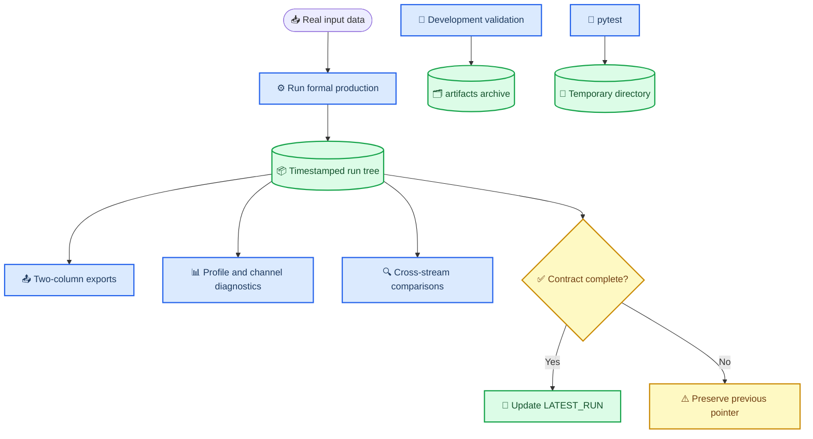

# TASK-013B 输出目录治理与简化速度—时间导出报告

_DPS Studio · 真实双通道数据验收 · 2026-07-27_

---

## 📋 执行摘要

- TASK-013B 已在未提交的 TASK-013 和 TASK-013A-R 工作区上完成。
- 正式生产运行现在固定写入
  `outputs/production_runs/run_<YYYYMMDD_HHMMSS>/`，成功后才更新
  `outputs/LATEST_RUN.txt`。
- 四个 profile/channel 流均新增严格两列 CSV；所有 STFT 帧和 NaN 间隔均被保留。
- 15 个已确认 pytest 临时目录已删除；10 个开发/验证目录已完整迁移并记录 manifest。
- 真实数据有限点数为 `392 / 379 / 375 / 366`，与 TASK-013A-R 基准完全一致。
- 全量测试 `327 passed`；Ruff、mypy strict 和 `git diff --check` 均通过。
- 本任务未修改 STFT、脊线、信号存在检测、事件候选、事件共识或质量阈值。

## 🔍 审计与污染来源

### 1. 开始前审计

| 项目 | 修改前结果 |
| --- | --- |
| `HEAD` | `11b761fe49550f22e7430f939f2bedb87826c345` |
| 分支 | `main`，跟踪 `origin/main` |
| 暂存区 | 空 |
| 已跟踪 diff | 18 个文件，3,215 additions，822 deletions |
| pytest | 321 passed，1 个 `.pytest_cache` ACL 警告 |
| Ruff | 通过 |
| mypy strict | 42 个源码文件通过 |
| 原始 CSV SHA-256 | `AB9F656E3563AB96D0E842DB88510076F6368E246853FD3427D8FD7DB68F7353` |

TASK-013 和 TASK-013A-R 没有中间提交，因此无法用 Git 将两者的修改精确拆分。
开始前的合并工作区状态、一级目录大小、时间、Git 跟踪状态和建议动作已固化在
[清理清单](../artifacts/output_cleanup_inventory.csv)。

### 2. outputs 污染来源

仓库源码没有发现 `--basetemp`、`outputs/.pytest*`、`outputs/pytest*`、
`pytest_temp` 或 `pytest_manual_tmp` 的硬编码引用。生产输出测试原本已经使用
`tmp_path_factory`；污染目录内部的 `pytest-of-89484/pytest-*` 结构表明，来源是
此前运行质量门时把进程 `TEMP/TMP` 指向了 `outputs/.pytest_*`。

当前生产测试和新增测试全部在 pytest 临时根中生成模拟输出树。配置测试中的
`outputs/production_runs` 也解析到 `tmp_path`，不指向真实仓库输出目录。

### 3. 旧目录分类

| 分类 | 数量 | 处理原则 |
| --- | ---: | --- |
| `pytest_temporary` | 15 | 满足附件全部删除条件后删除 |
| `development_output` | 4 | 迁移到可追溯 legacy 目录 |
| `validation_output` | 6 | 迁移到可追溯 legacy 目录 |
| `production_output` | 1 | 保持原位 |
| `historical_unknown` | 3 | 来源未充分确认，保持原位 |

三个保持原位的未知历史目录是 `task007_demo_runs`、`task008a_demo_runs` 和
`task008b_demo_runs`。它们未被 Git 跟踪，但当前仓库无法可靠还原确切生产脚本，
因此没有删除或迁移。

## 📦 清理、迁移与目录契约

### 4. 清理和迁移动作

15 个 pytest 临时目录被删除，其中 `pytest_manual_tmp` 和 `pytest_temp` 因旧 ACL
限制，仅对已核验的精确路径使用提升权限删除。删除对象均未被 Git 跟踪，且名称
属于任务允许的模式。

10 个已确认开发或验证目录被迁移到：

`artifacts/legacy_outputs/migration_20260727_010406/`

逐目录核验了源路径消失、目标存在、文件数和总字节数匹配。最新 TASK-013A-R
验收树完整保留 44 个文件和 10,150,250 bytes。完整记录见
[迁移 manifest](../artifacts/legacy_outputs/migration_20260727_010406/migration_manifest.csv)。

### 5. 新输出目录契约



正式运行根目录包含：

```text
outputs/production_runs/run_<YYYYMMDD_HHMMSS>/
├── run_manifest.json
├── run.log
├── README.txt
├── event_consensus.json
├── simple_exports/
├── balanced/
├── high_time_resolution/
└── comparisons/
```

profile 名称由当前 `AnalysisProfile.profile_id.value` 派生；输出契约不再通过根目录
常量复制两套 profile 别名。每个 channel 保留 42 列完整诊断表
`apparent_velocity_diagnostics.csv`，并兼容保留内容完全相同的旧文件名
`apparent_velocity.csv`。

### 6. 简化两列 CSV 设计

每个简单导出只有：

```text
time_s,apparent_velocity_m_s
```

`time_s` 直接来自 STFT 帧中心绝对时间；速度直接来自
`ChannelAnalysis.refined_velocity_m_s`。写出时使用 18 位科学计数法，使用
round-trip 解析器重新读取后与 core 数组 bit-exact。

没有使用 `display_velocity_m_s`、preview、unfiltered argmax、离散速度或人工补零；
没有删除 NaN 行、插值、平滑、补零或重采样。禁止的全局
`final/recommended/merged/fused/best_velocity.csv` 均未生成。

`simple_exports/README.txt` 明确记录了四个独立流、文件名语义、单位、NaN 语义、
unsigned apparent velocity、未完成 LiF 修正、尾部分支身份未确认以及禁止直接平均
通道或曲线。

## 📊 真实数据与一致性

### 7. 四个真实 simple exports

真实运行目录：

`outputs/production_runs/run_20260727_112254`

| Profile / channel | 行数 | 有限点 | NaN | 时间范围/s | 有限速度范围/(m/s) |
| --- | ---: | ---: | ---: | --- | --- |
| Balanced / ch1 | 620 | 392 | 228 | `5.539698542600033e-4`–`5.559506542606788e-4` | 117.878401–1,411.933250 |
| Balanced / ch2 | 620 | 379 | 241 | `5.539698542600033e-4`–`5.559506542606788e-4` | 117.624469–692.095413 |
| High time / ch1 | 622 | 375 | 247 | `5.539666542600022e-4`–`5.559538542606800e-4` | 118.416878–683.752728 |
| High time / ch2 | 622 | 366 | 256 | `5.539666542600022e-4`–`5.559538542606800e-4` | 114.769453–680.829751 |

文件路径：

- `simple_exports/balanced__pdv_channel_1__apparent_velocity_time.csv`
- `simple_exports/balanced__pdv_channel_2__apparent_velocity_time.csv`
- `simple_exports/high_time_resolution__pdv_channel_1__apparent_velocity_time.csv`
- `simple_exports/high_time_resolution__pdv_channel_2__apparent_velocity_time.csv`

四条流的最后一行都是正式有限点，说明记录尾部已通过质量门的帧未被截断。

### 8. 与详细诊断 CSV 一致性

| 核验 | 结果 |
| --- | --- |
| simple vs. 新 detailed 的 `time_s` | 四条流逐元素相同 |
| simple vs. 新 detailed 的正式速度 | 四条流逐元素相同，包括 NaN |
| 新 detailed vs. 兼容旧文件名 | 四条 42 列表完全相同 |
| simple round-trip vs. core 时间 | 四条流 bit-exact |
| simple round-trip vs. core 正式速度 | 四条流 bit-exact，包括 NaN |
| 有限点数 vs. TASK-013A-R | `392 / 379 / 375 / 366`，完全一致 |

与迁移后的 TASK-013A-R 旧 CSV 比较时，NaN mask 和有限点数完全一致；速度最大
绝对差不超过 `2.274e-13 m/s`，在 `rtol=1e-15` 内一致。旧 CSV 的十进制序列化使
时间列出现不超过 `9.986e-17 s` 的重读差异；新导出通过 round-trip 重读与 core
数组 exact 一致。

所有 formal NaN 位置在旧 preview 中均有有限值，但 simple export 仍保持 NaN：
四条流对应 `228 / 241 / 247 / 256` 帧。四个 simple export 的零值计数均为 0，
证明没有采用 preview 或 display zero。

## 🧪 测试治理与验收

### 9. 测试临时目录修复

- 生产集成 fixture 使用 `tmp_path_factory`。
- 新增真实 `outputs` 全树快照 fixture，测试模块结束后逐文件路径和大小必须不变。
- 正式输出函数在 pytest 临时树中生成完整 54 文件契约。
- `run_pipeline` 拒绝将正式运行写到配置 `production_runs` 根之外。
- 失败运行不更新 `LATEST_RUN.txt`；成功运行使用临时文件加 `Path.replace()` 原子更新。
- pytest cache 改到已忽略的 `.test_tmp/pytest_cache`；pytest 数据根继续使用系统临时目录。
- 仓库 `outputs` 下不再使用 `.pytest_*`、`pytest_*`、`basetemp` 或 `test_tmp`。

### 10. 清理前后目录对比

| 状态 | `outputs` 一级对象 |
| --- | --- |
| 清理前 | 29 个目录：15 pytest、1 production、10 已确认开发/验证、3 未确认历史 |
| 清理后及真实运行前 | `production_runs` 加 3 个未确认历史目录 |
| 真实运行成功后 | 上述 4 个目录加 `LATEST_RUN.txt` |

`LATEST_RUN.txt` 当前内容：

```text
production_runs/run_20260727_112254
```

### 11. 自动测试结果

新增或扩展的测试覆盖：

- 四个 profile/channel 两列文件及严格 header
- 行数、严格递增时间、正式速度和 NaN mask
- 前置信号不可靠帧、边界峰和记录尾部
- 无 index、display 或 preview 字段
- 人工参考时刻与 `EventCandidateConfig` 不变量
- CSV round-trip 精度
- 真实 `outputs` 不污染
- 完整 tmp 输出树
- 正式目录边界
- `LATEST_RUN.txt` 失败保持与成功更新
- 禁止含义不明确的全局速度文件

### 12. pytest、Ruff、mypy

| 质量门 | 最终结果 |
| --- | --- |
| 全量 pytest | 327 passed in 14.50 s |
| Ruff | All checks passed |
| mypy strict | 42 个源码文件，0 issues |
| 真实生产分析 | 成功，54 files |
| `git diff --check` | 通过 |

## 🔗 Git、哈希与收束

### 13. Git diff

最终合并工作区的已跟踪 diff 为 20 个文件、3,803 additions、825 deletions。
其中包含此前未提交的 TASK-013/TASK-013A-R；TASK-013B 的编排修改集中在：

- `.gitignore`
- `pyproject.toml`
- `README.md`
- `run_demo_pipeline.bat`
- `scripts/production_outputs.py`
- `scripts/run_demo_pipeline.py`
- `tests/unit/test_production_outputs.py`
- `tests/unit/test_run_demo_pipeline_modes.py`

清理清单、迁移 manifest 和本报告均为未跟踪新文件。暂存区仍为空。

### 14. 原始数据哈希

`data/raw/20260607.csv` 在开始前和所有测试、迁移、正式分析结束后的 SHA-256 均为：

```text
AB9F656E3563AB96D0E842DB88510076F6368E246853FD3427D8FD7DB68F7353
```

原始数据未被覆盖、移动或修改。

### 15. 最终状态声明

- 未执行 `git add`
- 未创建 commit
- 未执行 push
- 未修改正式数值算法或质量阈值
- 未开始 TASK-013B 之外的其他任务
- 已停止实施，等待审计
