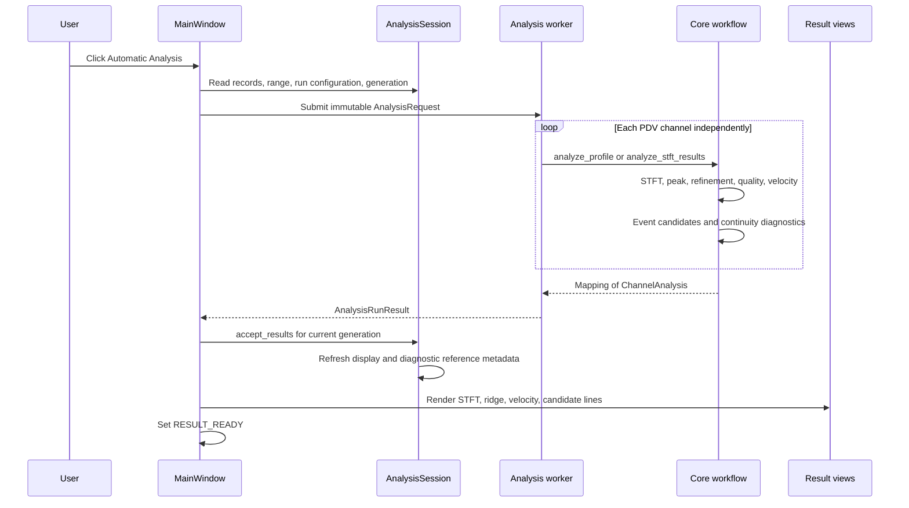
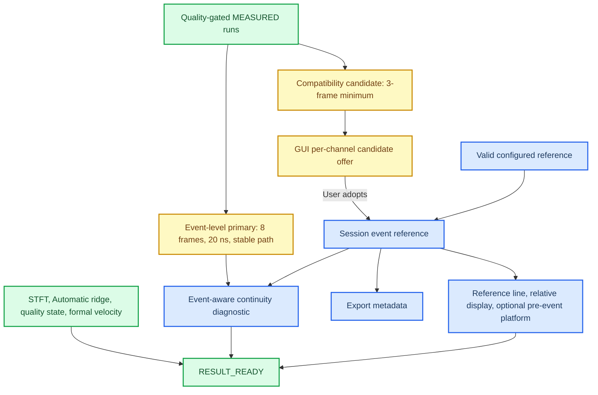

# TASK-018A Automatic Analysis 全链路审计

_审计对象：PDV Studio 当前本地源码；审计日期：2026-08-10；结论仅描述可复现的软件行为，不把事件候选等同于实验物理真值。_

---

## 📌 结论摘要

点击“自动分析”后，软件对每个 PDV 通道独立执行：原始电压的单边 STFT、搜索带内逐帧最大幅值选峰、三点对数幅值亚频点细化、频谱对比度质量门控、表观速度换算与显示数组构造。计算在后台线程运行，成功接收当前 generation 的完整双通道结果后进入 `RESULT_READY`。

界面所称“自动事件候选”不是原始电压阈值、导数、RMS 或 change point。它是**第一个通过频谱质量门控并连续至少 3 帧的 `MEASURED` 段的首帧中心时间**。因此它能在窄带 beat signal 持续出现时近似标出起跳，但也可能被很早出现的短暂强窄带分量触发。

当前同时存在两层事件结果：

- `SignalDetectionResult.detected_event_candidate_time_s`：兼容层，最短 3 帧；GUI 当前展示这一层。
- `StreamEventCandidates.primary_candidate_time_s`：事件级层，还要求至少 8 帧、首末帧中心跨度至少 20 ns、相邻频率步进不超过 100 MHz；GUI 当前不展示它，也不自动采纳它。

任何自动候选都不会自动改写 experiment event reference。只有用户点击采纳，或配置中存在对当前数据域有效的参考时间，session 才持有 reference。reference 不参与 Automatic ridge selection，也不改变正式频率、质量状态或速度。

## 🔗 完整调用链

### 逐级接口与状态

| 阶段 | 真实位置与 API | 主要输入 → 输出 | 单位与配置 | session 状态变化 |
| --- | --- | --- | --- | --- |
| Action | `gui/main_window.py:358, 1018`，`QAction` → public slot | 用户触发 → handler 调用 | 无科学单位 | 无 |
| 请求构造 | `MainWindow.run_automatic_analysis()`，`main_window.py:2160` | records、range、run config、generation → `AnalysisRequest` | 时间 s；频率 Hz；波长 m | mode 设为 Automatic；adapter busy |
| 后台适配 | `_AnalysisWorker.run()`，`analysis_adapter.py:91`，private | request → `AnalysisRunResult` | 原样传递显式配置 | 不访问 QWidget |
| STFT | public `compute_configuration_stfts()` / `compute_stft()`，`workflow/analysis.py:62`、`time_frequency/stft.py:19` | 每通道 `SignalRecord` → `STFTResult` | 电压 V、时间 s、频率 Hz；profile | 无 |
| Ridge | public `extract_peak_ridge()`，`ridge/peak.py:22` | STFT + 搜索带 → 离散 peak ridge | Hz；profile/GUI override | 无 |
| Refinement | public `refine_peak_ridge_subbin()`，`ridge/refinement.py:23` | 离散 ridge + STFT → refined candidate | Hz、bin offset | 无 |
| Spectral quality | public `assess_ridge_spectral_quality()`，`ridge/spectral_quality.py:31` | peak + guard 外频谱 → 两种 contrast | 幅值比 dB | 无 |
| Formal detection | public `detect_beat_signal()`，`quality/detection.py:23` | refined ridge + quality + analysis range → state、正式频率/速度、兼容事件候选 | s、Hz、m/s、dB | 无 |
| Event level | public `build_stream_event_candidates()`，`event_candidates.py:479` | 最终 per-frame states → assessed segments、primary candidate | s、Hz | 无 |
| Continuity | public `assess_ridge_continuity()` 与 `assess_event_aware_ridge_continuity()` | refined candidate → 只读诊断 | s、Hz、Hz/s | 无 |
| Display | public `build_display_velocity()`，`workflow/display.py:19` | 正式速度 + reference + display config → 独立 display array | s、m/s | 无 |
| 接收 | `AnalysisSession.accept_results()`，`analysis_session.py:395` | 当前 generation 的完整 mapping → session analyses | 不改正式数组 | `stft_valid/results_valid=True` |
| 完成 | `MainWindow._analysis_finished()`，`main_window.py:2192` | accepted analyses → views/candidate buttons | GUI 显示 µs、MHz；core 仍为 SI | `RESULT_READY` |

public/private 的判断以 Python 接口命名和导出为准：numerical core 上述函数均为 public；`_AnalysisWorker.run()`、`_analysis_finished()` 等是 GUI 内部实现。

## 🧮 STFT 与 ridge 数值路径

### STFT 输入和预处理

`compute_stft()` 直接读取 `SignalRecord.voltage_v`。当前正式路径没有滤波、平滑、重采样、去趋势或 baseline subtraction；非近似均匀采样会报错。SciPy 参数为 Hann window、`detrend=False`、`return_onesided=True`、`boundary=None`、`padded=False`、`scaling="spectrum"`。

默认 Balanced profile 为 `nperseg=768`、`noverlap=640`、hop 128、`nfft=4096`、搜索带闭区间 50 MHz–2 GHz。当前 40 GHz 数据的派生尺度是：

- frame hop：3.2 ns；
- window support：19.2 ns；
- FFT 数值网格间距：9.765625 MHz；
- 有限窗频率尺度 `fs / nperseg`：约 52.083333 MHz。

`nfft=4096` 加密的是 FFT 取样网格，不会把 768-sample 有限窗的物理分辨能力提升到 9.765625 MHz。代码和本审计不把网格间距称为物理频率分辨率。

### Automatic peak selection

对每一 STFT frame，Automatic 在闭搜索带内选择

\[
k_i^*=\operatorname*{arg\,max}_{k\in[50\,\mathrm{MHz},2\,\mathrm{GHz}]} |Z(k,i)|.
\]

相等最大值按 NumPy `argmax` 取最低频率的第一个 bin。Automatic workflow 调用该函数时显式传入 `event_start_time_s=None`，并且在没有 Guided corridor 时**不把 GUI analysis range 传给 ridge extraction**；analysis range 随后只在 formal detection 中门控。没有平滑、连续性约束、历史状态、dynamic programming、HMM、Kalman 或跨通道融合。

Guided 模式是同一最大幅值逻辑与显式 corridor 的交集；corridor 之外为 NaN，不回退到 Automatic。它与 Automatic 结果分别保存。

### 亚频点细化

对离散峰两侧各一个 bin 的正有限幅值取自然对数，令 `y_-`、`y_0`、`y_+` 为三点值：

\[
\delta_i=\frac{1}{2}\frac{y_- - y_+}{y_- - 2y_0 + y_+},\qquad
f_i^{\mathrm{ref}}=f_{k_i^*}+\delta_i\Delta f.
\]

只有分母为负、绝对值大于 `16 × machine epsilon × local scale` 且 `-0.5 ≤ δ ≤ 0.5` 时细化成功。搜索带边界、FFT 边界、无效局部峰或越界 offset 返回 NaN 和明确 `RidgeRefinementStatus`；不会以离散值静默填补。

## 🎯 自动 event/onset detection 原理

### 真正读取的输入

事件候选读取的是已经选出的 STFT ridge 及其频谱质量证据：selected peak magnitude、guard 外背景中位幅值、guard 外最大 competitor 幅值、refinement 状态、frame-center 时间和 analysis range。它不读取 raw voltage、预处理电压、raw derivative、RMS 或已有 velocity。

### 频谱质量量

以离散选中峰为中心，排除 `peak_exclusion_half_width_bins=12` 个相邻 bin；实现用

\[
g=(12+0.5)\Delta f
\]

形成严格 `|f-f_peak| > g` 的保留集合。当前数据中 `g=122.0703125 MHz`。保留集合的中位幅值是 background，最大幅值是 strongest competitor：

\[
C_{bg}=20\log_{10}(P/B_{median}),\qquad
C_{comp}=20\log_{10}(P/C_{max}).
\]

这里的 competitor 只是 guard 外最大 bin，不保证是已识别的 local peak；其频率和 rank 没有保存。这两个 contrast 也不是经过标定的正式 SNR。

### 逐帧门控顺序

`detect_beat_signal()` 对每帧依次判定：

1. frame center 是否在 analysis range 内；
2. detector 是否 enabled；
3. spectral quality 是否可评估；
4. `C_bg ≥ 10 dB`；
5. `C_comp ≥ 3 dB`；
6. peak 是否不在搜索带边界；
7. `f_discrete × window_duration ≥ 1 cycle`；
8. sub-bin refinement 是否成功。

通过者暂记 `MEASURED`。随后只枚举完全连续的 `MEASURED` runs；少于 3 帧的 run 改为 `UNSTABLE_DETECTION`。第一个剩余 run 的首帧中心就是兼容事件候选，run 长度完整保留。正式 refined frequency 和 apparent velocity 仅在最终 `MEASURED` 帧保留，其他帧为 NaN。

### 为什么它可能找到冲击起跳

当冲击相关运动使 PDV beat signal 形成持续、相对背景显著、相对竞争分支占优的窄带谱线时，上述多重门控会从无可靠 beat 的帧转为连续 `MEASURED` 帧。首个合格 run 因而可作为“可测 beat 开始”的工程候选。

边界同样明确：它检测的是**满足软件频谱准则的最早连续段**，不是经外部传感器标定的冲击时刻。只要求 3 帧意味着约 6.4 ns 的首末 frame-center span；真实数据中确有 channel 1 的早期短 run 早于主要清晰谱线，因此当前 GUI candidate 会过早。事件级层正是用更长的 8 帧/20 ns/路径稳定性条件减少这种脆弱性，但尚未接到 GUI candidate line。

### 无候选时的行为

没有 qualifying run 时，`detected_event_candidate_time_s=None`、run length 为 0。分析继续，正式 per-frame state/NaN 仍返回，GUI 不显示该通道候选；不会使用 analysis-range start、固定默认值或另一通道作为 fallback，也不会因此报错。

## ⚙️ 参数与来源

| 参数 | 当前值 | 来源 | 作用/审计说明 |
| --- | ---: | --- | --- |
| analysis range | 553.96025426–555.96022926 µs | TOML；仅覆盖数据域时采用 | formal detection/display 的时间域；其他 shot 回退完整公共数据域 |
| manual event reference | 554.668 µs | TOML 或用户采纳 | display/review/export metadata；不选峰；仅对首个 shot 有效 |
| wavelength | 1.55 µm | TOML/GUI run config | `v_app = λ₀ f_b / 2`；不含 LiF 等修正 |
| search band | 50 MHz–2 GHz | Balanced profile，可显式 override | coarse peak 闭区间 |
| window / overlap / hop | 768 / 640 / 128 samples | Balanced profile，可显式 override | STFT support 与时间采样 |
| `nfft` | 4096 | Balanced profile，可显式 override | FFT 数值网格密度 |
| peak/background | ≥10 dB | TOML → `SignalDetectionConfig` | signal existence gate |
| peak/competitor | ≥3 dB | TOML → `SignalDetectionConfig` | ambiguity gate |
| excluded neighbor bins | 12 | TOML → `SignalDetectionConfig` | background/competitor guard |
| min consecutive frames | 3 | TOML → `SignalDetectionConfig` | GUI 兼容事件候选与正式稳定性 |
| min cycles/window | 1.0 | TOML → `SignalDetectionConfig` | 低频有限窗 gate |
| detector enabled | `true` | TOML | 关闭时无可检测 beat |
| min background bins | 2 | TOML | quality 可评估性 |
| event-level min frames | 8 | TOML → `EventCandidateConfig` | 更稳健 segment eligibility |
| event-level min span | 20 ns | TOML → `EventCandidateConfig` | 首末 frame-center span |
| event-level max step | 100 MHz | TOML → `EventCandidateConfig` | 路径稳定性；也复用于新增诊断 jump threshold |
| pre-event display | disabled；0 m/s | TOML/GUI | 只构造独立 display array |

`background_guard_window_scale=2.0` 虽存在于 TOML、GUI request 和 workflow 签名中，但当前正式 spectral quality 实际使用的是 `peak_exclusion_half_width_bins` 派生 guard；该 scale 只在未提供 detection config 时被验证，未进入 guard 计算。这是遗留的无效配置项，属于建议清理/澄清，不应描述成当前生效阈值。

另外两个实现容差不是实验阈值：sub-bin 分母容差为上述 `16 ε` 数值保护；session 参考时间域检查容差为 `max(data_span, 1 s) × 10⁻¹²`。新增 event-window 边界用 `8 ε` 相对浮点容差，仅用于把恰好落在 window support 边缘的 frame 稳定分类。

## 👥 双通道与事件参考

`compute_configuration_stfts()` 和 `analyze_stft_results()` 遍历 mapping，对 channel 1 和 channel 2 分别执行相同算法。不存在固定 channel 1、当前显示通道优先、二选一、cross-channel fallback 或 voltage/velocity fusion。

每通道生成自己的兼容候选与事件级候选。仓库虽有事件 consensus 数据模型和函数，但当前 GUI Automatic 请求没有调用跨通道 consensus。GUI candidate buttons 按通道分别显示；用户可选择采纳其中一个，此时 session 形成一个共享 experiment reference。某通道没有 candidate 不会借用另一通道，也不妨碍该通道分析返回。

配置参考会在每次加载文件时重新验证。554.668 µs 对 `20260607.csv` 有效，对其余三个 shot 超出数据域，因此被明确拒绝并设为 `None`，而不是截断或替换。

## 🧭 event 对下游的真实影响

| 后续环节 | 自动候选直接影响？ | 用户确认/config reference 影响？ | 结论 |
| --- | --- | --- | --- |
| analysis range | 否 | 否 | range 独立配置/确认 |
| Automatic ridge search | 否 | 否 | workflow 显式传 `event_start_time_s=None` |
| quality gate / formal state | 否 | 否 | 只受 range、频谱证据和 detection config 影响 |
| formal frequency/velocity | 否 | 否 | 保持原 production 数组 |
| Guided corridor | 否 | 否 | corridor 由用户另行定义 |
| pre-event display platform | 否 | 是，且需显式 enable | 仅非 `MEASURED` 的 reference 前 display 值 |
| GUI reference line / relative display | 作为可采纳提示 | 是 | 自动候选不会静默采纳 |
| export | 否 | 是 | 写入 `event_reference_time_s` metadata |
| 新增 continuity diagnostic | robust primary 可作为无手动参考时的依据 | 是，优先 | 仅分类证据，不改变 selection |

## 🔎 当前 ridge 能力与缺口

| 能力 | 当前状态 | 是否参与正式 selection |
| --- | --- | --- |
| 搜索带内 strongest discrete bin | 已实现 | 是 |
| 三点 log-magnitude sub-bin refinement | 已实现 | 是，正式值仍受 quality gate |
| peak/background、peak/competitor | 已实现 | 参与 formal quality，不改变 coarse peak identity |
| strongest competitor magnitude | 已保留 | 只做 quality；未保留其频率/rank |
| 多个 local peak candidates / top-K | 未实现 | 否 |
| 旧 adjacent continuity | 已实现 diagnostic | 否 |
| 新 event-aware continuity | TASK-018A diagnostic | 否 |
| Guided corridor | 已实现独立模式 | 只参与 Guided selection |
| dynamic programming/global path | 未实现 | 否 |
| event-aware Automatic reselection | 未实现，属于 TASK-018B | 否 |

Automatic ridge 的最大结构性缺陷是：每帧只保存一个全局最大幅值 bin，既不保留可替换峰的频率，也不利用时间连续性维持 branch identity。质量门控能把不可靠帧的正式速度变成 NaN，却不能纠正已选错的 peak；后续 continuity 即使发现单帧跳变，也没有候选可重选。

## 🧾 审计判定

### 必须修正

本任务范围内未发现会改变 production 数值的单位错误、channel hard-code 或静默 fallback。新增诊断接入后补充了 reference 变化时同步刷新 continuity metadata 的状态一致性修正；它不改变正式数组。

### 建议优化

- GUI 应明确区分并评估是否改为展示事件级 primary candidate，而不是短 3-frame 兼容候选。
- 清理或真正接线 `background_guard_window_scale`，避免配置界面暗示它已生效。
- TASK-018B 若做 continuity-assisted reselection，先扩展轻量 top-K/local-max candidate representation，再做离线 A/B；不要直接修改默认 production。

### 暂不处理

不在 TASK-018A 实现 DP、HMM、Kalman、跨通道融合、自动曲线修补、LiF correction 或采集硬件集成。

### 未知或需要实验确认

10 dB、3 dB、3 帧、8 帧、20 ns、100 MHz 等均是显式 development defaults，软件行为已有测试和真实数据复现，但其对不同材料、信噪比、示波器带宽和实验几何的物理最优性仍需标注事件真值的实验集合验证。

## 📚 源码索引

- GUI chain：`src/dps_studio/gui/main_window.py:358,1018,1608,2160,2192,2258,2264`
- session state：`src/dps_studio/gui/analysis_session.py:349,379,395,600,643`
- background adapter：`src/dps_studio/gui/analysis_adapter.py:50,91,224,248`
- core orchestration：`src/dps_studio/core/workflow/analysis.py:62,89,133,184,283-402`
- STFT / ridge / refinement：`src/dps_studio/core/time_frequency/stft.py:19`；`src/dps_studio/core/ridge/peak.py:22`；`src/dps_studio/core/ridge/refinement.py:23`
- quality / detection / event level：`src/dps_studio/core/ridge/spectral_quality.py:31`；`src/dps_studio/core/quality/detection.py:23`；`src/dps_studio/core/event_candidates.py:55,269,479`
- velocity / display / export：`src/dps_studio/core/physics/velocity.py:18`；`src/dps_studio/core/workflow/display.py:19,135`；`src/dps_studio/core/export/writer.py:495`
- TASK-018A continuity：`src/dps_studio/core/ridge/continuity.py:18`；`src/dps_studio/core/ridge/continuity_models.py:22,50`

所有路径均相对项目根目录；行号对应本次 TASK-018A 工作树。
