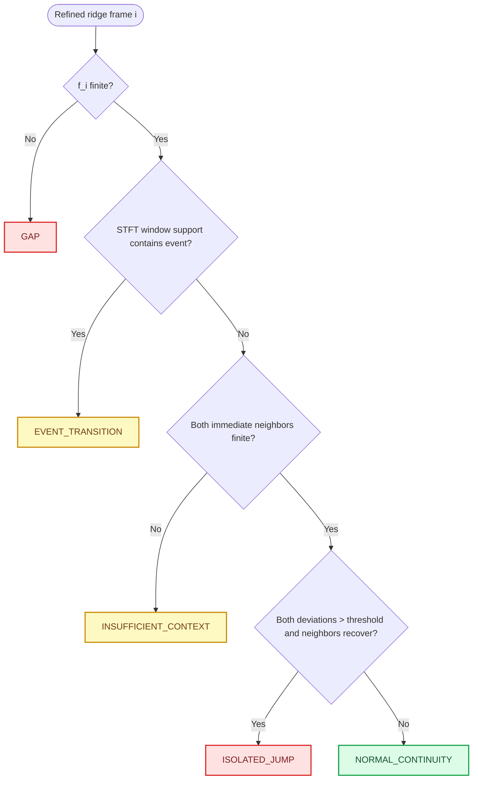
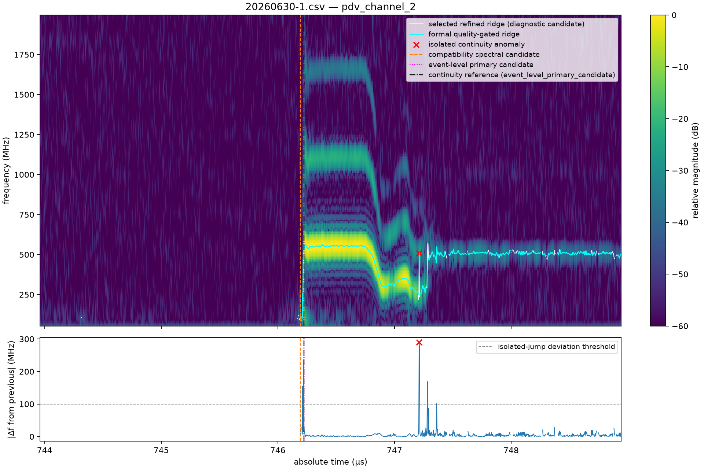

# TASK-018A 实施与真实数据评估报告

_范围：Automatic Analysis 审计、事件感知连续性诊断、四组真实 shot 的离线评估与 production 不变性验证；未进入 TASK-018B。_

---

## 📌 交付结论

- 当前自动起跳来自 STFT ridge 的频谱质量门控和连续 `MEASURED` run，不来自 raw voltage 阈值、导数或 RMS。
- 新增 continuity API 是 core 内无 GUI、无 I/O、不可变、SI-only 的诊断输出；不平滑、不插值、不删帧、不重选 ridge。
- 四个 raw CSV、两个通道共 8 条结果中发现 1 个严格满足“单帧跳出、下一帧恢复”的异常：`20260630-1.csv / pdv_channel_2 / frame 1015`。
- 修改前后 8 条 production 结果的 event time、frame count、formal ridge、refined frequency、state、apparent/display velocity 和 NaN mask 均逐元素完全一致。
- 当前没有第二候选峰频率或 rank；只有 selected peak 与 guard 外 strongest competitor 的**幅值**。TASK-018B 要做重选，最小前置改动是保留轻量 top-K/local-max candidate representation。

Automatic 原理详解见 [TASK-018A_AUTO_ANALYSIS_AUDIT.md](TASK-018A_AUTO_ANALYSIS_AUDIT.md)。机器可读结果见 [assessment.json](../artifacts/task018a/assessment/assessment.json)、[event_detection.csv](../artifacts/task018a/assessment/event_detection.csv) 和 [continuity_assessment.csv](../artifacts/task018a/assessment/continuity_assessment.csv)。

## 🌿 Git 与安全基线

### 开始状态

| 项目 | 结果 |
| --- | --- |
| 初始分支 | `codex/feature/task-018-auto-analysis` |
| 初始 HEAD | `48407dccea8763fc892111cd2a2f5135ee09d31d` |
| 初始 worktree / stage | clean / empty |
| 初始 `git diff --check` | pass |
| commit / push / rebase / merge | 均未执行 |

分支已由环境使用 Codex 规定前缀建立；没有修改 `main` 历史。

### 修改前质量基线

| 命令 | 基线结果 | 判读 |
| --- | --- | --- |
| `python -m pytest --basetemp=.pytest_tmp/task018a_baseline` | 455 passed, 1 failed | 已知 `tests/unit/test_package.py::test_cli` 将 pytest 的 `--basetemp` 泄漏给 CLI argparse；非 TASK-018 回归 |
| `python -m ruff check .` | pass | 仅有既存无权限临时目录的遍历 warning |
| `python -m mypy src/dps_studio` | pass，65 source files | 无类型错误 |
| `python -m dps_studio.gui` | 正常启动并保持运行 | 5 秒内 stdout/stderr 为空，随后仅终止该 smoke 进程 |

测试使用现有 `D:\miniconda3\envs\dps-studio\python.exe`（Python 3.12.13）；默认 base Python 不含 pytest/Ruff/mypy，因此未进行全局安装。

## 🔗 Automatic 审计结果

### 完整调用链

`QAction` → `MainWindow.run_automatic_analysis()` → immutable `AnalysisRequest` → `AutomaticAnalysisAdapter` background worker → `analyze_profile()` / `analyze_stft_results()` → per-channel STFT → maximum-magnitude ridge → sub-bin refinement → spectral quality → formal signal detection/velocity → display velocity → event candidates → continuity diagnostics → `AnalysisSession.accept_results()` → candidate buttons/views → `RESULT_READY`。

逐级路径、输入输出、SI 单位、配置来源、public/private 与 state mutation 已在[全链路审计](TASK-018A_AUTO_ANALYSIS_AUDIT.md#-完整调用链)中逐项列出。

### 事件算法、参数、双通道和 fallback

兼容事件候选是最早 final-`MEASURED` run 的首帧中心；每帧必须满足 peak/background ≥10 dB、peak/competitor ≥3 dB、非频带边界、window 内至少 1 cycle、refinement 成功，run 至少 3 帧。分析范围仅门控 formal detection，不参与 Automatic coarse peak selection。

事件级 primary 在同一 final states 上额外要求 ≥8 帧、首末 frame-center span ≥20 ns、最大相邻频率步进 ≤100 MHz。两个 PDV 通道完全独立，没有固定 channel 1、显示通道优先、跨通道选择或失败回退。无候选时返回 `None` 和 run count 0，软件继续完成分析。

GUI 当前显示兼容候选，而不是事件级 primary。候选只供用户采纳；不自动设置 reference。有效 reference 影响 reference line、relative/display presentation、可选 pre-event display platform 和 export metadata，不影响 Automatic ridge、quality state、formal frequency/velocity 或 Guided corridor。

### Ridge selection 与旧 continuity

Automatic 每帧在 50 MHz–2 GHz 闭区间取 `argmax(|STFT|)`，再做三点对数幅值二次细化。quality 使用选中峰、guard 外背景中位幅值和 guard 外最大 competitor 幅值。旧 `assess_ridge_continuity()` 只输出相邻差分证据，不参与 peak selection；当前也没有 dynamic programming 或 global path。

`background_guard_window_scale=2.0` 当前未进入正式 guard 计算；实际 guard 由 12 个 excluded neighbor bins 与 FFT grid spacing 派生。该参数属于建议澄清的遗留配置。

## 🧠 新增事件感知 continuity diagnostic

### Public API 和数据模型

| 文件 | Public 对象 | 职责 |
| --- | --- | --- |
| `core/ridge/continuity_models.py` | `EventAwareContinuityConfig` | 显式 SI 阈值 |
| 同上 | `EventAwareContinuityResult` | 不可变 per-frame 指标、状态与 provenance |
| `core/ridge/continuity.py` | `assess_event_aware_ridge_continuity()` | 无 I/O、无 GUI 的纯数值分类 |
| `core/workflow/models.py` | `ChannelAnalysis.event_aware_continuity_result` | 随分析结果公开诊断 |
| `core/workflow/display.py` | `configure_channel_event_reference()` | reference 更新时同步重算诊断 metadata |

新增状态复用现有 `RidgeContinuityStatus` enum：`NORMAL_CONTINUITY`、`EVENT_TRANSITION`、`ISOLATED_JUMP`、`GAP`、`INSUFFICIENT_CONTEXT`。旧状态和旧 continuity API 保持兼容。

### 指标定义

对 refined candidate frequency `f_i` 和 frame-center time `t_i`，仅在直接相邻值有限时计算：

\[
\Delta f_i^- = f_i-f_{i-1},\qquad
\Delta f_i^+ = f_{i+1}-f_i,
\]

\[
s_i=\frac{f_{i+1}-f_{i-1}}{t_{i+1}-t_{i-1}},\qquad
r_i=|f_{i+1}-f_{i-1}|.
\]

输出字段分别为 `delta_frequency_from_previous_hz`、`delta_frequency_to_next_hz`、`local_frequency_slope_hz_per_s` 和 `neighbor_recovery_difference_hz`。时间严格为 s，频率严格为 Hz，斜率为 Hz/s。

### Event-aware 分类

event transition 不是拍脑袋的 ±0.1 µs。若 event time 为 `t_e`、STFT window duration 为 `T_w`，frame `i` 的 window support 包含事件，即

\[
|t_i-t_e|\le T_w/2,
\]

则标为 `EVENT_TRANSITION`。Balanced 当前 `T_w=19.2 ns`。参考来源优先级为：当前有效 manual/config/user-adopted reference；否则使用事件级 primary；两者皆无则不豁免。

isolated jump 要求 `|Δf_i^-|` 和 `|Δf_i^+|` 都严格大于 100 MHz，同时 `r_i ≤ fs/nperseg`。当前数据 recovery tolerance 约 52.083333 MHz；它命名为有限窗频率尺度，不称作 FFT grid 或物理分辨率。首末帧或邻居缺失为 `INSUFFICIENT_CONTEXT`。

### NaN 与 production 隔离

`f_i=NaN` 直接得到 `GAP`。任一直接邻居 NaN 时，不跨 gap 计算 slope/recovery，不 forward/back fill，不插值，不 median/Savitzky–Golay smoothing，不删除 frame。诊断只读取 `RefinedRidgeResult`，写入新的独立字段；没有代码路径把状态反馈给 coarse peak、formal refined frequency、velocity、display velocity 或 `RESULT_READY` validity。

## 🧪 单元测试

新增 `tests/unit/test_event_aware_ridge_continuity.py`，覆盖：

| 场景 | 输入要点 | 期望 |
| --- | --- | --- |
| 正常连续 | 100, 101, 102, 103 MHz | 无 isolated jump |
| 单帧假跳 | 100, 101, 300, 102, 103 MHz | 300 MHz 帧为 isolated jump |
| 持续变化 | 100, 120, 140, 160 MHz | 不等价于 isolated noise |
| event jump | 60, 60, 60, 430, 440, 445 MHz | window support 内为 event transition |
| NaN gap | 100, 101, NaN, 103 MHz | gap 保留且不跨越 |
| boundary / units | 首末帧、s/Hz/Hz/s | 明确 context 与 SI 行为 |
| config provenance | 非法阈值、event source | 显式拒绝 |

另在 GUI/session 测试中验证：用户设置 reference 后，每个通道的 continuity result 同步获得相同时间和 `manual` source，正式数组不需要重跑。

## 📊 四组真实数据事件评估

### 兼容候选与事件级 primary

| Source | Channel | GUI 兼容候选 (µs) | 事件级 primary (µs) | 工程视觉比较 |
| --- | --- | ---: | ---: | --- |
| 20260607 | ch1 | 554.081854 | 554.664254 | 兼容候选明显早；primary 与清晰谱线起始及 554.668 µs 配置参考大致一致 |
| 20260607 | ch2 | 554.667454 | 554.667454 | 两层一致，并与配置参考大致一致 |
| 20260630-1 | ch1 | 746.117215 | 746.222815 | 兼容候选是更早短段；primary 更接近主谱线出现 |
| 20260630-1 | ch2 | 746.194015 | 746.222815 | primary 更接近主谱线出现 |
| 20260630-2 | ch1 | 540.215650 | 540.215650 | 两层一致，位于明显谱线起始附近 |
| 20260630-2 | ch2 | 540.215650 | 540.215650 | 两层一致，位于明显谱线起始附近 |
| 20260701 | ch1 | 656.402466 | 656.844066 | 兼容候选明显早；primary 更接近主谱线出现 |
| 20260701 | ch2 | 656.844066 | 656.844066 | 两层一致，位于明显谱线起始附近 |

`detected_event_time_s`、detection status、fallback、首帧 contrast/frequency/run count 均保存在 [event_detection.csv](../artifacts/task018a/assessment/event_detection.csv)。GUI candidate line 直接使用兼容字段，因此其数值与上表严格一致；“大致一致”仅是工程视觉判断，不是实验物理真值。

结果说明当前 detector 的频谱逻辑有效，但 3-frame compatibility candidate 对短暂早期分量偏敏感。值得优化的是 GUI 使用哪一层候选及其标注，不建议在 TASK-018A 重写 detector。

## 🚨 真实 continuity 结果

### 规模与缺失

| Source | Channel | Frames | `MEASURED` | Refined candidate NaN |
| --- | --- | ---: | ---: | ---: |
| 20260607 | ch1 | 620 | 392 | 118 |
| 20260607 | ch2 | 620 | 379 | 195 |
| 20260630-1 | ch1 | 1557 | 820 | 626 |
| 20260630-1 | ch2 | 1557 | 769 | 685 |
| 20260630-2 | ch1 | 620 | 448 | 152 |
| 20260630-2 | ch2 | 620 | 428 | 166 |
| 20260701 | ch1 | 620 | 341 | 179 |
| 20260701 | ch2 | 620 | 313 | 259 |

这里的 NaN 是 refined candidate 无法细化的帧，不等同于 formal velocity NaN 总数；formal measurement 还会受质量门控。

### Event transition 与 isolated jump

| Source | Channel | Event-transition frames | Isolated jumps |
| --- | --- | ---: | ---: |
| 20260607 | ch1/ch2 | 各 6 | 0 / 0 |
| 20260630-1 | ch1/ch2 | 各 7 | 0 / 1 |
| 20260630-2 | ch1/ch2 | 各 6 | 0 / 0 |
| 20260701 | ch1/ch2 | 7 / 5 | 0 / 0 |

唯一严格异常为：

| 字段 | 数值 |
| --- | ---: |
| Source / channel / frame | `20260630-1.csv` / `pdv_channel_2` / 1015 |
| Frame center | 747.211614991 µs |
| Selected refined frequency | 508.751027844 MHz |
| Previous deviation | +289.779700197 MHz |
| Next deviation | −274.182246143 MHz |
| Neighbor recovery difference | 15.597454054 MHz |
| Formal state at anomaly | `AMBIGUOUS_PEAK` |
| Formal apparent velocity | NaN |

邻近 refined candidates 为约 218.971 MHz → 508.751 MHz → 234.569 MHz，前后邻居彼此接近而中心帧跳出；频谱图也显示该红色异常点脱离当时主路径。formal quality gate 已因 competitor contrast 不足把该帧速度保持为 NaN，所以它是“选中候选 branch identity 可疑、production measurement 已拒绝”的明确证据。

其余 7 条通道结果没有满足当前严格 one-frame-recovery 定义的 isolated jump。较大的普通步进仍可能出现在 gap 边缘、复杂多分支区或持续 branch change；`NORMAL_CONTINUITY` 只表示“不满足本诊断的 isolated 模式”，不证明物理正确。

八张人工检查图位于 [figures](../artifacts/task018a/assessment/figures/)；每张同时显示 spectrogram、selected refined candidate、formal quality-gated ridge、两层 event line、continuity reference、可疑帧及逐帧 frequency step。

## 🧬 Candidate availability 与 TASK-018B

| 候选信息 | 当前是否保留 | 可否用于重选 |
| --- | --- | --- |
| selected discrete peak frequency/index/magnitude | 是 | 只能描述当前选择 |
| refined selected frequency | 是 | 只能描述当前选择 |
| strongest competitor magnitude | 是 | 只做 contrast |
| strongest competitor frequency/index | 否 | 否 |
| local peak list、rank、prominence | 否 | 否 |
| top-K candidate frequency/amplitude | 否 | 否 |

因此没有实现 experimental candidate score；缺少 alternative candidate frequency 时，计算所谓 `continuity_improvement` 会是虚构。assessment 明确写入 `current_selected_rank=not_retained`、`alternative_candidate_available=False`。

TASK-018B 最小合理方向：

1. 在每个 frame 的既有搜索带幅值上，以轻量 local maxima/top-K 方式保留 frequency、magnitude、index、spectral contrasts，不改变当前 selected peak。
2. 先离线定义只读 candidate score，把 local spectral evidence、event exemption 和相邻连续性分别输出；不调一组神秘权重后直接设为 production default。
3. 用全部真实 shots 做 current-vs-experimental A/B，并增加带外部标注 event/branch truth 的数据。
4. 只有证据充分后，另行决定是否 opt-in reselection；继续保持 NaN、quality flags、Automatic/Guided 与双通道结果独立。

本任务没有进入上述实现。

## 🧷 Production 不变性回归

修改前先对 4 个 CSV × 2 通道保存 8 个 `.npz` 基线及 summary。修改后由 `tools/assess_task018a_continuity.py` 重新运行同一 Balanced Automatic 配置并逐元素比较，浮点数组使用 exact `np.array_equal(..., equal_nan=True)`，没有使用宽松 tolerance。入口放在 `tools/` 是因为既有 GUI isolation 测试明确保护 `scripts/`、`data/raw` 和 `outputs/` 必须保持 Git clean。

| 比较对象 | 8/8 结果 |
| --- | --- |
| frame count / exact `time_s` | 完全一致 |
| formal coarse ridge | 完全一致 |
| refined candidate frequency | 完全一致 |
| formal refined frequency | 完全一致 |
| `signal_state` | 完全一致 |
| formal apparent velocity | 完全一致 |
| display velocity | 完全一致 |
| NaN mask | 完全一致 |
| compatibility event time | 完全一致 |

结论：`all_production_results_unchanged=true`。新增 reference-refresh 逻辑只重建 continuity diagnostic/reference metadata 和原有 display presentation，不重算或改写 production science arrays。

## 🔐 data/raw 完整性

开始和评估结束时 SHA-256 完全一致；脚本在写 CSV/JSON/PNG 前后再次计算并在不一致时抛错。

| 文件 | SHA-256 |
| --- | --- |
| `.gitkeep` | `F1945CD6C19E56B3C1C78943EF5EC18116907A4CA1EFC40A57D48AB1DB7ADFC5` |
| `20260607.csv` | `AB9F656E3563AB96D0E842DB88510076F6368E246853FD3427D8FD7DB68F7353` |
| `20260630-1.csv` | `203B182E477E1E08214551977A00313EAF6F17A71391D83875F6F879DC3A0A74` |
| `20260630-2.csv` | `C0C31B2990EAE228B21594276D030B83600A7DDB98C1953842E4CB80C17FA261` |
| `20260701.csv` | `5CCB6530E0CC715E4A7A81327C625FCE267A8B3473C0487479366EAD9D9A952A` |

文件数始终为 5（4 个 CSV + `.gitkeep`）；未修改、覆盖、删除、重命名或移动任何 raw 文件，也未向 `data/raw` 写入产物。

## 🧭 Feature / differentiation matrix

| 能力 | 分类 | 证据/边界 |
| --- | --- | --- |
| Automatic event detection | 已经实现 | 频谱质量门控；GUI 使用 3-frame 兼容候选 |
| event-level stable candidate | 已经实现但 GUI 未接线 | 8 frames、20 ns、100 MHz eligibility |
| event-aware continuity | 只有 diagnostic | TASK-018A public core output；不参与 selection |
| quality-gated ridge | 已经实现 | 低质量正式频率/速度为 NaN；不保证 branch identity |
| sub-bin refinement | 已经实现 | 三点 log-magnitude quadratic |
| Automatic / Guided 双模式 | 已经实现 | 结果独立保存 |
| Guided corridor | 已经实现 | channel-local；无 bin 时 NaN，不回退 Automatic |
| dual-channel independent analysis | 已经实现 | 相同 workflow 独立运行 |
| future dual-channel consistency/fusion | 规划中/需要实验确认 | 当前 consensus 未接 GUI Automatic，无 velocity fusion |
| reproducible metadata export | 已经实现 | 配置、reference、formal arrays 可导出；本次另有 assessment manifest |
| configurable optical wavelength/profile | 已经实现 | 显式 run config；`v_app=λ₀f_b/2` |
| oscilloscope direct acquisition | 规划中 | 本任务未实现，不应宣传 |
| continuity-assisted reselection | 规划中/需要实验确认 | 缺少 alternative candidate representation |
| LiF correction / new measurement model | 不建议宣称 | 未验证且本任务禁止加入 |

不使用“国内首创、首次、原创算法、领先、独有”等无法证明的表述。这里的 differentiation 是工程能力盘点，不是创新性或优先权主张。

## ✅ 最终质量门

| 门禁 | 最终结果 | 判读 |
| --- | --- | --- |
| `python -m pytest --basetemp=.pytest_tmp/task018a_final_exact` | 462 passed, 1 failed | 唯一失败为既存 `test_cli`：pytest 的 `--basetemp` 进入 `cli.main()` 的 argparse；与修改前同因 |
| 短 `TEMP/TMP=.pytest_tmp/t18f2` 后运行无额外参数的 `python -m pytest` | 463 passed, 1 cache warning | 全套通过；warning 仅为既存 `.test_tmp/pytest_cache` 无权限 |
| 新增 continuity + reference-refresh 定向测试 | 11 passed | 包括 7 个新 continuity 单测与 GUI/session reference 同步 |
| `python -m ruff check .` | pass | 对既存不可访问 TASK-015D 临时目录报告 warning，不影响检查结果 |
| `python -m mypy src/dps_studio` | pass，67 source files | 无类型错误 |
| `git diff --check` | pass | 无 whitespace error |

另一次 no-argv 复验曾使用较长临时目录名，Windows 在深层 production-export test path 上触发 `FileNotFoundError`；改用短的 `t18f2` 后同一测试通过。该中间失败属于 Windows 路径长度环境效应，不是 TASK-018A 数值或导出回归。

### GUI smoke

真实 `python -m dps_studio.gui` 启动后连续存活 8 秒，stdout/stderr 均为空；随后仅终止该 smoke 进程。真实数据 smoke 使用 `20260630-2.csv`：

| 检查 | 结果 |
| --- | --- |
| 打开数据 | 两个真实 PDV 通道成功加载 |
| Automatic / STFT / ridge | 两通道各 620 frames，STFT 与 finite ridge 正常 |
| Event/reference | 两通道 candidate buttons 均存在，候选均为 540.215650320 µs；该 shot 的配置 reference 无效并明确为 `None` |
| Velocity | ch1/ch2 分别有 448/428 个 finite formal velocity frames |
| Guided | ch1 corridor run 成功，Guided valid result 独立保留 |
| `RESULT_READY` | Automatic 和 Guided 完成后均为 true |
| Export | 全量 suite 中 `test_task017_result_export.py` 5 项全部通过，覆盖 GUI availability、review navigation、写入与非覆盖语义 |

### 最终 Git 状态

分支仍为 `codex/feature/task-018-auto-analysis`，HEAD 仍为 `48407dccea8763fc892111cd2a2f5135ee09d31d`；stage 为空，未 commit、未 push。tracked diff 为 7 个修改文件、110 insertions、7 deletions；此外有新增 continuity core/model、unit test、两份文档、`tools/` 审计入口和 `artifacts/task018a/` 结果。

最终 `git status --short` 还列出本任务创建的 `.pytest_tmp/task018a_*` 与 `.pytest_tmp/t18f2/` 未跟踪测试临时目录。依据“不未经确认删除文件”的项目规则，本任务没有自动清理这些目录。`data/raw`、`scripts`、`outputs` 的 scoped Git status 为空。

## 🗂️ 25 项交付核对

| # | 要求 | 位置/状态 |
| ---: | --- | --- |
| 1 | branch / HEAD | “Git 与安全基线” |
| 2 | baseline | 同上 |
| 3 | Automatic 调用链 | 本报告摘要 + 全链路审计 |
| 4 | event detection 算法 | 全链路审计“自动 event/onset detection” |
| 5 | event 参数 | 全链路审计“参数与来源” |
| 6 | 双通道 event | 全链路审计“多通道与事件参考” |
| 7 | event fallback | `None`、0、无跨通道 fallback |
| 8 | downstream 影响 | 全链路审计 dependency graph |
| 9 | ridge selection | 本报告与全链路审计 |
| 10 | current continuity | 旧 adjacent diagnostic，不参与 selection |
| 11 | 新 continuity metrics | “指标定义” |
| 12 | event-aware 设计 | “Event-aware 分类” |
| 13 | suspicious frames | “真实 continuity 结果” |
| 14 | candidate availability | “Candidate availability” |
| 15 | production 未改变 | “Production 不变性回归” |
| 16 | 四组真实数据 | 8 通道表、CSV/JSON、8 张图 |
| 17 | pytest | 指定命令 462 pass + 已知 CLI 失败；无 argv workaround 463 pass |
| 18 | Ruff | pass |
| 19 | mypy | pass，67 files |
| 20 | GUI smoke | 真实启动 + raw Automatic/Guided/RESULT_READY pass；export GUI tests pass |
| 21 | raw 前后 SHA-256 | “data/raw 完整性” |
| 22 | git diff | 最终状态回填 |
| 23 | git status | 最终状态回填 |
| 24 | feature matrix | “Feature / differentiation matrix” |
| 25 | TASK-018B 推荐 | “Candidate availability 与 TASK-018B” |

## 🧾 分类结论

### 必须修正

本任务已修正用户变更 reference 后 continuity diagnostic reference metadata 不同步的状态边界。未发现需要在 TASK-018A 内改写 production event/ridge 的明确缺陷。

### 建议优化

GUI 的 compatibility candidate 在三个 channel 1 真实结果中早于主要清晰谱线；建议下一任务优先评估展示 event-level primary，并清理无效 `background_guard_window_scale` 配置语义。Automatic 的根本算法缺口是无 alternative peak representation 和 branch continuity selection。

### 暂不处理

不做曲线自动修补、DP/HMM/Kalman、跨通道 fusion、LiF correction、示波器 acquisition、packaging 或 TASK-018B reselection。

### 未知或需要实验确认

当前 thresholds 对四组数据可运行且能提供有意义工程证据，但没有外部标注的 event/branch ground truth，不能据此声称物理最优、材料通用或算法原创。异常帧的物理分支身份也需要实验上下文确认。
