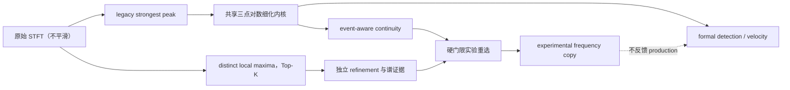

# TASK-018B：稳健自动起跳候选与连续性辅助多候选脊线分析报告

*项目：DPS Studio；分支：`codex/feature/task-018-auto-analysis`；评估日期：2026-08-11；内部计算统一使用 SI 单位。*

---

## 🎯 结论

TASK-018B 已完成，但实验性 continuity-assisted reselection 没有进入 production。GUI 的默认自动起跳候选现在来自 `StreamEventCandidates.primary_candidate_time_s`；旧 3-frame compatibility candidate 继续保留用于审计，但不再抢占默认候选。用户仍须显式点击采用，系统不会把候选静默写成正式 `event_reference_time_s`。

四个 raw shot × 两个通道的真实 A/B 只建议重选一帧：`20260630-1.csv / pdv_channel_2 / frame 1015`。该帧实际存在 rank-2 局部峰，离散频率为 `214.843749926737 MHz`，三点对数细化后为 `211.379347724094 MHz`。它不位于预设的 220–240 MHz 区间内，但相对前后帧 `218.971327646855 / 234.568781700846 MHz` 明显更连续，同时谱证据满足实验门限。因此实验副本从 `508.751027843821 MHz` 重选为 `211.379347724094 MHz`。

证据仍不足以把该规则提升为 Automatic production：只有 4 个 shot、1 个重选帧，没有独立物理标定或人工真值。推荐继续作为诊断实验，扩充带标注数据后再单独作 promotion 决策。

## 🧭 数据流与语义边界



Automatic production 路径仍是：STFT → 搜索带内 strongest peak → sub-bin refinement → spectral quality → formal signal detection → apparent velocity。新增对象只在无 Guided corridor 的 Automatic 分析中构建；Guided 的 corridor 几何、峰搜索、结果语义及 NaN 行为均未改变。

`background_guard_window_scale` 仍未接入真实 spectral-quality guard。本任务没有改变其算法作用，只记录为遗留 unused/deprecated 候选，避免无验证地修改 production 阈值。

## 🖥️ GUI、候选与正式 reference

GUI 当前显示并允许采用的是 event-level primary，而不是 compatibility candidate。若 primary 缺失但 compatibility 存在，界面明确显示“较弱诊断，此处不可采用”，不会把 compatibility 冒充 primary。候选按钮发出的 provenance 为 `user_adopted:automatic_primary:<channel>`。

三份真实 GUI smoke 均通过 Automatic、显式采用、`RESULT_READY`、formal velocity、Guided 和 Export：

| Shot / channel 1 | Compatibility (µs) | Primary / GUI 默认 (µs) | Primary − compatibility (µs) | Finite formal velocity frames |
|---|---:|---:|---:|---:|
| `20260607.csv` | 554.081854260 | 554.664254260 | 0.582400000 | 392 |
| `20260701.csv` | 656.402466340 | 656.844066340 | 0.441600000 | 341 |
| `20260630-1.csv` | 746.117214991 | 746.222814991 | 0.105600000 | 820 |

完整 4 × 2 event candidate 对比：

| Shot | Channel | Compatibility (µs) | Primary (µs) | 差值 (µs) |
|---|---|---:|---:|---:|
| `20260607.csv` | ch1 | 554.081854260 | 554.664254260 | 0.582400000 |
| `20260607.csv` | ch2 | 554.667454260 | 554.667454260 | 0 |
| `20260630-1.csv` | ch1 | 746.117214991 | 746.222814991 | 0.105600000 |
| `20260630-1.csv` | ch2 | 746.194014991 | 746.222814991 | 0.028800000 |
| `20260630-2.csv` | ch1 | 540.215650320 | 540.215650320 | 0 |
| `20260630-2.csv` | ch2 | 540.215650320 | 540.215650320 | 0 |
| `20260701.csv` | ch1 | 656.402466340 | 656.844066340 | 0.441600000 |
| `20260701.csv` | ch2 | 656.844066340 | 656.844066340 | 0 |

`automatic_event_candidate_time_s` 是自动分析提出的 primary candidate；`event_reference_time_s` 是 session 真正采用的 reference。两者允许不同，前者不会自动覆盖后者。配置 reference、用户采用 primary 和无 reference 分别通过 `configuration/config`、`user_adopted:automatic_primary:<channel>` 和 JSON `null` 表达；不猜测来源。

GUI smoke 记录见 [`gui_smoke.json`](../artifacts/task018b/gui_smoke_run/gui_smoke.json)。

## 📦 Metadata v3 与正式导出

现有 metadata 顶层新增四个字段，原有 STFT、quality、ridge、wavelength、analysis range、source、result counts 和 display semantics 字段均保留：

```json
{
  "automatic_event_candidate_time_s": 0.0006568440663402226,
  "compatibility_event_candidate_time_s": 0.000656402466340072,
  "event_reference_time_s": null,
  "event_reference_source": null
}
```

前两个值分别直接来自 `StreamEventCandidates.primary_candidate_time_s` 和 `SignalDetectionResult.detected_event_candidate_time_s`。后二者保留 session 已采用 reference 及 provenance 的原语义。没有 primary/compatibility 时写 `null`，不使用 analysis start、另一通道或默认常量填充。

由于正式 metadata schema 增加了稳定字段，版本由 `pdv-studio-formal-result-v2` 递增为 `pdv-studio-formal-result-v3`。变更是加法式的，旧字段没有删除或重命名。Case A（候选存在但未采用）、B（用户采用 primary）、C（配置 reference 可与 primary 不同）、D（两个候选均不存在）均有自动化测试。

真实 `20260701.csv / pdv_channel_1 / automatic` 导出位于 [`formal_export`](../artifacts/task018b/assessment/formal_export)，目录中严格只有：

- `20260701_ch1_auto.csv`
- `20260701_ch1_auto_detail.csv`
- `20260701_ch1_auto.metadata.json`

metadata JSON 数量为 1，没有 `event.json`、`onset.json` 或任何第四个正式 JSON。该次导出没有已采用 reference，所以 `event_reference_time_s` 与 `event_reference_source` 均为 `null`；automatic 与 compatibility candidate 则保留实际模型值。

## 🔬 多候选模型与实验重选

每个 Automatic STFT frame 的 immutable `LocalPeakCandidateResult` 以显式上限保存 distinct local maxima。单个 candidate 至少包含：bin index、离散频率、幅值、幅值 rank、细化频率、细化状态、bin offset、独立 background/competitor、两个 dB 对比和谱质量状态。

局部峰由 `scipy.signal.find_peaks` 直接作用于未平滑的搜索带幅值；plateau 只表示一次。没有 filtering、resampling、插值、平滑或无限制保留噪声峰。相同幅值按较低 bin index 确定性排序。

alternative 与 legacy 共用唯一的 `refine_three_point_log_magnitude` 内核。失败时保留明确的 `BOUNDARY_PEAK`、`INVALID_LOCAL_PEAK` 或 `OFFSET_OUT_OF_RANGE`，`refined_frequency_hz` 和 offset 为 NaN；离散频率不会冒充细化值。

每个 candidate 独立计算谱证据。对于 rank-2/rank-3，rank-1 如果位于 guard 之外，会自然成为 strongest competitor。实验门限没有为了 alternative 降级：

- peak/background ≥ 6 dB；
- peak/competitor ≥ −6 dB，即 alternative 幅值不得比 strongest 低超过 6 dB；
- refinement 必须成功；
- legacy continuity 必须是 `ISOLATED_JUMP`；
- candidate 必须同时比 legacy 更接近前一帧和后一帧；
- 两侧距离必须不超过既有 `neighbor_recovery_tolerance_hz`；
- `|t_i - t_event| <= window_duration / 2` 的 event transition 一律保护；
- 不跨 gap，不填 NaN，不使用加权总分。

多个 candidate 同时通过时，只按透明的字典序选择：最小化两侧最大距离，再最小化距离和，最后使用 amplitude rank。所有谱证据与连续性证据仍分字段保存。

K=2、3、5 在全部 8 条真实通道上找到相同的唯一可重选帧。最终实验默认采用 K=3：K=2 已覆盖该 alternative，K=3 多保留一个有审计价值的峰；K=5 只增加低 competitor-contrast 的噪声尾峰，没有增加重选覆盖。

## 🧪 Frame 1015 与全量 A/B

`20260630-1.csv / pdv_channel_2 / frame 1015` 的真实证据如下：

| 项目 | Legacy rank-1 | Alternative rank-2 | Rank-3 |
|---|---:|---:|---:|
| Discrete frequency (MHz) | 507.812499827 | 214.843749927 | 302.734374897 |
| Refined frequency (MHz) | 508.751027844 | 211.379347724 | 307.439973808 |
| Magnitude | 0.0053090611 | 0.0043703728 | 0.0024695850 |
| Peak/background (dB) | 33.1433 | 31.4533 | 26.4954 |
| Peak/competitor (dB) | 1.6900 | −1.6900 | −6.6479 |
| Distance to previous (MHz) | 289.7797 | 7.5920 | 88.4686 |
| Distance to next (MHz) | 274.1822 | 23.1894 | 72.8712 |
| 实验结论 | legacy selected | reselected | competitor gate 拒绝 |

前后帧恢复差为 `15.597454 MHz`，既有 recovery tolerance 为 `52.083333 MHz`。rank-2 同时通过独立谱门限、refinement、两侧连续性和 event protection 检查，因此实验结果建议重选。它是一个真实局部峰，但“更连续”不等于“物理真值”；其 branch identity 仍需独立实验确认。

全量结果：legacy isolated jump 共 1 帧，experimental reselection 共 1 帧，位置就是上述 frame 1015。K=2/3/5 均一致，其余 7 条通道为 0。真实全局+局部 A/B 图见 [`20260630-1__pdv_channel_2__frame_1015.png`](../artifacts/task018b/assessment/figures/20260630-1__pdv_channel_2__frame_1015.png)。

开发产物：

- [`candidate_assessment.csv`](../artifacts/task018b/assessment/candidate_assessment.csv)
- [`reselection_assessment.csv`](../artifacts/task018b/assessment/reselection_assessment.csv)
- [`event_candidate_comparison.csv`](../artifacts/task018b/assessment/event_candidate_comparison.csv)
- [`assessment.json`](../artifacts/task018b/assessment/assessment.json)

这些文件仅是 development artifacts，不属于正式 production export。

## ✅ 稳定性、测试与完整性

TASK-018A 的 8 份 `.npz` 基线用于逐元素比较。以下内容在全部 4 × 2 通道上完全相同：time axis、coarse ridge、refined candidate、formal refined frequency、signal state、formal apparent velocity、display velocity、NaN mask 和 compatibility event candidate。`all_production_results_unchanged = true`。

Guided smoke 明确验证：Guided 仍可到达 `RESULT_READY`，且 `local_peak_candidates` 与 `experimental_reselection_result` 均为 `None`。两个通道仍分别执行 STFT、candidate、event、ridge、velocity 和 continuity；没有融合、平均或 final channel。

质量门结果：

| 检查 | 结果 |
|---|---|
| `python -m pytest --basetemp=.pytest_tmp/task018b_final` | 479 passed，1 failed；唯一失败为既有 `test_cli` 把 pytest 的 `--basetemp` 传给 `cli.main()`；另有 2 条既有 `.test_tmp/pytest_cache` 权限 warning；未修改无关 CLI |
| `python -m ruff check .` | 通过；退出码 0，另报告若干既有不可访问临时目录的遍历 warning |
| `python -m mypy src/dps_studio` | 通过 |
| `git diff --check` | 通过 |
| 真实 GUI smoke | 3/3 shot 通过 Automatic、primary、采用、reference、velocity、Guided、Export |
| 正式导出 | 3 个文件、1 个 metadata JSON、schema v3 |

raw 文件在开始、A/B、GUI smoke 和结束时的 SHA-256 保持一致：

| 文件 | SHA-256 |
|---|---|
| `.gitkeep` | `F1945CD6C19E56B3C1C78943EF5EC18116907A4CA1EFC40A57D48AB1DB7ADFC5` |
| `20260607.csv` | `AB9F656E3563AB96D0E842DB88510076F6368E246853FD3427D8FD7DB68F7353` |
| `20260630-1.csv` | `203B182E477E1E08214551977A00313EAF6F17A71391D83875F6F879DC3A0A74` |
| `20260630-2.csv` | `C0C31B2990EAE228B21594276D030B83600A7DDB98C1953842E4CB80C17FA261` |
| `20260701.csv` | `5CCB6530E0CC715E4A7A81327C625FCE267A8B3473C0487479366EAD9D9A952A` |

仓库仍位于 `codex/feature/task-018-auto-analysis`，HEAD 为 `9d51a46e81915abf62694dd745c35f05c7462067`。本任务未 reset、stash、merge、rebase、commit 或 push；`data/raw` 无工作树改动。`.gitignore` 增加 `.pytest_tmp/`，防止后续测试临时目录继续进入状态输出；既有 TASK-018A tracked 内容未删除。

## 📋 24 项审计回答

| # | 回答 |
|---:|---|
| 1 | GUI 当前使用 event-level primary。 |
| 2 | 真实差异见 4 × 2 表；最大差为 `20260607 ch1` 的 0.5824 µs。 |
| 3 | 在现有 `.metadata.json` 顶层增加 automatic、compatibility、reference、source 四字段。 |
| 4 | 正式导出仍只有一个 metadata JSON。 |
| 5 | automatic 字段唯一来源是 `StreamEventCandidates.primary_candidate_time_s`。 |
| 6 | automatic 是建议候选；reference 是 session 真正采用的值，可不同或为空。 |
| 7 | immutable、逐帧、Top-K local-peak candidate model。 |
| 8 | 对未平滑 search-band magnitude 使用 distinct local maxima；plateau 只算一次。 |
| 9 | 评估 K=2/3/5，最终实验默认 K=3。 |
| 10 | frame 1015 有 rank-2 真实峰：214.844 MHz discrete / 211.379 MHz refined，实验建议重选。 |
| 11 | experimental reselection 总数为 1。 |
| 12 | `20260630-1.csv / pdv_channel_2 / frame 1015`。 |
| 13 | 工程上它与前后帧均更连续，距离为 7.592/23.189 MHz。 |
| 14 | branch 物理身份、门限可迁移性和更大样本仍需实验确认。 |
| 15 | legacy production 在 8 条真实通道上逐元素保持。 |
| 16 | Guided 保持，Automatic candidate 系统未进入 Guided。 |
| 17 | pytest 479 passed；仅既有 CLI argv 问题 1 failed。 |
| 18 | Ruff 通过。 |
| 19 | mypy 通过。 |
| 20 | 三份指定真实数据 GUI smoke 全通过。 |
| 21 | raw SHA-256 见完整性表，前后不变。 |
| 22 | diff 仅包含 TASK-018B 代码、测试、工具、报告、开发产物及 `.gitignore`。 |
| 23 | status 保持未提交；无 staged change、无 raw change。 |
| 24 | 不建议立即 promotion；当前只有一个成功真实案例，证据不足。 |

## 🚦 后续建议

不要在本任务内把 experimental frequency 接入 formal detection 或 apparent velocity。下一步应先收集更多人工复核/独立标定的 isolated-jump 案例，冻结候选峰身份与误选代价，再对 `6 dB / −6 dB / recovery tolerance` 做预注册式验证。只有跨 shot、跨通道、跨参数仍保持低误选率，才适合开启独立的 production promotion 任务。
