# TASK-018C：Automatic 连续性算法正式接入与 STFT 窗口函数预设

*审计对象：`DPS_Studio` / `dps_studio`；分支 `codex/feature/task-018-auto-analysis`；基线提交 `4aeb57526c4c96a7917004d92039f06cda6757aa`；真实数据验收日期 2026-08-11。*

---

## 📌 结论摘要

TASK-018C 已把“事件感知的连续性辅助局部候选峰重选”接入 Automatic 正式结果，默认模式为 `continuity_assisted`；`legacy_strongest_peak` 完整保留并可在 GUI 中一键切回。新默认相对 TASK-018B legacy production 在 4 个真实 shot × 2 个通道中只改变 1 帧，即 `20260630-1.csv / pdv_channel_2 / frame 1015`。

该帧正式频率由 legacy 的 `508.75102784382087 MHz` 改为 rank-2 的 `211.37934772409430 MHz`，状态由 `AMBIGUOUS_PEAK` 改为 `MEASURED`，正式表观速度由 `NaN` 改为 `163.81899448617307 m/s`。速度由 core physics 公共 API 计算，没有在 GUI 中复制 `v = λf/2`。

Hann、Hamming、Blackman、Blackman-Harris、Boxcar 五种 SciPy 稳定窗口名均可配置和实际运行，默认仍为 Hann。Boxcar 在本次真实数据范围内产生最多的 ridge 差异、ambiguous frames 和 continuity reselections，并在最极端样本中使 event candidate 比 Hann 提前 `2259.2 ns`；它仅适合作为无加权诊断对照，不能据此宣称降噪更好。

## 🧭 正式数据流

```mermaid
flowchart LR
  accTitle: Automatic continuity-assisted production data flow
  accDescr: The strongest-peak path remains the baseline. Only validated isolated jumps may select an existing alternative peak before formal quality gating and public apparent-velocity conversion.

  stft["STFT<br/>explicit window"] --> strongest["Legacy strongest peak<br/>coarse and refined"]
  strongest --> primary["Event-level primary candidate"]
  strongest --> continuity["Event-aware continuity diagnostic"]
  stft --> candidates["Top-K local peaks<br/>K = 3"]
  primary --> continuity
  continuity --> reselection["Isolated-jump candidate gates"]
  candidates --> reselection
  strongest --> formal_selector["Formal selector"]
  reselection --> formal_selector
  formal_selector --> provenance["Formal ridge plus origin and rank"]
  provenance --> quality["Formal spectral and signal-state gates"]
  quality --> velocity["Core physics public API<br/>apparent velocity"]
  velocity --> export["GUI display and one metadata JSON"]

  classDef source fill:#e8f1fb,stroke:#356a9a,color:#102a43
  classDef decision fill:#fff3cd,stroke:#9a7410,color:#4b3900
  classDef result fill:#e6f4ea,stroke:#347a45,color:#173f23
  class stft,strongest,candidates source
  class primary,continuity,reselection,formal_selector,quality decision
  class provenance,velocity,export result
```

Guided 分析继续使用其独立 corridor 路径，不生成 Automatic 的 local-peak candidate 或 experimental reselection，也不把 Automatic 结果回灌到 Guided。

## ⚙️ 正式模式、规则与参数

正式枚举包含：

- `continuity_assisted`：默认；以 strongest peak 为常态，只允许在严格门控下重选已有局部候选峰。
- `legacy_strongest_peak`：每帧始终使用搜索频带内最强峰，作为回归基线、科研比较与故障退路。

production rescue 仅处理现有 event-aware continuity 已标记为 `ISOLATED_JUMP` 的帧，并同时要求：候选 refinement 成功、谱学证据达标、相对 strongest 不过弱、比 legacy 更接近前后两个有效邻帧、两侧距离在 recovery tolerance 内、不处于 `EVENT_TRANSITION`、不跨 NaN gap。失败时保留原质量状态或 `NaN`；不进行插值、平滑、过滤、前后填充、全局路径优化或强制 rank-2。

| 参数 | production 值 | 来源与说明 |
|---|---:|---|
| `mode` | `continuity_assisted` | 正式配置，GUI 默认 |
| `top_k_candidates` | 3 | TASK-018B 的 K=2/3/5 对比结论；K=3 保留额外诊断峰而未扩大有效重选 |
| `continuity_reselection_enabled` | `true` | 可序列化开关 |
| `minimum_candidate_peak_to_background_db` | `10.0 dB` | 从 experimental `6 dB` 收紧到现有正式 background 门槛 |
| `minimum_candidate_relative_to_strongest_db` | `-6.0 dB` | 保留 TASK-018B 显式阈值 |
| `recovery_tolerance_hz` | 每次运行解析 | 默认取 `sample_rate_hz / window_length_samples`；本次 frame 1015 为 `52.08333331557261 MHz` |

event-level primary 继续读取既有正式配置：最少 8 帧、最短 `20 ns`、相邻频率步进不超过 `100 MHz`。新代码没有复制这些 magic numbers。

## 🔬 真实 frame 1015 回归

`20260630-1.csv / pdv_channel_2 / frame 1015` 在 strongest 路径中仍被识别为孤立跳变。rank-2 alternative 的 peak/background 为 `31.453321757965877 dB`，高于 production 的 `10 dB`；相对 strongest 为 `-1.68998476502356 dB`，高于 `-6 dB`。因此它仍满足更严格的 production rescue。

| 字段 | Legacy | Continuity-assisted production |
|---|---:|---:|
| frame | 1015 | 1015 |
| `time_s` | `0.0007472116149911109` | 相同 |
| selected rank | 1 | 2 |
| refined frequency | `508751027.84382087 Hz` | `211379347.72409430 Hz` |
| signal state | `ambiguous_peak` | `measured` |
| formal apparent velocity | `NaN` | `163.81899448617307 m/s` |
| selection origin | `strongest_peak` | `continuity_assisted_alternative` |

detail CSV 的该行同时保存 `ridge_selection_origin=continuity_assisted_alternative` 与 `selected_candidate_rank=2`；metadata 保存本次 `continuity_reselection_count=1`。

## 📊 4×2 production 逐帧差异

验收先在代码改动前保存了 4 个真实 shot × 2 个通道的 TASK-018B legacy baseline，再分别运行 `legacy_strongest_peak` 与新默认 `continuity_assisted`。8 条 legacy 输出与基线逐数组相等；新默认相对 legacy 的 changed frames 总数为 1。

| source | channel | frame | time_s | legacy frequency (Hz) | continuity frequency (Hz) | legacy state | continuity state | legacy velocity (m/s) | continuity velocity (m/s) | rank | reason |
|---|---|---:|---:|---:|---:|---|---|---:|---:|---:|---|
| `20260630-1.csv` | `pdv_channel_2` | 1015 | `0.0007472116149911109` | `508751027.84382087` | `211379347.72409430` | `ambiguous_peak` | `measured` | `NaN` | `163.81899448617307` | 2 | `reselected` |

完整机器可读证据位于 [`production_changed_frames.csv`](../artifacts/task018c/assessment/production_changed_frames.csv) 和 [`legacy_baseline_verification.csv`](../artifacts/task018c/assessment/legacy_baseline_verification.csv)。这证明变更范围是局部且可枚举的；它不证明被选分支在所有实验条件下都具有物理正确性。

## ⏱️ Event candidate 与 reference 语义

Automatic 默认起跳候选继续使用 `StreamEventCandidates.primary_candidate_time_s`，没有恢复为 3-frame compatibility candidate。对 Hann / `20260630-1 / ch2`：

- `automatic_event_candidate_time_s = 0.0007462228149907737 s`
- `compatibility_event_candidate_time_s = 0.0007461940149907639 s`
- `event_reference_time_s = null`
- `event_reference_source = null`

automatic candidate 只用于 Automatic onset diagnostic、event context 与 event-aware continuity protection；它不会静默覆盖正式 `event_reference_time_s`。reference 仍只来自用户显式采纳或明确实验配置，GUI 的采纳动作继续保留。

## 🪟 STFT 窗口预设与实测

内部仅接受 SciPy 兼容稳定名 `hann`、`hamming`、`blackman`、`blackmanharris`、`boxcar`；非法值明确报错，不 fallback 到 Hann。窗口 override 只改变 `window_name`，不联动 window length、overlap、hop、nfft、搜索频带、质量门、连续性门、波长或 event 参数。所有既有 profile 的明确默认均为 Hann；切换 profile 会恢复该 profile 默认窗口，随后手动选择才形成当前 run 的唯一 window override。

真实评估覆盖 `20260607.csv`、`20260701.csv`、`20260630-1.csv` 的两个通道，共 30 次运行。除窗口外参数完全一致。下表是六条通道运行的汇总计数；`ridge difference vs Hann` 按 frame 计数。

| Window | MEASURED | NaN | Reselections | Finite velocity | Ambiguous | Boundary | Ridge difference vs Hann |
|---|---:|---:|---:|---:|---:|---:|---:|
| Hann | 3015 | 2579 | 1 | 3015 | 599 | 1550 | 0 |
| Hamming | 3155 | 2439 | 2 | 3155 | 673 | 1137 | 3819 |
| Blackman | 2883 | 2711 | 1 | 2883 | 545 | 1929 | 3532 |
| Blackman-Harris | 2772 | 2822 | 1 | 2772 | 509 | 2128 | 3532 |
| Boxcar | 3798 | 1796 | 39 | 3798 | 793 | 0 | 5579 |

相对 Hann，Blackman 与 Blackman-Harris 的 event primary 最大偏移为 `3.2 ns`，Hamming 最大绝对偏移为 `57.6 ns`，Boxcar 的偏移范围为提前 `3.2 ns` 到 `2259.2 ns`。在 `20260630-1 / ch2`，Boxcar primary 为 `0.0007440756149900415 s`，而 Hann 为 `0.0007462228149907737 s`；Boxcar 同时产生 39 次重选和 793 个 ambiguous frames。它明显更易给出不同 branch/onset，但没有外部实验 reference，不能把差异直接判为物理错误或把更多 MEASURED 判为更好降噪。

完整 30 行指标在 [`window_comparison.csv`](../artifacts/task018c/assessment/window_comparison.csv)，真实数据 ridge overlay 与 quality-count 图在 [`window_comparison/`](../artifacts/task018c/assessment/window_comparison/)。这些 artifacts 只用于开发比较，不参与算法输入。

## 🖥️ GUI、状态失效与 Guided 回归

GUI 新增两个简洁 selector：

- 窗口函数：Hann、Hamming、Blackman、Blackman-Harris、矩形窗（Boxcar），默认 Hann；tooltip 明确 Boxcar 是无加权诊断基线且泄漏特性不同。
- 自动脊线提取：连续性辅助、传统最强峰，默认连续性辅助；命名未使用 AI、Smart 或 Intelligent。

切换窗口会使 STFT、ridge、quality、velocity、Guided 旧结果和 export validity 全部失效。切换 Automatic extraction mode 会保留同一 STFT 对象，只使 ridge 及所有下游结果、Guided 和 export validity 失效。测试确认旧结果不会继续冒充当前参数结果。

离屏真实 GUI smoke 覆盖：

- Hann + continuity-assisted：frame 1015 正式重选，`163.81899448617307 m/s`。
- Hann + legacy：frame 1015 恢复 `508.75102784382087 MHz` 与 `NaN` velocity。
- Blackman-Harris + continuity-assisted：完整 Automatic workflow 与 export 可运行。
- Hamming + continuity-assisted：STFT、ridge、velocity 与 export 可运行。
- Hamming + Guided：结果 ready，427 个有限速度点，Automatic candidate/reselection diagnostics 均不存在。
- `python -m dps_studio.gui`：入口启动后稳定存活 5 秒；随后只终止本次 probe 进程。

机器可读 smoke 结果见 [`gui_smoke.json`](../artifacts/task018c/gui_smoke/gui_smoke.json)。

## 📦 正式导出与 provenance

每次正式导出仍只有三份文件：simple CSV、detail CSV、唯一 `.metadata.json`，没有拆分出 continuity/window/ridge/event JSON。simple CSV 维持简洁的时间与显示速度；detail CSV 新增 `ridge_selection_origin` 和 `selected_candidate_rank`。

TASK-018C 独立验收时把新增稳定字段对应的 schema 从 v3 升到 `pdv-studio-formal-result-v4`；验收 artifact 仍保存这份 v4 输出。随后同一共享工作树中并行叠加的任务外速度修正改动把当前综合 schema 继续升到 v5。v5 不是 TASK-018C 的版本决策，本报告以 [`v4 metadata`](../artifacts/task018c/assessment/formal_export/20260630-1_ch2_auto.metadata.json) 作为本任务的可复核验收证据。

Automatic metadata 的 `automatic_ridge_selection` 保存：mode、K、enabled、两项谱学阈值、解析后的 recovery tolerance、tolerance 来源、selection method 和实际 reselection count。既有 `stft_configuration.window_name`、automatic candidate、compatibility candidate、event reference 与 reference source 均保留。Guided 导出中该 Automatic 配置为 `null`，避免混淆路径语义。

## ✅ 测试与质量门

TASK-018C 新增或扩展的测试覆盖：legacy 精确回归、可信 isolated jump 重选、弱 alternative 拒绝、event transition 禁止重选、gap 不补、无 candidate 不造速度、provenance；五种窗口配置/实算/shape/参数不联动/metadata/非法值拒绝；GUI 默认、selector、invalidation、profile precedence、Guided 与 export；真实 frame 1015。

最终质量命令及状态：

| 命令 | 状态 |
|---|---|
| `python -m pytest --basetemp=.pytest_tmp/task018c_final` | `517 passed, 3 failed`；见下文归因 |
| TASK-018C 回归集合 | `141 passed` |
| 当前正式导出/并行速度修正针对性测试 | `33 passed` |
| `python -m ruff check .` | passed；仅报告历史不可访问 cache 目录 warning |
| `python -m mypy src/dps_studio` | passed，75 source files |
| `git diff --check` | passed；仅有 Git 的 LF/CRLF 提示 |

任务说明预告的 `tests/unit/test_package.py::test_cli` 仍会把 pytest 自身的 `--basetemp` 传给 CLI argparse 并触发 `SystemExit: 2`；本任务没有为此做无关 CLI 重构。其余 2 个失败来自同一共享工作树中并行出现的任务外速度修正改动：保护路径测试检测到 `scripts/production_outputs.py` 被修改；一个旧 signal-detection 断言仍要求 measured display velocity 等于 apparent velocity，而并行代码已将 display 切到独立 corrected velocity。TASK-018C 的 141 项隔离回归全部通过。

## 🔐 Raw 数据与 Git 审计

`data/raw` 在开始、production/window/GUI 实测后再次计算 SHA-256，before/after 完全一致：

| 文件 | SHA-256 |
|---|---|
| `.gitkeep` | `F1945CD6C19E56B3C1C78943EF5EC18116907A4CA1EFC40A57D48AB1DB7ADFC5` |
| `20260607.csv` | `AB9F656E3563AB96D0E842DB88510076F6368E246853FD3427D8FD7DB68F7353` |
| `20260630-1.csv` | `203B182E477E1E08214551977A00313EAF6F17A71391D83875F6F879DC3A0A74` |
| `20260630-2.csv` | `C0C31B2990EAE228B21594276D030B83600A7DDB98C1953842E4CB80C17FA261` |
| `20260701.csv` | `5CCB6530E0CC715E4A7A81327C625FCE267A8B3473C0487479366EAD9D9A952A` |

未执行 reset、stash、discard、rebase、merge、commit 或 push。最终 `git diff` 和 `git status` 包含 TASK-018C 文件，也包含本任务执行期间同一共享工作树并行出现的速度修正文件；后者未被本任务回滚、覆盖或计入 TASK-018C 成果。`data/raw` 无状态变化。

## 🧾 结论分类

### 必须修正

TASK-018C 范围内未发现需要在继续开发前修正的 production regression。当前综合工作树仍有上述 2 个任务外速度修正失败；其所属任务必须在形成可发布综合快照前收敛代码/测试语义。它们不能在 TASK-018C 中通过回滚用户并行改动或无关重构来“修绿”。已知 CLI/pytest argv 失败继续单独跟踪。

### 建议优化

未来可在获得独立实验 reference 后，为窗口比较增加 branch-level 物理标注；也可把 30 条窗口评估固化为可选择运行的 slow regression，但不应放宽当前 rescue gates。

### 暂不处理

持续多帧错误分支、长时间 branch switch、dynamic programming、HMM、Kalman、Bayesian、AI、平滑、过滤、插值、NaN fill、参数化 Kaiser/Tukey、双通道融合、采集与打包均不属于 TASK-018C。

### 未知或需要实验确认

当前真实验证范围仅为 4 个 shot × 2 通道的 production A/B，以及 3 个 shot × 2 通道 × 5 窗口的窗口评估。continuity-assisted 的准确表述是“事件感知的连续性辅助局部候选峰重选”；现有证据不支持声称其物理正确率已被证明、是最优算法或是通用降噪算法。尤其 Boxcar 的早 onset 与更多重选是否对应错误 branch，需要外部实验时标或独立诊断确认。
