# TASK-019A 交互与正式导出修订报告

_PDV Studio · 本地源码、自动测试与真实实验数据验收 · 2026-08-11_

---

## ✅ 必须修正

### 完成结论

TASK-019A 的四类问题均已完成修正。默认正式导出现在使用事件相对时间；绝对实验时间始终保留。Velocity 顶部同时提供“适合分析范围”和“适合结果范围”，且仅该视图隐藏 PyQtGraph 内建 `A`。窗口材料与观测角变更只刷新速度后处理，不再清空结果或使工作流回退。Step 5 与 Step 6 通过同一个 session-level `VelocityCorrectionConfig` 双向同步。

| 验收项 | 最终状态 | 核心证据 |
| --- | --- | --- |
| 时间零点 | 通过 | 默认 `ExportTimeOrigin.EVENT`；简表使用 `time_from_event_s` |
| 绝对时间 | 通过 | detail CSV 保留稳定字段 `time_s` |
| 速度图视图控制 | 通过 | 两个顶部按钮采用不同、严格的 bounds 语义 |
| 修正后处理 | 通过 | generation、STFT、ridge、event、quality 对象均保持 |
| Step 5/6 同步 | 通过 | 两页读写同一个 session config，角度内部为 rad |
| 正式导出一致性 | 通过 | GUI、CSV、metadata 来自同一当前 session 状态 |
| 自动检查 | 通过 | `530 passed`；Ruff、mypy 均通过 |
| 原始数据安全 | 通过 | 前后 SHA-256 完全一致，`git diff -- data/raw` 为空 |

### 修改前的错误 invalidation 根因

源码审计确认，问题并非物理修正 API 本身。修改前，`AnalysisSession.set_velocity_correction_config()` 在替换配置后调用 `_invalidate_downstream()`。该方法同时递增 Automatic/Guided generation，清空 `channel_analyses` 与 `guided_channel_analyses`，并将正式结果标记为无效。随后 `MainWindow._velocity_correction_changed()` 又调用 `_clear_downstream_presentation()` 和 `_sync_workflow_state_after_invalidation()`，所以 GUI 失去 Velocity/Export 能力并回退到需要重新提取 ridge 的状态。

修改后，session setter 改为调用公开 workflow 后处理入口 `configure_channel_velocity_correction()`。该入口只把已有 `apparent_velocity_m_s` 交给正式 `apply_velocity_corrections()`，再用既有 display builder 重建 `display_velocity_m_s` 与 origin。GUI 未复制 LiF 或角度公式。

```mermaid
flowchart LR
    accTitle: Velocity Post-Processing Refresh
    accDescr: Window material or angle changes reuse the current apparent velocity, rebuild only correction and display arrays, refresh views and export, and keep the workflow result ready.

    edit_config([⚙️ Edit correction]) --> session_config[💾 Update session config]
    session_config --> workflow_refresh[🔄 Refresh velocity post-processing]
    stored_apparent[(🔒 Stored apparent velocity)] --> workflow_refresh
    workflow_refresh --> physics_api[⚙️ Apply core corrections]
    physics_api --> display_result[📊 Rebuild display velocity]
    display_result --> refresh_views[🔄 Refresh Velocity and export]
    refresh_views --> result_ready([✅ Keep RESULT_READY])

    classDef action fill:#dbeafe,stroke:#2563eb,stroke-width:2px,color:#1e3a5f
    classDef protected fill:#f3f4f6,stroke:#6b7280,stroke-width:2px,color:#1f2937
    classDef success fill:#dcfce7,stroke:#16a34a,stroke-width:2px,color:#14532d

    class edit_config,session_config,workflow_refresh,physics_api,display_result,refresh_views action
    class stored_apparent protected
    class result_ready success
```



实际保持不变的上游内容包括 `SignalRecord`、analysis range、STFT、ridge/refinement、event candidates、event-aware continuity、signal detection/quality、正式表观速度、Automatic/Guided generation 与结果有效标志。变化范围限定为 `angle_corrected_apparent_velocity_m_s`、`corrected_velocity_m_s`、`display_velocity_m_s`、对应 origin、Velocity/Comparison 绘图和导出预览。

### Step 5 与 Step 6 的单一配置

`AnalysisSession.run_configuration.velocity_correction_config` 是唯一正式数据源。Step 5 的 `windowMaterialCombo` / `measurementAngleDegrees` 和 Step 6 的 `exportWindowMaterialCombo` / `exportMeasurementAngleDegrees` 都先写入该配置，再由 `_sync_velocity_correction_controls()` 使用 `QSignalBlocker` 回填两页控件。

这不是两份配置间复制：任一页面变更都会先更新 session，并基于 session 当前值刷新两页。测试实际覆盖 Step 5 `LiF → None`、Step 6 `None → LiF` 以及角度双向同步。UI 使用 degree，`VelocityCorrectionConfig.measurement_angle_rad` 继续使用 SI rad。

当 `WindowMaterial.NONE` 且角度非零时，最终 corrected velocity 等于 angle-corrected apparent velocity；只跳过窗口修正。NaN mask 保持，未插值、补零、平滑或重跑 quality gate。

### 时间零点与正式输出

新增公开 `event_relative_time_s()`：

```text
time_from_event_s = time_s - event_reference_time_s
```

函数复制输入时间轴进行坐标变换，不修改绝对数组。没有正式 `event_reference_time_s` 时，detail 的相对时间列为 `nan`；若用户仍选择默认事件相对简表，GUI 会禁用导出并明确提示先正式采用事件参考或切换到绝对实验时间。自动候选不会被静默提升为正式参考。

正式 schema 从 `pdv-studio-formal-result-v5` 升级到 `pdv-studio-formal-result-v6`，未引入 migration framework。

| 输出 | 时间字段 | 语义 |
| --- | --- | --- |
| simple CSV，默认 | `time_from_event_s` | 可直接用于以起跳点为零的科研绘图 |
| simple CSV，absolute | `time_s` | 实验绝对时间 |
| detail CSV | `time_s` | 始终保留的绝对正式时间 |
| detail CSV | `time_from_event_s` | 始终存在；无正式参考时为 `nan` |

detail CSV 继续分别保存 `apparent_velocity_m_s`、`angle_corrected_apparent_velocity_m_s`、`corrected_velocity_m_s` 和 `display_velocity_m_s`。simple CSV 的速度列继续是 `display_velocity_m_s`，其每一行与 detail CSV 同源且逐值一致。

metadata 新增的最终结构为：

```json
{
  "time_coordinate": {
    "absolute_time_preserved": true,
    "event_reference_time_s": 0.0007462228149907737,
    "export_time_origin": "event",
    "relative_time_definition": "time_from_event_s = time_s - event_reference_time_s",
    "simple_csv_time_column": "time_from_event_s",
    "detail_csv_absolute_time_column": "time_s",
    "detail_csv_relative_time_column": "time_from_event_s"
  }
}
```

原有顶层 `event_reference_time_s`、`event_reference_source`、`physics` 与 `velocity_correction` 均保留。窗口材料或角度变更后，metadata 写入最终实际 session 配置，不写 GUI 临时文本。

### Velocity 图的最终语义

顶部工具区保留“适合分析范围”，新增“适合结果范围”；两者只操作 Plot ViewBox。

| 控件 | X 轴 | Y 轴 | 不发生的操作 |
| --- | --- | --- | --- |
| 适合分析范围 | 已配置 analysis range；相对显示时减去 event reference | 仅该 X 窗口内、当前可见速度曲线的 finite 值 | 不修改 range、数据或结果，不计算 |
| 适合结果范围 | 当前实际绘制曲线的 finite 时间范围 | 当前可见曲线的 finite 速度值 | 不使用 raw full range，隐藏曲线和 NaN 不参与 |

两条 tooltip 已按任务指定文案提供完整中英文。Velocity 使用 `PlotItem.hideButtons()` 局部永久隐藏内建 `A`；Spectrogram 与 Ridge 的 `buttonsHidden` 仍为 `false`，底层 ViewBox/auto-range API 仍可由顶部按钮使用。

时间零点同时驱动 Velocity 显示：事件模式下横轴为相对起跳时间、事件线在 `x = 0`；absolute 模式下横轴与事件线使用实验绝对时间。该变换仅发生在绘图数组，ROI、analysis range、STFT time 和内部 SI 坐标不变。

### 中英文翻译

全部新增字符串已重新抽取至 `pdv_studio_en.ts` 并编译为 `pdv_studio_en.qm`。`pyside6-lrelease` 最终结果为 `429 finished, 0 unfinished`。测试直接验证下列英文：

- `Fit Analysis Range`
- `Fit Result Range`
- `Time Origin`
- `Event Time = 0`
- `Absolute Experiment Time`
- `Export Velocity Settings`
- 两条任务指定英文 tooltip

### 自动测试与静态检查

按任务要求使用 Conda 环境执行：

```text
conda run -n dps-studio python -m pytest
conda run -n dps-studio ruff check .
conda run -n dps-studio mypy src
```

| 检查 | 结果 |
| --- | --- |
| pytest | `530 passed in 41.80s` |
| Ruff | `All checks passed!` |
| mypy | `Success: no issues found in 76 source files` |
| translations | `429 finished and 0 unfinished` |

Windows 上历史 pytest/temp 目录存在 ACL 拒绝访问，本次通过独立短临时路径运行，没有修改 scientific code 绕过权限。mypy 扫描时打印了这些既有目录的非致命“拒绝访问”warning，但检查退出码为 0，`src` 的 76 个文件全部通过。

专项测试覆盖需求 A–N：相对时间与绝对时间不变、默认/切换导出时间原点、两种 fit、隐藏曲线与 NaN、局部隐藏 `A`、generation/对象身份验证、correction-only 重算、Step 5/6 双向同步、角度同步、GUI/CSV/metadata 一致性和 NaN mask。

### 真实 GUI 验收

`python -m dps_studio.gui` 已用 `dps-studio` 环境真实启动并通过 3 秒启动存活检查，随后正常终止验收进程。完整功能验收使用同一 `MainWindow` 入口的 offscreen QApplication 和真实文件 `data/raw/20260630-1.csv`，执行 Data → Range → STFT → Ridge → Velocity → Review & Export。

最终 [GUI smoke 证据](../artifacts/task019a/gui_smoke/gui_smoke.json) 记录：

- `RESULT_READY` 在修正前后保持
- Step 5 和 Step 6 均停留在当前页面
- Step 6 → Step 5 同步通过
- `None → LiF` 后 corrected velocity 实际改变并恢复 LiF 语义
- Automatic/Guided generation 均不变
- STFT、ridge、refined、event、quality 对象 identity 均不变
- apparent velocity 与 NaN mask 不变
- 默认 simple header 为 `time_from_event_s,display_velocity_m_s`
- detail 同时包含 `time_s` 和 `time_from_event_s`
- metadata 的窗口材料、15° 角度、事件参考和时间原点与 GUI 一致
- Velocity 内建按钮已隐藏，Spectrogram/Ridge 未受影响
- raw 前后哈希一致，`all_passed: true`

验收导出的三件套位于 `artifacts/task019a/gui_smoke/export/`，均为新文件，未覆盖历史输出。

### data/raw 安全

`git diff -- data/raw` 为空。验收前后完整 SHA-256 如下：

| 文件 | SHA-256 |
| --- | --- |
| `.gitkeep` | `F1945CD6C19E56B3C1C78943EF5EC18116907A4CA1EFC40A57D48AB1DB7ADFC5` |
| `20260607.csv` | `AB9F656E3563AB96D0E842DB88510076F6368E246853FD3427D8FD7DB68F7353` |
| `20260630-1.csv` | `203B182E477E1E08214551977A00313EAF6F17A71391D83875F6F879DC3A0A74` |
| `20260630-2.csv` | `C0C31B2990EAE228B21594276D030B83600A7DDB98C1953842E4CB80C17FA261` |
| `20260701.csv` | `5CCB6530E0CC715E4A7A81327C625FCE267A8B3473C0487479366EAD9D9A952A` |

### 实际修改文件

| 类别 | 文件 |
| --- | --- |
| Core export | `src/dps_studio/core/export/__init__.py`<br>`src/dps_studio/core/export/models.py`<br>`src/dps_studio/core/export/time_coordinates.py`<br>`src/dps_studio/core/export/writer.py` |
| Core workflow | `src/dps_studio/core/workflow/__init__.py`<br>`src/dps_studio/core/workflow/display.py` |
| GUI | `src/dps_studio/gui/analysis_session.py`<br>`src/dps_studio/gui/main_window.py`<br>`src/dps_studio/gui/result_views.py` |
| Translation | `src/dps_studio/gui/translations/pdv_studio_en.ts`<br>`src/dps_studio/gui/translations/pdv_studio_en.qm` |
| Tests | `tests/unit/test_formal_result_export.py`<br>`tests/unit/test_task019a_time_and_postprocessing.py`<br>`tests/unit/gui/test_task015a_analysis.py`<br>`tests/unit/gui/test_task015c_r_event_reference_views.py`<br>`tests/unit/gui/test_task016r2_guided_multichannel.py`<br>`tests/unit/gui/test_task017_result_export.py`<br>`tests/unit/gui/test_task019a_interactions.py` |
| Acceptance tool | `tools/smoke_task019a_gui.py` |
| Acceptance artifacts | `artifacts/task019a/gui_smoke/gui_smoke.json`<br>`artifacts/task019a/gui_smoke/export/20260630-1_ch1_auto.csv`<br>`artifacts/task019a/gui_smoke/export/20260630-1_ch1_auto_detail.csv`<br>`artifacts/task019a/gui_smoke/export/20260630-1_ch1_auto.metadata.json` |
| Report | `docs/TASK-019A_REPORT.md` |

未修改 `configs/`、`src/dps_studio/core/physics/`、任何 STFT/ridge/event/quality 算法或 `data/raw/`。

### Git 审计

开始时工作树和 staged diff 均为空，HEAD 为 `5e4b934 新增：（速度修正）新增窗口修正`。最近五条提交为：

```text
5e4b934 新增：（速度修正）新增窗口修正
4aeb575 修改：（起跳检测）优化起跳时间点检测 新增：（脊线算法）增加连续性判断
9d51a46 修改:(GUI)优化起跳点识别
48407dc 修改：（GUI）优化数据导出流程
deb8fa8 修改：（GUI）优化引导模式的通道选择问题，优化自动模式与引导模式的光标
```

完成时 `git diff --cached --stat` 仍为空；未执行 `git add`、commit、push、reset 或 checkout。tracked diff 在写入本报告前为 15 个文件、`1087 insertions(+), 408 deletions(-)`；此外存在本任务新增的 core、测试、工具、报告和验收 artifact 文件。`pdv_studio_en.ts` 的较大文本 diff 来自对全部 GUI Python 源重新运行 Qt `lupdate`，实际新增用户文本为本任务对应条目。

## 💡 建议优化

- 下游若固定读取 v5 simple CSV 的 `time_s`，应根据 metadata 的 `export_schema_version` 与 `simple_csv_time_column` 更新为兼容 v6；detail 的既有 `time_s` 语义未改变
- 后续可在发布说明中明确“事件相对简表需要正式 event reference”；当前 GUI 已提供禁用状态和说明，不会静默采用候选
- 若需要保留人工可视截图，可另做一次有显示设备的可见窗口验收；本任务已完成真实 Qt 启动、真实数据计算与 offscreen 控件/导出验收

## 📋 暂不处理

- 不修改 Rigg 2014 LiF 公式、`b1` / `b2`、角度修正公式或执行顺序
- 不新增窗口材料，不修改 STFT、ridge、continuity、event detection、quality gate 或 Automatic/Guided 科学算法
- 不为 schema v6 创建 migration framework
- 不自动把 automatic candidate 升级为正式 `event_reference_time_s`；继续尊重现有“用户显式采用”语义
- 不隐藏其他图的 PyQtGraph 内建 Auto Range；本任务只处理 Velocity
- 不删除历史 outputs/artifacts，不处理与 TASK-019A 无关的既有目录和权限问题

## 🤔 未知或需要确认

- 无科学实现或验收阻塞项
- 仓库中若干历史 `.task015d_*` / `.test_tmp` 目录仍有 Windows ACL 拒绝访问；本任务没有删除或修改它们。是否统一修复 ACL 或清理这些历史临时目录，需要维护者另行确认
- 本任务没有 stage、commit 或 push。是否将 `artifacts/task019a/gui_smoke/` 的四个验收文件随代码一并纳入版本控制，由维护者在后续 Git 操作时确认
