# TASK-019 — 正式窗口材料修正、PDV 观测角修正与输出 metadata 收尾

_PDV Studio 实施与验收报告 · 2026-08-11_

---

## 📋 结论

TASK-019 已完成。正式计算链现在独立保存表观速度、角度修正表观速度、窗口修正速度和显示速度；默认使用 `LiF`、`0°`，内部角度单位为 rad。三组既有 GUI 正式结果已通过真实 `MainWindow → background adapter → core workflow → export_formal_results` 流程原位重跑，没有另建三套 metadata JSON。

| 验收项 | 结果 |
| --- | --- |
| LiF 模型 | `Rigg2014_Eq16`，`b1=0.7895`，`b2=0.9918` |
| 论文速度单位 | 显式 `m/s → km/s → km/s → m/s` |
| 角度模型 | `v_normal = v_measured / cos(theta)` |
| 默认配置 | `LiF`，`measurement_angle_rad=0.0` |
| 正式输出 | 三组均为 `pdv-studio-formal-result-v5` |
| 完整测试 | `520 passed` |
| 静态检查 | Ruff 与 mypy strict 均通过 |
| raw 数据 | 前后 SHA-256 一致，tracked diff 为空 |

## ✅ 必须修正

### 科学定义与执行顺序

基础表观速度关系保持不变：

```text
v_app = lambda_0 * f_b / 2
```

其中 `lambda_0` 使用 m，`f_b` 使用 Hz，`v_app` 使用 m/s。`apparent_velocity_m_s` 没有被窗口或角度修正覆盖。

正式 LiF 修正采用 Rigg 等针对 1550 nm PDV、[100] LiF 给出的 Eq. (16)：[^1]

```text
u_km_s = 0.7895 * (u_star_km_s ** 0.9918)

u_star_km_s = apparent_velocity_m_s / 1000
corrected_velocity_m_s = u_km_s * 1000
```

没有额外乘除常温折射率 `n0`。角度修正采用视线投影关系：

```text
v_normal = v_measured / cos(measurement_angle_rad)
```

DOI `10.1063/1.4940935` 对应论文的作者是 Lewis J. Lea 和 Andrew P. Jardine，而不是 Prompt 中写出的 C. R. Siviour；代码和 metadata 使用经 DOI 核对后的作者信息与 Eq. (4)。[^2]

```mermaid
flowchart LR
    accTitle: Formal velocity correction chain
    accDescr: Formal PDV processing preserves apparent velocity, applies line-of-sight angle correction before the selected LiF window model, and builds a separate display layer from the corrected result.

    beat_frequency[Beat frequency in Hz] --> apparent_velocity[Apparent velocity in m/s]
    apparent_velocity --> angle_correction[Apply angle projection]
    angle_correction --> window_choice{Window material?}
    window_choice -->|LiF| lif_correction[Apply Rigg Eq. 16]
    window_choice -->|None| window_identity[Keep angle result]
    lif_correction --> corrected_velocity[Final corrected velocity]
    window_identity --> corrected_velocity
    corrected_velocity --> formal_export[Write formal outputs]
    corrected_velocity --> display_velocity[Build display velocity]

    classDef input fill:#f3f4f6,stroke:#6b7280,stroke-width:2px,color:#1f2937
    classDef process fill:#dbeafe,stroke:#2563eb,stroke-width:2px,color:#1e3a5f
    classDef output fill:#dcfce7,stroke:#16a34a,stroke-width:2px,color:#14532d

    class beat_frequency,apparent_velocity input
    class angle_correction,window_choice,lif_correction,window_identity process
    class corrected_velocity,formal_export,display_velocity output
```



组合顺序固定为：

```text
apparent PDV velocity
→ geometrical angle correction
→ selected window correction
→ corrected velocity
```

非零角度与 LiF 的组合在 metadata 中明确标记为可分离工程近似，不声称是经过 Rigg 2014 直接验证的完整斜入射动态折射模型。

### 正式 public API

`dps_studio.core.physics` 新增并公开：

| API | 语义 |
| --- | --- |
| `WindowMaterial` | 仅支持 `LiF` 与 `none` |
| `LiFWindowCorrectionModel` | 集中保存 Rigg 模型常量和来源 |
| `LIF_RIGG_2014_1550NM` | 不可变的正式 LiF 模型定义 |
| `VelocityCorrectionConfig` | `window_material` 与 SI `measurement_angle_rad` |
| `VelocityCorrectionResult` | 三层正式速度数组及波长验证状态 |
| `correct_observation_angle(...)` | 视线投影修正，SI 输入/输出 |
| `correct_lif_window_velocity(...)` | LiF Eq. (16)，显式论文单位转换 |
| `apply_velocity_corrections(...)` | 角度后窗口的统一入口 |
| `velocity_correction_metadata(...)` | 稳定、JSON-ready 的模型 provenance |

`ChannelAnalysis` 保留兼容字段 `refined_velocity_m_s` 作为正式表观速度，并增加只读属性：

```text
apparent_velocity_m_s
angle_corrected_apparent_velocity_m_s
corrected_velocity_m_s
display_velocity_m_s
```

`analyze_profile(...)`、`analyze_configuration(...)` 和 `analyze_stft_results(...)` 接受 `velocity_correction_config`。未显式传入时采用 `VelocityCorrectionConfig()`，即 `LiF` 与 `0 rad`。

### 数值安全、NaN 与质量状态

- `measurement_angle_rad` 必须 finite、`>=0` 且 `<pi/2`
- `NaN`、`inf`、负角、`90°` 和 `>90°` 均被拒绝
- `0 rad` 返回严格 identity 数组值
- 输入速度只允许非负有限值或 `NaN`
- 三层正式速度具有完全一致的 `NaN` mask
- correction 不插值、不平滑、不填补、不将无效帧改成零
- `SignalState` 与 quality flags 不被 correction 修改
- event-pre 零平台只从 corrected velocity 构建 display layer，不进入正式 corrected measurement

### GUI、状态失效与翻译

正式控件位于 Velocity 步骤的右侧参数面板：

| 控件 | 默认值 | 内部值 |
| --- | --- | --- |
| 窗口材料 | `LiF` | `WindowMaterial.LIF` |
| 观测角度 | `0°` | `0 rad` |

GUI tooltip 定义了角度是 PDV measurement line-of-sight 与界面运动法线的夹角，并提示窗口外安装角不必等于界面实际光线角；软件不按 Snell 定律静默推断动态窗口内部角度。非 1550 nm 时 GUI 与结果 metadata 均给出明确警告，不会静默修改波长。

改变窗口材料、观测角或激光波长会递增 generation、清除 automatic/guided 的旧结果并回到可复用 STFT 的状态；旧 corrected velocity 不能继续显示或导出。Velocity 图用两条轻量曲线区分 apparent 与 corrected，比较视图使用 corrected；display 曲线仍独立存在。

`pdv_studio_en.ts` 已从当前 Python 源重新抽取并补齐，`pdv_studio_en.qm` 已重新编译：`410 finished, 0 unfinished`。测试直接验证了新增英文控件和 tooltip。

### metadata 与 CSV

现有 writer schema 从 v4 升为 `pdv-studio-formal-result-v5`。关键新增结构为：

```json
{
  "physics": {
    "vacuum_wavelength_m": 1.55e-6,
    "velocity_relation": "v_app=lambda0*f_b/2"
  },
  "velocity_correction": {
    "execution_order": [
      "apparent_velocity",
      "geometrical_angle_correction",
      "window_correction"
    ],
    "angle": {
      "angle_rad": 0.0,
      "angle_deg_display": 0.0,
      "model": "line_of_sight_projection",
      "snell_law_inference_applied": false
    },
    "window": {
      "enabled": true,
      "material": "LiF",
      "model": "Rigg2014_Eq16",
      "reference_wavelength_m": 1.55e-6,
      "crystal_orientation": "[100]",
      "b1": 0.7895,
      "b2": 0.9918,
      "paper_velocity_unit": "km/s",
      "source_doi": "10.1063/1.4890714"
    }
  }
}
```

`event_reference_time_s`、automatic/compatibility event candidate、STFT、ridge、quality gate、profile、source 和 pre-event display 字段均保留。JSON 没有删除任何字段：顶层 `vacuum_wavelength_m` 虽可由 `physics` 中的值重复得到，但无法确认所有历史消费者已迁移，因此保守保留。

详细 CSV 现在明确分列：

```text
apparent_velocity_m_s
angle_corrected_apparent_velocity_m_s
corrected_velocity_m_s
display_velocity_m_s
```

GUI 简表使用明确的 `display_velocity_m_s`；production script 的两列简表使用明确的 `corrected_velocity_m_s`。旧 `apparent_velocity_diagnostics.csv` 文件名作为稳定诊断契约保留，但文件内部不会混淆 apparent 与 corrected。

### 三组真实正式输出

现有三组结果均在 `artifacts/task018b/gui_smoke_run` 原位更新：

| 数据组 | metadata | event time (s) |
| --- | --- | ---: |
| `20260607` | `20260607_ch1_auto.metadata.json` | `0.0005546642542602401` |
| `20260630-1` | `20260630-1_ch1_auto.metadata.json` | `0.0007462228149907737` |
| `20260701` | `20260701_ch1_auto.metadata.json` | `0.0006568440663402226` |

每组目录仍恰好包含一个 simple CSV、一个 detail CSV 和一个 metadata JSON。三个 JSON 均可解析，均记录 `LiF`、`Rigg2014_Eq16`、`b1`、`b2`、1550 nm、`0 rad/0°`、角度来源、窗口来源和事件时间。

独立 spot-check 使用 `0.7895 * (apparent_m_s / 1000)**0.9918 * 1000`，没有调用 production correction API：

| 数据组 | apparent (m/s) | program corrected (m/s) | independent (m/s) | abs diff (m/s) |
| --- | ---: | ---: | ---: | ---: |
| `20260607` | `1411.9332502790612` | `1111.572576850931` | `1111.572576850931` | `0.0` |
| `20260630-1` | `100.62661039570129` | `80.954823966890984` | `80.954823966890984` | `0.0` |
| `20260701` | `127.60683444741976` | `102.46083794514155` | `102.46083794514155` | `0.0` |

## 💡 建议优化

- 在实验配置获得可靠的压力、密度与加载路径后，可增加“标定范围复核”提示，但不应自动删除现有速度点
- 若未来验证其他波长或材料，应新增独立、有来源的 model definition，不能插值 Rigg 1550 nm 参数或复用 LiF 常数
- 可在确认全部外部消费者迁移到 `physics.vacuum_wavelength_m` 后，再评估删除顶层重复波长字段
- 可在下一次正式 schema 迁移中重命名历史 `apparent_velocity_full_time_reviewed.png`，本任务为避免扩大输出迁移范围而保留旧文件名

这些项目不是 TASK-019 验收阻塞项，本次未实现。

## 📌 暂不处理

- Sapphire、Quartz、PMMA、Diamond 等未验证窗口材料
- arbitrary wavelength interpolation 与 release-isentrope 专用修正
- 斜入射、动态折射率与压缩 LiF 的耦合 Snell ray tracing
- Fresnel reflection、窗口前后表面寄生反射、零速反射峰和 etalon filtering
- LiF EOS、压力、密度、温度反演或不确定度 Monte Carlo
- 新 ridge、continuity、event detector、channel fusion 或 GUI redesign

## ⚠️ 未知或需要实验确认

以下项目在仓库和现有实验记录中不能可靠确认，状态统一为 `unknown / requires experimental confirmation`：

| 实验项 | 状态 |
| --- | --- |
| 实际 PDV 激光中心波长是否严格为 1550 nm | `unknown / requires experimental confirmation` |
| 实际 LiF 晶向是否为 [100] | `unknown / requires experimental confirmation` |
| 实验记录角度是外部安装角还是界面处测量角 | `unknown / requires experimental confirmation` |
| 非零角度经过 LiF 后是否需要耦合折射模型 | `unknown / requires experimental confirmation` |
| 当前数据 release/off-Hugoniot 部分是否允许使用 Rigg correction | `unknown / requires experimental confirmation` |

当前默认运行只表明软件使用了配置值 `1550 nm`、`LiF [100]` 模型和 `0°`；不把这些软件配置解释成实验事实。

## 🔍 验证记录

### 自动测试与静态检查

| 命令 | 结果 |
| --- | --- |
| `conda run -n dps-studio python -m pytest` | `520 passed in 34.40s` |
| `conda run -n dps-studio ruff check .` | `All checks passed` |
| `conda run -n dps-studio mypy src` | `Success: no issues found in 75 source files` |
| production integration subset | `57 passed` |
| offscreen three-shot GUI production run | `all_passed=true` |

直接调用 conda 环境中的 `pytest` entry point 时，Windows 环境没有把仓库根目录加入 import path，两个 `scripts.*` 测试在 collection 阶段报 `ModuleNotFoundError`。改用同一解释器的 `python -m pytest` 后完整收集 520 项并全部通过；没有修改或降低 pytest、Ruff 或 mypy 配置。Ruff 扫描时对历史不可访问临时目录报告 `os error 5` warning，但退出码为 0，项目源文件检查通过。

### raw SHA-256

生产运行前后以及最终复核的哈希一致：

| 文件 | SHA-256 |
| --- | --- |
| `.gitkeep` | `F1945CD6C19E56B3C1C78943EF5EC18116907A4CA1EFC40A57D48AB1DB7ADFC5` |
| `20260607.csv` | `AB9F656E3563AB96D0E842DB88510076F6368E246853FD3427D8FD7DB68F7353` |
| `20260630-1.csv` | `203B182E477E1E08214551977A00313EAF6F17A71391D83875F6F879DC3A0A74` |
| `20260630-2.csv` | `C0C31B2990EAE228B21594276D030B83600A7DDB98C1953842E4CB80C17FA261` |
| `20260701.csv` | `5CCB6530E0CC715E4A7A81327C625FCE267A8B3473C0487479366EAD9D9A952A` |

`git diff --exit-code -- data/raw` 为 clean；没有修改、覆盖或删除 `data/raw`。

### Git 审计

开始前已执行 `git status --short`、`git diff --stat`、`git diff`、`git diff --cached --stat` 和 `git log -5 --oneline`。HEAD 为 `4aeb575`；最近五个提交为 `4aeb575`、`9d51a46`、`48407dc`、`deb8fa8`、`221206e`。

开始时工作树已包含未提交的 TASK-018/TASK-018C 源码、测试与 artifacts 修改，其中部分与本任务需要接入的 workflow/GUI 文件重叠。本任务在原有修改上最小增量实现，没有 reset、checkout、stage、commit 或 push，也没有处理无关文件。最终 tracked worktree 的合并统计为 `45 files changed, 6649 insertions(+), 4873 deletions(-)`；该统计包含进入 TASK-019 前已有的修改，不能当作 TASK-019 独立 diff。cached diff 为空。未观察到需要处理的 `presentation/presentations` tracked deletion。

### TASK-019 实际修改文件

| 范围 | 文件 |
| --- | --- |
| physics core | `src/dps_studio/core/physics/corrections.py`、`models.py`、`__init__.py` |
| workflow | `src/dps_studio/core/workflow/analysis.py`、`config.py`、`display.py`、`models.py` |
| export/production | `src/dps_studio/core/export/writer.py`、`scripts/production_outputs.py`、`tools/smoke_task018b_gui.py` |
| GUI | `analysis_adapter.py`、`analysis_session.py`、`main_window.py`、`result_views.py`、英文 `.ts/.qm` |
| configs | `configs/pdv_studio_defaults.toml`、`configs/demo_dual_profile.toml` |
| tests | `test_velocity_corrections.py`、formal export、production outputs、GUI invalidation/translation/display 与 signal display 契约测试 |
| artifacts | `artifacts/task018b/gui_smoke_run` 下三个既有结果组及既有 `gui_smoke.json` |
| docs | `docs/TASK-019_REPORT.md` |

## 🔗 参考文献

[^1]: Rigg, P. A., Knudson, M. D., Scharff, R. J., & Hixson, R. S. (2014). “Determining the refractive index of shocked [100] lithium fluoride to the limit of transmissibility.” _Journal of Applied Physics, 116_, 033515. https://doi.org/10.1063/1.4890714

[^2]: Lea, L. J., & Jardine, A. P. (2016). “Application of photon Doppler velocimetry to direct impact Hopkinson pressure bar experiments.” _Review of Scientific Instruments, 87_, 023101. https://doi.org/10.1063/1.4940935
