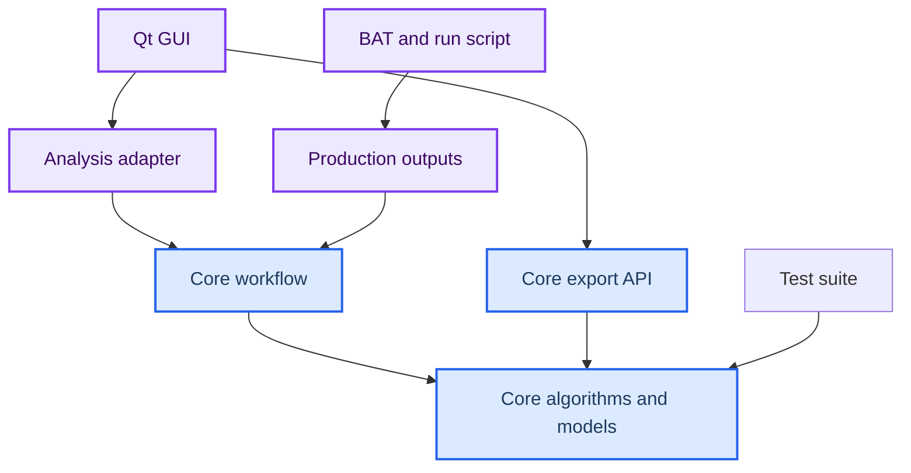

# DPS Studio Project Code Ownership Guide

_基于 2026-08-13 当前工作树的项目接管审计；面向需要逐步亲自掌握源码的项目作者。_

---

## 📋 0. 审计基线与阅读说明

| 项目 | 审计记录 |
| --- | --- |
| 仓库 | `D:\Code\Python_Projects\DPS_Studio` |
| 分支 | `codex/feature/task-018-auto-analysis` |
| HEAD | `3b39efb653c8634c615ed9ef4b368d2c333a2961` |
| 起始工作树 | 干净；无 tracked/untracked/staged 修改 |
| Python | `D:\miniconda3\envs\dps-studio\python.exe`，Python 3.12.13 |
| pytest | 9.1.1；当前收集 530 项 |
| 审计依据 | 当前工作树源码、测试、配置、入口脚本、Git 历史和实际 import/call 关系 |

开始修改前实际执行了 `git status`、`git branch --show-current`、`git log -8 --oneline`、`git diff --stat`、`git diff --cached --stat`。起始 `git status`、普通 diff 和 staged diff 均为空。最近八个提交从 `bb9f3da` 的 GUI 频谱显示一直到当前 `3b39efb` 的窗口修正后处理。

本指南中的 `:Lx-Ly` 只对应上述 commit 加本 TASK 当前工作树。后续改动后，请优先搜索类名、函数名和参数名，不要只依赖旧行号。本文把“代码已经存在”与“代码已经进入正式主链”分开判断；`scripts/` 中能运行的代码不自动等于正式算法。

原始数据在审计前后均按 SHA-256 校验：

| 文件 | SHA-256 |
| --- | --- |
| `data/raw/20260607.csv` | `AB9F656E3563AB96D0E842DB88510076F6368E246853FD3427D8FD7DB68F7353` |
| `data/raw/20260630-1.csv` | `203B182E477E1E08214551977A00313EAF6F17A71391D83875F6F879DC3A0A74` |
| `data/raw/20260630-2.csv` | `C0C31B2990EAE228B21594276D030B83600A7DDB98C1953842E4CB80C17FA261` |
| `data/raw/20260701.csv` | `5CCB6530E0CC715E4A7A81327C625FCE267A8B3473C0487479366EAD9D9A952A` |

## 🎯 1. 这套软件现在到底做什么

DPS Studio 当前是一个“核心数值包 + 正式双 profile 批处理 + 可交互 Qt GUI + 开发/历史审计脚本”的 PDV/DPS 分析项目。它已经能严格读取双通道示波器文本数据，建立不可变 `SignalRecord`，独立计算每个通道的单边 STFT，找谱峰、做三点亚频点精修、计算谱对比度、按质量门判定 `MEASURED`、识别连续测量段、构造双通道/双 profile 事件共识、进行孤立跳点的连续性辅助候选重选、换算表观速度、应用观测角和 LiF 窗口修正，并输出 CSV、metadata JSON 和 PNG。

正式数值主链集中在 `src/dps_studio/core/`；`scripts/production_outputs.py` 是正式批处理的输出编排层，但它不是核心算法定义处。GUI 已接上同一套公开 core API，并非纯占位壳。`python -m dps_studio` 和安装后的 `dps-studio` 目前只处理 `--version`，尚未连接分析或 GUI；真正 GUI 入口是 `python -m dps_studio.gui` 或 `run_pdv_studio_gui.bat`。

### 已进入正式主链

- 严格分隔文本读取与显式列/单位映射
- 不可变双通道 `SignalRecord`
- Hann 等受控窗口的单边、无 padding STFT
- 闭区间频带内最强离散谱峰
- 三点对数幅值二次精修
- 峰—背景、峰—竞争峰对比度与逐帧信号状态
- 连续 `MEASURED` 段和跨通道/跨 profile 事件共识
- 默认启用的 `continuity_assisted` 孤立跳点候选重选
- `v_app = lambda0 * f_b / 2` 的无符号表观速度
- 观测角修正与 Rigg-2014 LiF 窗口修正，三组速度数组分开保存
- GUI 自动/引导分析、正式三文件导出
- BAT 双 profile production tree、manifest、图和简化两列输出

### EXPERIMENTAL 或开发性质

- `reselection.py` 和结果类仍使用 `experimental` 命名，但默认配置会通过 `selection.py` 把通过硬门的替代候选提升为正式 Automatic ridge。这是“命名仍实验、行为已 production”的重要不一致。
- `very_high_time_resolution_experimental` 与 `very_high_frequency_resolution_experimental` profile 明确标注实验性。
- `scripts/compare_real_ridge_refinement.py`、`assess_real_ridge_quality.py`、`assess_real_ridge_diagnostics.py` 及 `tools/assess_task018*.py` 是开发证据工具，不是 GUI 或 BAT 的算法入口。
- guided ridge 的走廊中心在控制点之间线性插值；这是用户约束的几何插值，不是对测量脊线进行平滑。

### NOT IMPLEMENTED 或尚未接入

- `core/preprocessing/` 只有一行占位 `__init__.py`；没有正式 filtering、denoising、resampling 或通用预处理流水线。
- 没有动态规划、Viterbi 或全局路径优化 ridge tracker。
- 没有对两通道原始电压求平均、自动择优或速度融合。
- 没有有符号速度方向恢复；单边实信号 STFT 只产生非负频率。
- `plugins/` 与 `plugins/window_models/` 只有占位文件，运行时没有注册、发现或调用插件。
- `resources/`、`notebooks/` 空；`results/` 仅有 `.gitkeep`，当前没有代码写入。
- packaging 只定义 Hatch wheel 和 console script；没有当前可见的 PyInstaller spec 或安装包构建主链。

## 📁 2. 项目目录地图

```text
DPS_Studio/
├─ configs/
│  ├─ demo_dual_profile.toml
│  └─ pdv_studio_defaults.toml
├─ data/
│  ├─ raw/                         # 原始实验 CSV，绝不能覆盖/删除
│  ├─ reference/legacy/            # 旧软件参考速度
│  ├─ examples/ processed/ synthetic/
├─ docs/                           # TASK 报告、参数审计和本接管指南
├─ scripts/
│  ├─ run_demo_pipeline.py
│  ├─ production_outputs.py
│  ├─ plot_real_stft.py
│  ├─ plot_real_velocity.py
│  ├─ compare_real_ridge_refinement.py
│  ├─ assess_real_ridge_quality.py
│  ├─ assess_real_ridge_diagnostics.py
│  └─ audit_legacy_velocity_reference.py
├─ src/dps_studio/
│  ├─ cli.py  __main__.py
│  ├─ core/
│  │  ├─ analysis_profiles.py  event_candidates.py
│  │  ├─ io/{delimited,models,exceptions}.py
│  │  ├─ models/{signal,exceptions}.py
│  │  ├─ time_frequency/{stft,models,windows,exceptions}.py
│  │  ├─ ridge/
│  │  │  ├─ peak.py  refinement.py  spectral_quality.py
│  │  │  ├─ candidates.py  continuity.py  reselection.py  selection.py
│  │  │  ├─ diagnostics.py  guidance.py
│  │  │  └─ *_models.py  exceptions.py
│  │  ├─ quality/{detection,models}.py
│  │  ├─ physics/{velocity,corrections,models,exceptions}.py
│  │  ├─ workflow/{analysis,config,display,models,quality_parameters}.py
│  │  ├─ export/{writer,models,time_coordinates}.py
│  │  └─ preprocessing/__init__.py  # 占位
│  ├─ gui/
│  │  ├─ app.py  main_window.py  analysis_adapter.py  analysis_session.py
│  │  ├─ data_controller.py  preset_repository.py  import_dialog.py
│  │  ├─ analysis_range.py  ridge_corridor.py  result_views.py
│  │  ├─ raw_signal_view.py  advanced_parameters_dialog.py
│  │  └─ state.py  i18n.py  display_preferences.py  styles.py ...
│  └─ plugins/window_models/__init__.py  # 占位
├─ tests/
│  ├─ unit/                         # 30 个非 GUI test 模块
│  ├─ unit/gui/                     # 14 个 GUI test 模块
│  └─ manual_task016*.py            # 4 个手工验收脚本，不由 pytest 自动收集
├─ tools/                           # TASK-018/019 开发验收和 offscreen GUI smoke
├─ artifacts/                       # Git 跟踪的历史验收证据，不能按 cache 删除
├─ outputs/                         # 被忽略的生产/预览输出，当前包含真实生成物
├─ results/                         # 当前仅占位，不是实际输出入口
├─ run_demo_pipeline.bat
├─ run_pdv_studio_gui.bat
├─ pyproject.toml  environment.yml
└─ README.md  AGENTS.md  .gitignore
```

`src/` 是可安装、可测试、可由 GUI/批处理复用的产品代码；`scripts/` 是仓库内启动器、production 输出编排或一次性开发诊断。依赖方向应为 GUI/脚本 → core，core 绝不能 import GUI。当前 GUI 测试还显式搜索 `src/dps_studio/gui/*.py`，防止它 import `scripts`；core 也未反向依赖 GUI。

`outputs/` 是当前 BAT、预览脚本和旧审计真正使用的生成目录，已被 `.gitignore` 忽略；`results/` 当前没有调用者，仅保留目录。`artifacts/` 则是历史 TASK 的截图、JSON 和验收脚本，996 个文件受 Git 跟踪，属于开发证据而非可随手清除的 cache。

## 🔗 3. 程序入口与真实数据流

### 双击 production BAT

`run_demo_pipeline.bat:L1-L65` 固定使用 `D:\miniconda3\envs\dps-studio\python.exe`，设置 `PYTHONPATH=src`，构造 `outputs/production_runs/run_yyyyMMdd_HHmmss`，再调用 `scripts/run_demo_pipeline.py:L119-L138`。后者载入 `configs/demo_dual_profile.toml`，读取源文件、核对 SHA-256、调用 `scripts/production_outputs.py:run_production_outputs()`，成功后原子更新 `outputs/production_runs/LATEST_RUN.txt`。


纯文本版本：

```text
BAT -> load_workflow_config -> read_delimited_signals -> SignalRecord
    -> compute_stft（每通道独立）
    -> extract_peak_ridge -> refine_peak_ridge_subbin
    -> assess_ridge_spectral_quality -> detect_beat_signal（最强脊线）
    -> build_stream_event_candidates -> assess_event_aware_ridge_continuity
    -> extract_local_peak_candidates -> reselect_isolated_jump_candidates
    -> select_automatic_ridge（正式脊线）
    -> 再评谱质量/信号状态 -> apparent velocity
    -> angle correction -> LiF/none window correction
    -> profile/cross-profile event consensus
    -> production CSV/metadata/manifest/PNG/log/simple exports
```

### GUI 入口

`run_pdv_studio_gui.bat:L1-L28` → `python -m dps_studio.gui` → `src/dps_studio/gui/__main__.py:L1-L5` → `gui.app.main()` → `MainWindow`。`MainWindow.run_stft_analysis()`、`run_staged_automatic_analysis()`、`run_automatic_analysis()` 与 `run_guided_analysis()` 在 `src/dps_studio/gui/main_window.py:L2449-L2588` 构造不可变 `AnalysisRequest`。`src/dps_studio/gui/analysis_adapter.py:L84-L239` 在 `QThreadPool` 中调用 `compute_configuration_stfts()`、`analyze_stft_results()`、`analyze_profile()` 或 `analyze_configuration()`；worker 不触碰任何 `QWidget`。

GUI 参数变化不是全部重算：STFT 参数变化清空 STFT 和下游；频带等下游参数变化可保留 STFT；事件参考、显示零平台和窗口修正可以通过 `src/dps_studio/gui/analysis_session.py:L342-L401`、`L410-L458`、`L665-L739` 只重建对应后处理数组。generation id 防止旧后台任务的迟到结果覆盖新会话，但当前没有真正中断 NumPy/SciPy 运算的 cooperative cancellation。

### Python 包入口

- `python -m dps_studio` → `src/dps_studio/__main__.py:L1-L3` → `cli.main()`
- 安装后的 `dps-studio` → `pyproject.toml:L25-L26` → 同一 `cli.main()`
- `cli.main()` 在 `src/dps_studio/cli.py:L8-L17` 只实现 `--version`，正常调用直接返回 0；目前尚未连接 GUI 或真实分析。

### 旧软件参考审计入口

`scripts/audit_legacy_velocity_reference.py` 是 2934 行的 development-only 工具。它读取 `data/raw/20260607.csv` 与 `data/reference/legacy/legacy_velocity_time.csv`，调用正式 core 的 reader、STFT、峰脊线、精修、谱质量、连续性和表观速度转换，同时在大脚本中自带整数 frame offset 对齐、分批 RFFT 参数网格、量化检查、合成真值、RMSE/相关系数/粗糙度、绘图和 Markdown/JSON 报告。其 `search_integer_frame_offset()` 明确禁止插值和时间拉伸；这些对齐、参数候选和推荐规则没有进入 production core。

## 📊 4. 数据对象及其转换关系

| 对象 | 定义 | 由谁产生 | 关键内容 | 是否不可变 |
| --- | --- | --- | --- | --- |
| `DelimitedSignalLoadResult` | `src/dps_studio/core/io/models.py:L14-L36` | `read_delimited_signals` | source、行数、header、未选列、通道映射 | 是 |
| `SignalRecord` | `src/dps_studio/core/models/signal.py:L28-L185` | reader 或测试 | SI 时间、电压、采样率、均匀性、source | 数组只读 |
| `STFTResult` | `src/dps_studio/core/time_frequency/models.py:L21-L100` | `compute_stft` | frame time、frequency grid、complex spectrum、完整参数 | 数组只读 |
| `RidgeResult` | `src/dps_studio/core/ridge/models.py:L43-L157` | `extract_peak_ridge`/selection | 离散频率、峰值、质量 flag | 数组只读 |
| `RefinedRidgeResult` | `src/dps_studio/core/ridge/models.py:L161-L334` | refinement/selection | 离散与 refined 频率、bin offset、状态 | 数组只读 |
| `SignalDetectionResult` | `src/dps_studio/core/quality/models.py:L90-L301` | `detect_beat_signal` | 正式状态、只在 MEASURED 有值的频率/速度、质量证据 | 数组只读 |
| `VelocityCorrectionResult` | `src/dps_studio/core/physics/models.py:L88-L164` | `apply_velocity_corrections` | apparent、angle-corrected、final corrected 三组数组 | 数组只读 |
| `ChannelAnalysis` | `src/dps_studio/core/workflow/models.py:L30-L172` | `analyze_stft_results` | 一个通道全部中间层和显示层的聚合 | dataclass frozen |
| `AnalysisSession` | `src/dps_studio/gui/analysis_session.py:L133-L803` | GUI | 当前 record/config/cache/result/generation；是状态容器 | 可变会话 |

不要把 `display_velocity_m_s` 等同于测量值。它可在事件前填显示零平台；正式 `apparent_velocity_m_s`、`angle_corrected_apparent_velocity_m_s` 和 `corrected_velocity_m_s` 仍独立保留，质量不可靠位置仍为 NaN。

## 🗂️ 5. 核心代码分级

### Tier 1：必须完全掌握

| 顺序 | 文件 | 为什么必须掌握 |
| ---: | --- | --- |

| 1 | `src/dps_studio/core/workflow/config.py` | 决定 TOML (一种文本配置文件格式) 如何转化为程序使用的参数对象 |
| 1 | `src/dps_studio/core/workflow/config.py` | 决定 TOML (一种文本配置文件格式) 如何转化为程序使用的参数对象 |
| 2 | `src/dps_studio/core/io/delimited.py` | 决定原始文件和列如何进入系统 |
| 3 | `src/dps_studio/core/models/signal.py` | 定义采样率、均匀性和原始数据边界 |
| 4 | `src/dps_studio/core/analysis_profiles.py` | 定义五个 STFT/profile 基准和 GUI override 规则 |
| 5 | `src/dps_studio/core/time_frequency/stft.py` | 决定时频矩阵 |
| 6 | `src/dps_studio/core/ridge/peak.py` | 决定每帧最强离散候选 |
| 7 | `src/dps_studio/core/ridge/guidance.py` | 决定 guided 走廊允许的时频域 |
| 8 | `src/dps_studio/core/ridge/refinement.py` | 决定亚频点频率和失败语义 |
| 9 | `src/dps_studio/core/ridge/spectral_quality.py` | 决定谱背景/竞争峰证据 |
| 10 | `src/dps_studio/core/quality/detection.py` | 决定何时有正式测量值 |
| 11 | `src/dps_studio/core/event_candidates.py` | 决定事件段和双通道/profile 共识 |
| 12 | `src/dps_studio/core/ridge/continuity.py` | 定义 event-aware isolated jump |
| 13 | `src/dps_studio/core/ridge/candidates.py` | 生成局部替代谱峰 |
| 14 | `src/dps_studio/core/ridge/reselection.py` | 对候选应用连续性和谱质量硬门 |
| 15 | `src/dps_studio/core/ridge/selection.py` | 把通过的替代候选提升为正式脊线 |
| 16 | `src/dps_studio/core/physics/velocity.py` | 实现 PDV 频率→表观速度公式 |
| 17 | `src/dps_studio/core/physics/corrections.py` | 决定观测角与窗口修正 |
| 18 | `src/dps_studio/core/workflow/analysis.py` | 串起全部算法，决定真正执行顺序 |

### Tier 2：需要理解结构

`*_models.py`、`workflow/models.py`、`workflow/display.py`、`workflow/quality_parameters.py`、`core/export/`、`scripts/run_demo_pipeline.py`、`scripts/production_outputs.py`、两个 TOML、`gui/analysis_adapter.py`、`gui/analysis_session.py`、`gui/main_window.py`、`gui/data_controller.py`、`gui/preset_repository.py`、`gui/result_views.py`。这些代码决定边界、序列化、输出和 GUI 怎样调用 core；不必背每行，但要能从入口追到 Tier 1。

### Tier 3：按需查询

异常类、`__init__.py` 导出、GUI 样式/i18n/图标、手工验收、`tools/`、开发预览脚本、旧软件审计大脚本、历史 TASK artifacts。`preprocessing/`、`plugins/`、`results/` 是当前占位，不应误当成已经实现的架构。

## 🔍 6. Tier 1 源码身份证

以下“输入/输出”均指内存对象；除 `delimited.py` 和 `config.py` 外，Tier 1 算法不读写磁盘、不绘图。第一次出现的 dataclass（数据类）可理解为“以字段为主、自动生成初始化等样板代码的类”；`Enum`（枚举）是受控状态集合，避免用随意字符串表示科学状态。

### 6.1 `src/dps_studio/core/workflow/config.py`

- **文件与作用：** `src/dps_studio/core/workflow/config.py:L41-L131` 定义 `InputConfiguration`、`AnalysisConfiguration`、`QualityConfiguration`、`PlotConfiguration`、`OutputConfiguration` 和总 `WorkflowConfiguration`；`load_workflow_config()` 在 `L134-L551` 严格加载 TOML。
- **为什么核心：** production 与 GUI 的共享参数入口；路径、列、profile、频带外的质量/事件/修正/绘图参数都在这里转换和验证。
- **谁调用/它调用谁：** `run_demo_pipeline.py`、`PresetRepository` 和 GUI config chooser 调用它；它调用 `get_analysis_profile()` 并构造 quality、event、selection、correction 配置 dataclass。
- **输入/输出：** `Path + repository_root` → 冻结的 `WorkflowConfiguration`；会读 TOML，不写文件、不绘图。
- **关键判断：** 所有未知/缺失/非有限数值都报带字段名的错误；相对路径只相对 repository root 解析；GUI 的 `input.path='.'` 只是为了复用 schema，实际数据仍由用户导入。
- **误解风险：** `background_guard_window_scale` 被加载但当前正式 workflow 并不用它计算 guard；`manual_event_reference_time_s` 不是 peak extraction 的起始门。
- **修改影响/测试：** 会改变所有入口的参数解释。至少运行 `pytest tests/unit/test_workflow_config.py tests/unit/gui/test_task015b_presets.py`。
- **必须读懂：** `load_workflow_config()` 的每个 table 到对象的映射，尤其 `automatic_ridge_selection` 缺省时的默认对象。

### 6.2 `src/dps_studio/core/io/delimited.py`

- **作用与位置：** `read_delimited_signals()` 在 `src/dps_studio/core/io/delimited.py:L27-L89`；解析和逐字段检查在 `L239-L481`，构造 records 在 `L484-L515`。
- **为什么核心：** 它决定哪些字节成为时间和电压，错误列或缩放会让全部后续物理量失真。
- **调用关系：** BAT 和 GUI `DataImportController` 调用；内部调用 `SignalRecord`。不依赖 pandas，使用 Python `csv` 保留精确行/列错误上下文。
- **输入：** 文件路径、zero-based time/voltage 列、delimiter、header、encoding、time/voltage scale。
- **输出：** `DelimitedSignalLoadResult`，包含每通道独立 `SignalRecord`、行数、header、未选列；读取文件，不写文件、不绘图。
- **关键算法/失败：** 要求每行列宽一致、所有字段都非空、被选字段可转浮点、时间列与电压列互不冲突、scale key 与 channel 完全一致。未选的非空文本允许保留。
- **误解风险：** “未选列允许文本”不等于允许空字段；reader 不猜单位、不猜表头、不自动修复 malformed CSV。
- **测试：** `tests/unit/test_delimited_io.py` 27 个 test function，覆盖 header、scale、quoted comma、编码、非均匀时间、错误链和 source bytes。
- **必须读懂：** `_parse_data_row()` 与 `_build_signal_records()`。

### 6.3 `src/dps_studio/core/models/signal.py`

- **作用：** `SignalRecord` 在 `src/dps_studio/core/models/signal.py:L28-L185`；采样信息推导在 `L281-L338`。
- **为什么核心：** 这里定义 sample rate 和 uniform sampling，STFT 的所有时间/频率标尺由它开始。
- **输入/输出：** 1-D `time_s`、`voltage_v`、可选 source/metadata/tolerance → 只读 float64 数组及 sample count、median interval、`fs=1/dt`、Nyquist、duration、最大相对偏差。
- **核心判断：** 至少两个样本、等长、有限、时间严格递增；用 `median(diff(time))` 作 representative interval，并以相对容差 `1e-6` 判定均匀。数据不均匀时仍保留 record，但 `compute_stft` 会拒绝。
- **误解风险：** 它没有重采样；“representative”不是把每个采样间隔强制变成相同。数组在独立 immutable buffer 中，外部原数组后续修改不影响 record。
- **测试：** `tests/unit/test_signal.py`；修改 uniformity 或 sampling 推导还要跑 `tests/unit/test_stft.py`。
- **必须读懂：** `_derive_sampling_information()` 及两次不可变数组防护。

### 6.4 `src/dps_studio/core/analysis_profiles.py`

- **作用：** `AnalysisProfile`、`AnalysisParameterOverrides`、`AnalysisRunParameters` 在 `L80-L299`；profile + override 合并在 `L302-L458`；五个实际 profile 在 `L465-L548`。
- **输入/输出：** profile 枚举和可选 override → 经 record 验证的最终 run parameters；不 I/O、不绘图。
- **核心参数：** 所有 profile 都是 Hann、hop 128、nfft 4096、搜索 0.05–2 GHz；window 分别为 256、512、768、1024、2048，极端两个明确 experimental。
- **关键判断：** `hop_samples` 必须等于 `window_length-overlap`；nfft ≥ window；频带必须落在每个 record Nyquist 内。GUI override 不会修改全局 preset，而是生成 custom provenance。
- **误解风险：** profile 名“High frequency resolution”指更长有限窗口的频率尺度，不代表更高物理准确度；nfft 的零填充网格更密，不等于真实谱分辨率更高。
- **测试：** `test_analysis_profiles.py`、`test_analysis_run_parameters.py`、`gui/test_task015d_custom_overrides.py`。
- **必须读懂：** `build_analysis_run_parameters()` 怎样区分 base、override 和 provenance。

### 6.5 `src/dps_studio/core/time_frequency/stft.py`

- **作用：** `compute_stft()` 在 `src/dps_studio/core/time_frequency/stft.py:L20-L113`。
- **调用：** workflow 的 `compute_profile_stfts()`/`compute_configuration_stfts()`；内部调用 SciPy `get_window` 与 `signal.stft`。
- **输入/输出：** uniform `SignalRecord` + window length/overlap/nfft/window name → `STFTResult(time_s, frequency_hz, complex spectrum, metadata)`。
- **精确实现：** `fftbins=True` 的 periodic window；`detrend=False`、`return_onesided=True`、`boundary=None`、`padded=False`、`scaling='spectrum'`。frame time 是 SciPy 相对中心时间加原始 record start。
- **40 GS/s 实际量：** Balanced 768 点 = 19.2 ns；High time 512 点 = 12.8 ns；hop 128 点 = 3.2 ns；nfft 4096 的零填充网格约 9.765625 MHz。网格间距是 `fs/nfft`，不能称为真实频率分辨率。
- **失败：** 非均匀 record、window 超过样本、overlap 不在 `[0, window)`、nfft < window 均拒绝；不会 padding 末端。
- **测试：** `tests/unit/test_stft.py` 以及 `test_analysis_run_parameters.py`。
- **必须读懂：** SciPy 调用的每个显式关键字和 `absolute_times_s`。

### 6.6 `src/dps_studio/core/ridge/peak.py`

- **作用：** `extract_peak_ridge()` 在 `src/dps_studio/core/ridge/peak.py:L22-L198`。
- **输入/输出：** `STFTResult`、闭区间频带、可选分析范围/走廊 → `RidgeResult`。
- **真实算法：** 对每个候选 frame 取频带内 `abs(S)` 最大 bin；相等最大值由 NumPy 第一个 `argmax` 决定，即较低频 bin。没有 threshold、连续性、精修、物理转换或动态规划。
- **时间语义：** `event_start_time_s` 仅兼容性校验，不 gate extraction；只有显式 analysis start/end 或 guided corridor 才把 frame 标 PRE_EVENT/OUTSIDE。当前自动 workflow 在这一层通常不传 analysis range，而在后续 detection 层 mask。
- **走廊：** 每帧把 global band 与 corridor band 求交；无可用 bin 返回 NaN + `NO_ALLOWED_BINS`，绝不回退自动结果。
- **测试：** `tests/unit/test_peak_ridge.py`、`tests/unit/test_guided_analysis.py`。
- **必须读懂：** `band_indices`、`candidate_mask` 和两条 argmax 分支。

### 6.7 `src/dps_studio/core/ridge/guidance.py`

- **作用：** `RidgeCorridorConstraint` 在 `L20-L114`，`validate_ridge_corridor_for_stft()` 在 `L117-L197`。
- **输入/输出：** 至少两个严格递增的控制时间、中心频率和 half width → closed corridor；`allowed_band_hz()` 在控制点之间用 `np.interp` 线性插值中心。
- **物理/算法含义：** 这是人工告诉算法“在哪个局部频带找最强峰”，不是自动 continuity，也不修改 STFT。
- **误解风险：** 走廊域外 frame 正式为 NaN；GUI 默认开发宽度在 `src/dps_studio/gui/main_window.py:L2500-L2513` 初始化为五个 FFT grid bins，但用户可改。
- **测试：** `test_guided_analysis.py` 与四组 TASK-016 GUI tests。
- **必须读懂：** `allowed_band_hz()` 的闭区间、域外 None 和 validation。

### 6.8 `src/dps_studio/core/ridge/refinement.py`

- **作用：** 单峰 kernel `refine_three_point_log_magnitude()` 在 `L23-L79`；整条脊线 `refine_peak_ridge_subbin()` 在 `L82-L172`。
- **数学：** 对左/中/右三个正幅值取自然对数，令 `D=yL-2*yC+yR`，偏移 `delta=0.5*(yL-yR)/D`，频率 `f_refined=f_bin+delta*df`。
- **硬门：** D 必须显著小于 0（凹峰），`delta` 必须在 `[-0.5,0.5]`，边界 peak、非正/非有限幅值、无凹度或越界都返回 NaN + 明确 `RidgeRefinementStatus`。
- **关键语义：** 失败不以离散频率补值；这是遵守 NaN/quality flag 原则的关键位置。
- **测试：** `tests/unit/test_ridge_refinement.py`、`test_apparent_velocity.py`。
- **必须读懂：** denominator tolerance 和 band boundary 判定。

### 6.9 `src/dps_studio/core/ridge/spectral_quality.py`

- **作用：** `assess_ridge_spectral_quality()` 在 `L31-L191`。
- **输入/输出：** STFT、refined ridge、Hz guard、最小背景 bin 数 → `RidgeSpectralQualityResult`。
- **算法：** 在搜索频带中排除与离散峰频率距离 `<= guard_hz` 的 bin；保留 bin 的幅值中位数是 background，最大值是 strongest competitor；对比度均为 `20*log10(peak/reference)`。
- **含义边界：** 这是频域谱对比度，不是正式 SNR；函数只给证据，不删除、平滑或替换 ridge。
- **当前 guard：** workflow 用 `(peak_exclusion_half_width_bins + 0.5) * df_grid`，见 `src/dps_studio/core/workflow/analysis.py:L389-L403` 与 `src/dps_studio/core/workflow/quality_parameters.py:L34-L56`。
- **测试：** `tests/unit/test_ridge_spectral_quality.py`。
- **必须读懂：** inclusive guard、median background、状态优先级和最小 bin gate。

### 6.10 `src/dps_studio/core/quality/detection.py`

- **作用：** `detect_beat_signal()` 在 `L25-L235`，单帧状态顺序在 `_provisional_state()` `L238-L293`。
- **输入/输出：** STFT、refined ridge、spectral quality、`SignalDetectionConfig`、波长和分析范围 → `SignalDetectionResult`。
- **判断顺序：** analysis 外 → disabled/证据不可用 → peak/background < 门限 → competitor 门限 → band boundary → window cycles → refinement status → `MEASURED`。先形成 provisional 状态，再把短于 `minimum_consecutive_frames` 的连续测量 run 改为 `UNSTABLE_DETECTION`。
- **特殊规则：** continuity-assisted 替代点用“相对最强候选”阈值，且一个已经通过全部 rescue 门的孤立 frame 会被恢复为 `MEASURED`，不伪造多帧 run。
- **速度：** 只在最终 `MEASURED` mask 上计算 `lambda*f_refined/2`，其余 NaN。首次 qualifying 原始 run 的 frame center 是兼容 event candidate。
- **测试：** `tests/unit/test_signal_detection.py`、`test_display_velocity.py`、`test_workflow_analysis.py`。
- **必须读懂：** `L140-L173` 的 run gate/rescue/NaN 写入。

### 6.11 `src/dps_studio/core/event_candidates.py`

- **作用：** 枚举 `MEASURED` 段 `L353-L425`，评估段 `L428-L501`，同 profile 双通道共识 `L504-L653`，跨 profile 共识 `L656-L758`。
- **输入/输出：** 各通道 detection + event config → segment/assessment/consensus metadata；不改变频率或速度。
- **事件段：** 只认严格相邻的最终 `MEASURED` frame，不跨 NaN/状态 gap；要求至少 8 frames、首末 frame-center span 至少 20 ns、相邻频率最大步长不超过 100 MHz。可选 median contrast gate 当前省略。
- **共识：** 同 profile 要求恰好两个通道；起始时间差 ≤25 ns 或 interval overlap fraction ≥0.5，同时起始频率差 ≤150 MHz。取按时间排序后的第一对 compatible segment，profile 时间为两通道均值。跨 profile 时间 spread ≤25 ns 后求均值；只有一个 profile 支持会明确标为 single-profile。
- **误解风险：** 共识只融合事件 metadata，不平均原始电压、频率或速度；物理 branch review 仍是 `UNREVIEWED`。
- **测试：** `tests/unit/test_event_candidates.py`、`test_production_outputs.py`。
- **必须读懂：** compatibility 条件中的 OR/AND 组合和“earliest compatible pair”。

### 6.12 `src/dps_studio/core/ridge/continuity.py`

- **作用：** `assess_event_aware_ridge_continuity()` 在 `L18-L156`。
- **输入/输出：** refined ridge、event time/source、STFT window duration、`EventAwareContinuityConfig` → 每帧差值、坡度、neighbor recovery 和状态。
- **算法：** 只在相邻有限 frame 间算 previous/next delta；三点都有限才算 centered slope 和两侧邻居差。frame center 距 event ≤半个 STFT window duration 时标 `EVENT_TRANSITION`。
- **isolated jump：** 当前点对前后偏差都严格 `>` 100 MHz 且前后邻居彼此差 `<= recovery tolerance` 时成立。默认 recovery 是 `fs/window_length`，Balanced 约 52.08 MHz，High time 约 78.125 MHz。
- **缺口：** 永不跨 NaN；首尾或上下文不足明确标状态。该函数只分类，不改 ridge。
- **测试：** `tests/unit/test_event_aware_ridge_continuity.py`。
- **必须读懂：** event exemption 先于 isolated jump，以及严格 `>` 与 `<=`。

### 6.13 `src/dps_studio/core/ridge/candidates.py`

- **作用：** `extract_local_peak_candidates()` 在 `L21-L109`，单候选证据 `_candidate()` 在 `L112-L188`。
- **算法：** 对每帧未平滑频带幅值调用 SciPy `find_peaks(..., plateau_size=(1,None))`；先按幅值降序、再按低 bin 排序，保留 top K（默认 3）。每个候选独立做同一三点精修和谱对比度评估。
- **输入/输出：** STFT + band + guard + background count + config → `LocalPeakCandidateResult`。
- **边界：** search band 至少 3 bins；边界 local peak 精修失败；没有 prominence/height threshold，真正硬门在 reselection。
- **测试：** `tests/unit/test_local_peak_candidates.py`、`test_continuity_reselection.py`。
- **必须读懂：** ranking key 和 candidate quality 的背景集合。

### 6.14 `src/dps_studio/core/ridge/reselection.py`

- **作用：** `reselect_isolated_jump_candidates()` 在 `L27-L151`，逐候选 gate 在 `_candidate_reason()` `L154-L243`。
- **算法：** 只处理最强 ridge 已标 `ISOLATED_JUMP` 且不在 event window 的 frame。替代 candidate 必须 refined、quality assessed、peak/background ≥10 dB、相对最强 ≥-6 dB、对前后两个邻居都比 legacy 更近，且最大邻居距离不超过 recovery。
- **选择：** eligible 候选按 `(max(two distances), sum(two distances), amplitude rank)` 取最小。函数生成 experimental copy 和完整 evidence/reason，不平滑、不填 gap。
- **误解风险：** docstring 仍写 experimental，但默认 production config 会把结果交给下一文件正式提升。
- **测试：** `tests/unit/test_continuity_reselection.py`、`test_task018c_real_regression.py`。
- **必须读懂：** 每一个早返回 reason；它们就是排查“为什么没重选”的地图。

### 6.15 `src/dps_studio/core/ridge/selection.py`

- **作用：** `select_automatic_ridge()` 在 `L22-L138`。
- **输入/输出：** strongest discrete/refined、candidate、reselection、正式 config → 新 `RidgeResult`、`RefinedRidgeResult`、`AutomaticRidgeSelectionResult`。
- **算法：** legacy 模式或 reselection 关闭时原样返回 strongest；连续性模式则只复制被重选 frame 的 discrete/refined frequency、bin、offset、magnitude 和 refinement status，并标 origin/rank。
- **关键边界：** 不改 STFT、time axis 或质量 flags；后续 workflow 会对这条“正式选择后脊线”重新评谱质量与 detection。
- **测试：** `test_continuity_reselection.py`、`test_task016r_staged_workflow.py`、GUI `test_task018c_controls.py`。
- **必须读懂：** `reselection_is_active` 分支和 provenance 写入。

### 6.16 `src/dps_studio/core/physics/velocity.py`

- **作用：** `convert_ridge_to_apparent_velocity()` 在 `L18-L105`。
- **数学/物理：** reflection PDV 正入射近似 `v_app(t)=lambda0*f_b(t)/2`；输入 Hz、m，输出 m/s。
- **实现：** 为避免极端乘法 overflow，先用 larger/2 再乘 smaller；验证有限频率非负、NaN 位置完全保持、结果非负。quality flags 原样传播。
- **边界：** 因 STFT 单边，输出是无符号 magnitude；本函数不做角度、折射或 LiF 修正，也不判断 harmonic branch。
- **测试：** `tests/unit/test_apparent_velocity.py`、`test_workflow_analysis.py`。
- **必须读懂：** NaN 等位验证和“apparent 不是 corrected”的数据模型。

### 6.17 `src/dps_studio/core/physics/corrections.py`

- **作用：** 角修正 `L31-L54`，LiF `L57-L79`，组合 `L82-L133`，metadata `L136-L194`。
- **数学：** `v_normal=v_measured/cos(theta)`；LiF [100]、1550 nm 模型把 m/s 转 km/s 后计算 `v_corrected=0.7895*v_app^0.9918`，再转回 m/s。
- **执行顺序：** apparent → geometrical angle → window model；LiF 与非零角被明确称为 separable engineering approximation，不是 Snell-law 耦合模型。
- **数据边界：** apparent、angle-corrected、final corrected 分开；NaN 不插值。非 1550 nm 仍计算但附 warning，不能冒充已验证波长。
- **误解风险：** 当前两个 TOML 都选 `LiF`，因此 production/GUI 的最终 corrected 数组确实会变；README/BAT 的“no LiF correction”已经过时。
- **测试：** `tests/unit/test_velocity_corrections.py`、`test_formal_result_export.py`、`test_task019a_time_and_postprocessing.py`。
- **必须读懂：** `WindowMaterial.NONE/LIF` 分支、模型 provenance 和单位转换。

### 6.18 `src/dps_studio/core/workflow/analysis.py`

- **作用：** STFT-only `L55-L96`，profile/config 入口 `L99-L207`，真正 post-STFT 科学链 `analyze_stft_results()` `L210-L591`。
- **为什么最核心：** 单个算法文件只说明局部；这里决定“当前软件实际上按什么顺序运行”。
- **输入/输出：** channel→record 或 channel→STFT mapping + resolved parameters → immutable channel→`ChannelAnalysis` mapping。每通道独立循环；不 I/O、不绘图。
- **执行流程：** strongest peak/refinement → guard → quality/detection → event candidate → event-aware continuity → local candidate/reselection → formal selection → 再 quality/detection → apparent velocity → correction → display → diagnostic continuity/event metadata → aggregate。
- **重要判断：** guided corridor 时不生成/reselect local candidates；manual reference 优先用于 event transition protection；没有 manual 则用 earliest event candidate；formal detection 只保留 MEASURED；display 可用 corrected velocity 加显示零平台。
- **隐藏风险：** `background_guard_window_scale` 只在 detection config 为 None 时验证，不进入 guard 计算；`_convert_refined_velocity()` `L621-L677` 当前无调用者；这些是维护漂移信号。
- **测试：** `test_workflow_analysis.py`、`test_guided_analysis.py`、`test_signal_detection.py`、`test_task016r_staged_workflow.py`、`test_task018c_real_regression.py` 和 GUI staged tests。
- **必须读懂：** 建议逐段在 `L356-L591` 画对象名，不要一次记完；任何算法调整都先判断是 strongest 临时链还是 formal selection 后链。

## 📐 7. 数学、物理与代码映射

| 物理/数学概念 | 数学关系 | 代码 | 输出 |
| --- | --- | --- | --- |
| 采样 | `fs=1/median(diff(t))` | `src/dps_studio/core/models/signal.py:L281-L338` | `SignalRecord.sample_rate_hz` |
| STFT hop | `H=L-noverlap` | `src/dps_studio/core/time_frequency/stft.py:L96-L105` | frame time spacing |
| FFT grid | `df=fs/nfft` | SciPy STFT + `STFTResult.frequency_hz` | zero-padded grid |
| 离散 ridge | `k*=argmax_k |S(k,n)|` | `src/dps_studio/core/ridge/peak.py:L119-L172` | `RidgeResult.frequency_hz` |
| 亚频点 | `delta=0.5(yL-yR)/(yL-2yC+yR)` | `src/dps_studio/core/ridge/refinement.py:L23-L79` | `refined_frequency_hz` |
| 谱对比度 | `20 log10(Apeak/Aref)` | `src/dps_studio/core/ridge/spectral_quality.py:L31-L191` | 两个 dB 数组 |
| 最小周期数 | `cycles=f_bin*L/fs` | `src/dps_studio/core/quality/detection.py:L97-L104` | `INSUFFICIENT_CYCLES` 或继续 |
| PDV 表观速度 | `v_app=lambda0*f_b/2` | `src/dps_studio/core/physics/velocity.py:L18-L105` | unsigned m/s |
| 角修正 | `v_normal=v_app/cos(theta)` | `src/dps_studio/core/physics/corrections.py:L31-L54` | angle-corrected m/s |
| LiF 窗口 | `v=0.7895*u^0.9918`，`u` 用 km/s | `src/dps_studio/core/physics/corrections.py:L57-L79` | corrected m/s |
| isolated jump | 两边偏差均大、邻居彼此恢复 | `src/dps_studio/core/ridge/continuity.py:L112-L144` | status，不直接改值 |
| 事件段 | 连续 MEASURED + frames/duration/jump gates | `src/dps_studio/core/event_candidates.py:L353-L501` | candidate metadata |

### STFT 需要亲手推导的一帧

对 40 GS/s、Balanced：一帧取 768 个电压样本，乘 periodic Hann，支持时长 19.2 ns；相邻帧前进 128 样本，即 3.2 ns；以 4096 点 rFFT 计算 0 到约 20 GHz 的单边网格。原始窗口只有 768 个样本，额外 3328 个 FFT 点是零填充，所以约 9.77 MHz 只描述采样网格。真实可区分频率尺度仍受 19.2 ns Hann 支持和谱形影响。

### Ridge 不是“智能主频”

当前 Automatic 的基础不是全局路径算法。它先逐帧取最大谱峰，再只对满足“孤立跳点、事件保护外、候选谱质量、两邻居更近、恢复容差”全部条件的少数 frame 考虑替代峰。没有最大连续跳频的普遍硬约束，没有动态规划，也不会跨缺口。`continuity_assisted` 是局部保守救援，不是连续跟踪器。

### Jump detection 的准确名称

当前没有一个独立“impact jump detector”根据速度斜率直接宣布起跳。存在两类相关逻辑：

- event candidate 根据连续 `MEASURED` 段、时长和最大相邻频率步长筛段；这是事件元数据。
- event-aware continuity 识别“当前点离两侧都很远、两侧彼此又接近”的单帧孤立跳点；event 附近窗口被保护，不把真正冲击跳变当错误峰。

因此不要把 `ISOLATED_JUMP` 解释为物理起跳，它表示更像单帧选错 branch 的局部形状。

## 🖥️ 8. GUI、Core 与 production 的关系



- `DataImportController` `src/dps_studio/gui/data_controller.py:L33-L57` 只把 `SignalLoadRequest` 翻译成 core reader 参数。
- `PresetRepository` `src/dps_studio/gui/preset_repository.py:L17-L56` 加载共享 TOML，不复制 profile 数值。
- `AnalysisSession` 是 GUI 的单一内存状态源；它保留 raw records、STFT cache、Automatic/Guided 两套正式结果和 generation id。
- `AutomaticAnalysisAdapter` 是 adapter（适配器）：把 GUI 请求形状转换成 core API 调用；它没有第二套科研算法。
- `MainWindow` 很大（3415 行），兼有 UI 构建、状态机、参数同步、任务启动、展示和导出协调，属于职责偏重的 Tier 2 文件；不要在其中新增数值公式。
- `result_views.py` 只做单位显示和视口：时间乘 `1e6` 显示 µs、频率乘 `1e-9` 显示 GHz、速度通常乘 `1e-3` 显示 km/s；dB floor/colormap/line width 不改 CSV 数值。
- `production_outputs.py` 3823 行，同时做运行编排、阈值比较、CSV/manifest/图，明显职责过重，但本 TASK 只记录不重构。

## ⚙️ 9. 参数来源地图

### 参数优先级

```text
Production BAT
  demo_dual_profile.toml
    -> load_workflow_config
    -> profile 常量 + TOML 质量/事件/修正/输出
    -> core workflow

GUI
  pdv_studio_defaults.toml
    -> default profile
    -> 当前会话 GUI override（window/frequency/wavelength 等）
    -> AnalysisRunParameters + 其他 config dataclass
    -> core workflow

直接 Python API / tests
  函数显式参数
    -> 未提供时才用 dataclass/function default

开发 scripts
  各脚本模块级常量（独立，不会自动影响 GUI/BAT）
```

metadata 是“已经运行了什么”的输出证据，不是参数输入。修改 metadata JSON 不会改变重新分析结果。

### 最重要参数定位

| 参数 | 当前主值 | 首选修改入口 | 作用与注意 |
| --- | ---: | --- | --- |
| raw path/columns | `20260607.csv`, 0/1/2 | `configs/demo_dual_profile.toml:L2-L15` | 只影响 BAT；GUI 由 import dialog 决定 |
| profile 列表 | balanced + high time | `configs/demo_dual_profile.toml:L17-L18` | production 必须两个 profile |
| default GUI profile | balanced | `configs/pdv_studio_defaults.toml:L20-L22` | GUI 可切五个 profile |
| window | Hann | `src/dps_studio/core/analysis_profiles.py:L465-L548` | GUI 可 session override；旧预览脚本有独立常量 |
| window length | 768/512 | 同上 `L465-L497` | 改 profile 才影响全部正式入口 |
| overlap | 640/384 | 同上 | hop 是派生量 `L-overlap` |
| hop | 128 | 同上 | profile 同时存 hop 并校验一致，不能只改 overlap 忘记 hop |
| nfft | 4096 | 同上 | 改 grid，不等于独立改变真实窗口分辨率 |
| search band | 0.05–2 GHz | 同上 `L473-L474` 等 | GUI 可 override；preview 旧脚本常用 0.1–2 GHz |
| analysis range | raw full range | `configs/demo_dual_profile.toml:L20-L21` | detection/time output 范围 |
| manual event reference | `5.54668e-4 s` | `configs/demo_dual_profile.toml:L23` / GUI `configs/pdv_studio_defaults.toml:L29` | display/review + continuity event protection；不 gate peak |
| wavelength | `1.55e-6 m` | `configs/demo_dual_profile.toml:L25` / GUI `configs/pdv_studio_defaults.toml:L31` | production 注释说 demo，GUI 注释说 user-confirmed，语义冲突 |
| window material | LiF | 两 TOML correction table | 使 final corrected 不等于 apparent |
| angle | 0 rad | 两 TOML correction table | GUI 用 degree 显示，core 用 rad |
| quality gates | 10/3 dB | `configs/demo_dual_profile.toml:L39-L40` | 开发校准，不是绝对实验标准 |
| peak guard | 12 bins | `configs/demo_dual_profile.toml:L41` | 实际 Hz guard 为 `(12+0.5)*df` |
| min background | 2 bins | `configs/demo_dual_profile.toml:L34` | 低于此数 quality unavailable |
| consecutive frames | 3 | `configs/demo_dual_profile.toml:L42` | 短 run 变 unstable；rescue 孤点例外 |
| min cycles | 1 | `configs/demo_dual_profile.toml:L43` | `f*window_duration >= 1` |
| candidate top K | 3 | `src/dps_studio/core/ridge/selection_models.py:L38-L45`；GUI TOML `configs/pdv_studio_defaults.toml:L48-L56` | production TOML 未写 table，使用 core 默认 |
| rescue relative strongest | -6 dB | 同上 | 只用于 continuity alternative |
| isolated jump threshold | 100 MHz | `configs/demo_dual_profile.toml:L49-L51` | event candidate step gate 也被复用于 continuity threshold |
| recovery tolerance | `fs/window_length` | `src/dps_studio/core/workflow/analysis.py:L434-L451` | 派生量，不应单独乱改 |
| event consensus | 25 ns/0.5/150 MHz/25 ns | `configs/demo_dual_profile.toml:L55-L60` | 只改 metadata consensus |
| dB display floor | -60 dB | `configs/demo_dual_profile.toml:L62-L69` | 仅显示，不改数值 |
| output root | `outputs/production_runs` | `configs/demo_dual_profile.toml:L71-L72` | BAT 还显式传每次 run 目录 |

完整逐参数定位另见同 commit 下的 `docs/PROJECT_STRUCTURE_AND_PARAMETER_AUDIT.md`。如果两份文档与源码冲突，以源码为准。

### 多入口和重复参数

- `window/overlap/nfft/band/wavelength` 同时存在于 profile、TOML、GUI override 和多个开发脚本。修改 `plot_real_stft.py` 不会影响 BAT 或 GUI。
- `scripts/plot_real_stft.py:L24-L29` 与 `scripts/plot_real_velocity.py:L26-L31` 使用 1024/768/2048 和 0.1–2 GHz，明显不是当前 Balanced 768/640/4096 和 0.05–2 GHz。
- `scripts/compare_real_ridge_refinement.py:L43-L64` 又有一套开发常量；它用于报告/图，不是 formal config。
- `scripts/audit_legacy_velocity_reference.py:L76-L99` 的 1550 nm、hop、band、time range、window grid 和 large nfft 都只属于旧参考审计。
- production config 没有 `[automatic_ridge_selection]`，因此关键的 continuity-assisted/top-3/-6 dB 来自 core dataclass default；GUI config 则显式写出。手改 GUI TOML不会改变 BAT 默认，反之亦然。
- `background_guard_window_scale=2.0` 在 TOML、session 和 workflow 参数中传播，但当前 formal guard 使用 bins；不要以为改 2.0 会改变正式质量结果。

## 📦 10. Output 与 metadata

### Core GUI export

`src/dps_studio/core/export/writer.py:L82-L123` 只消费已有 `ChannelAnalysis`，不重跑分析。它先在用户目录创建隐藏 staging，完整写出后用 hard link 发布，遇到同名自动分配 `_2` 等 suffix，绝不覆盖。输出每通道三文件：

- `{source}_{ch}_{auto|guided}.csv`：用户选择时间原点 + `display_velocity_m_s`
- `*_detail.csv`：absolute/relative time、coarse/refined frequency、apparent/angle/final corrected/display velocity、所有状态与 provenance
- `*.metadata.json`：schema、source、profile、STFT、ridge、quality、wavelength、correction、event、counts

导出目录若在任何 `data/raw` 路径或 GUI 提供的 protected path 下会被拒绝，见 `src/dps_studio/core/export/writer.py:L150-L190`。metadata 会记录 source path，但 core GUI export 当前不记录 Git commit；production run manifest 会通过 `scripts/production_outputs.py:L3793-L3809` 读取 Git 状态。

### BAT production output

`scripts/production_outputs.py:L176-L455` 要求恰好两个 profile、每 profile 两通道。它写 per-channel detailed CSV 和八张图、profile summary/manifest、跨 profile comparison、event consensus、run manifest/log、simple exports 和 README。simple export 使用 `corrected_velocity_m_s`，并在 consensus 前建立明确的显示零平台；这不是测得零速度。输出目录必须是新的，run script 不覆盖已有目录。

### Documentation drift

这是当前最严重的文档漂移：

- `README.md:L43-L50` 和 `run_demo_pipeline.bat:L23-L24` 仍声明“no LiF correction”。
- `scripts/production_outputs.py:L107-L114` 的 `INTERPRETATION_GUARDS` 仍写 no LiF/angle correction。
- 但两个 TOML 都选择 `window_material='LiF'`，workflow `L529-L533` 实际调用 correction，diagnostic CSV 包含三类速度，simple export `scripts/production_outputs.py:L746-L759` 复制 final corrected velocity，manifest 也记录 correction。

因此当前输出必须按真实字段判断：`apparent_velocity_m_s` 是表观速度；`corrected_velocity_m_s` 是当前 LiF/angle 后结果。旧警示语不可作为运行事实。

## 🧪 11. 测试体系与修改后的最小验证

当前有 44 个 pytest test module、409 个显式 `test_*` function；参数化展开后完整收集 530 项，全部位于 `tests/unit/`。其中 14 个 GUI module 使用 offscreen Qt fixture。另有 4 个 `tests/manual_task016*.py`，因名称不是 `test_*.py` 而不会被默认 pytest 收集。

多数算法测试使用 deterministic synthetic arrays 或 tmp CSV。真正执行真实 raw 数值链的关键测试是：

- `tests/unit/test_legacy_velocity_audit.py::test_real_production_baseline_and_task008_fingerprints_are_unchanged`
- `tests/unit/test_task018c_real_regression.py`（读取 `20260630-1.csv` 的通道 2）

若干 GUI tests 只核对 raw SHA-256 或使用临时生成的“双通道 PDV”文件，不应误称为真实实验数值回归。`test_production_outputs.py` 虽完整保护目录/CSV/PNG/manifest contract，主要数据仍是 synthetic。

### 核心源码 → tests

| 源码 | 修改后至少运行 |
| --- | --- |
| `core/io/delimited.py` | `pytest tests/unit/test_delimited_io.py` |
| `core/models/signal.py` | `pytest tests/unit/test_signal.py tests/unit/test_stft.py` |
| `core/analysis_profiles.py` | `pytest tests/unit/test_analysis_profiles.py tests/unit/test_analysis_run_parameters.py` |
| `core/time_frequency/stft.py` | `pytest tests/unit/test_stft.py tests/unit/test_task016r_staged_workflow.py` |
| `core/ridge/peak.py` | `pytest tests/unit/test_peak_ridge.py tests/unit/test_guided_analysis.py` |
| `core/ridge/guidance.py` | `pytest tests/unit/test_guided_analysis.py tests/unit/gui/test_task016_guided_analysis.py` |
| `core/ridge/refinement.py` | `pytest tests/unit/test_ridge_refinement.py tests/unit/test_apparent_velocity.py` |
| `core/ridge/spectral_quality.py` | `pytest tests/unit/test_ridge_spectral_quality.py tests/unit/test_signal_detection.py` |
| `core/quality/detection.py` | `pytest tests/unit/test_signal_detection.py tests/unit/test_event_candidates.py` |
| `core/event_candidates.py` | `pytest tests/unit/test_event_candidates.py tests/unit/test_production_outputs.py` |
| `core/ridge/continuity.py` | `pytest tests/unit/test_event_aware_ridge_continuity.py tests/unit/test_continuity_reselection.py` |
| `core/ridge/candidates.py` | `pytest tests/unit/test_local_peak_candidates.py tests/unit/test_continuity_reselection.py` |
| `core/ridge/reselection.py` / `selection.py` | `pytest tests/unit/test_continuity_reselection.py tests/unit/test_task018c_real_regression.py` |
| `core/physics/velocity.py` | `pytest tests/unit/test_apparent_velocity.py tests/unit/test_workflow_analysis.py` |
| `core/physics/corrections.py` | `pytest tests/unit/test_velocity_corrections.py tests/unit/test_task019a_time_and_postprocessing.py` |
| `core/workflow/analysis.py` | 上述相关 unit + `test_workflow_analysis.py test_task016r_staged_workflow.py`，最后全量 |
| `core/workflow/config.py` | `pytest tests/unit/test_workflow_config.py tests/unit/gui/test_task015b_presets.py` |
| `core/export/writer.py` | `pytest tests/unit/test_formal_result_export.py tests/unit/gui/test_task017_result_export.py` |
| `scripts/production_outputs.py` | `pytest tests/unit/test_production_outputs.py tests/unit/test_run_demo_pipeline_modes.py` |
| GUI adapter/session/main | `pytest tests/unit/gui` + 对应 core tests |

### 当前薄弱点

- real-data 自动回归只有少数固定 record/channel；大部分复杂 rescue/event/correction contract 由 synthetic case 保护。
- 没有针对 README/BAT/production warning 与 correction config 一致性的测试，所以本次发现了明显 drift。
- 没有 test 直接断言 `background_guard_window_scale` 当前对 formal result 无效；这个“看似参数、实为 dead path”容易被误用。
- `MainWindow` 的大量交互有 GUI tests，但完整人工视觉/鼠标体验仍依赖手工 smoke，pytest 不能证明所有原生 Windows 行为。
- 没有性能/内存基准测试；production 大数据耗时变化不会由 530 项功能测试直接报告。

## 🔎 12. AI 黑箱与维护风险

| 严重度 | 风险 | 当前实际影响 | 作者应记住什么 |
| --- | --- | --- | --- |
| 高 | correction 文档漂移 | README/BAT 说 no LiF，代码与 config 实际做 LiF | 以字段和 workflow 调用为准；不要照旧警示解释数据 |
| 高 | experimental reselection 已正式使用 | 名称让人以为只诊断，默认 mode 却会改正式 ridge | 从 `selection.py` 看是否真正 promotion |
| 高 | 参数多入口 | GUI、BAT、profile、开发脚本可能同名不同值 | 修改前先确认入口，不要全局搜索到第一个就改 |
| 中 | `background_guard_window_scale` 无效路径 | 改 2.0 当前不会改 formal guard | 正式 guard 来自 12 bins + 0.5 bin |
| 中 | analysis range gate 分层 | peak 层自动通常全时取峰，detection 层才 mask | 不要只看 `RidgeResult` 就称正式测量 |
| 中 | continuity rescue 单帧例外 | rescue 点可绕过连续 3-frame run，仍有明确 provenance | 看 `ridge_selection_origin` 和 selected rank |
| 中 | production output 大脚本 | 3823 行混合 orchestration/plots/threshold/manifest | 核心公式不要放这里；修改 output 要跑 contract tests |
| 中 | `MainWindow` 过重 | UI、state、启动、导出集中，阅读成本高 | 科研逻辑去 adapter→workflow 查，不在窗口中猜 |
| 中 | 两个 TOML 对 1550 nm 的注释冲突 | production 称 demo，GUI 称 user-confirmed | 实验确认状态不应靠注释推断 |
| 中 | 手工路径固定 | BAT 固定 D 盘 Python；scripts 固定 raw/output | 换机器前检查，不要把运行失败误判为算法错误 |
| 低 | unused helper/dead API | `_convert_refined_velocity`、window-scale helper 易误导 | 搜索调用者；定义存在不等于运行 |
| 低 | placeholder architecture | preprocessing/plugins/results 看起来像功能 | 只有占位，无调用者 |
| 低 | cleanup swallow | export cleanup 对二次删除错误保持沉默 | 原始 write error 优先，但可能残留 hidden staging |

代码中没有 silent clipping raw data、silent smoothing 或 exception-wide fallback 到假值。存在的 clipping 主要是 plot-only dB floor。最值得警惕的“自动行为”是：profile default、recovery tolerance 派生、continuity rescue、短 run 改状态、pre-event display 以及导出 filename suffix。

## 🕰️ 13. 开发历史与脚本身份

Git 历史显示项目按可理解的依赖顺序成长：2026-07-10 初始化；07-11 SignalRecord/reader/STFT；07-12 ridge/velocity；07-15 refinement/diagnostics；07-22 profiles；07-27 production 简化输出；08-01 GUI 接 core；08-02 custom/display；08-04 guided；08-10 export；08-11 event/continuity、window correction。这个顺序也适合作为学习顺序。

| 文件 | 身份 | 当前主流程 | 是否可能过时 |
| --- | --- | --- | --- |
| `scripts/run_demo_pipeline.py` | 正式 BAT Python 入口 | 是 | 低 |
| `scripts/production_outputs.py` | 正式批处理输出编排 | 是 | 中：警示语 drift |
| `scripts/plot_real_stft.py` | 旧版 STFT 预览 | 否 | 高：1024/768/2048、0.1 GHz |
| `scripts/plot_real_velocity.py` | 旧版 candidate velocity 预览 | 否 | 高：同上且只 apparent |
| `scripts/compare_real_ridge_refinement.py` | 开发精修/窗口诊断 | 否 | 中：常量独立且 no LiF 文案 |
| `scripts/assess_real_ridge_quality.py` | 开发谱质量证据 | 否 | 中：调用 development helper |
| `scripts/assess_real_ridge_diagnostics.py` | 开发连续性/相关频率证据 | 否 | 中：不代表 formal thresholds |
| `scripts/audit_legacy_velocity_reference.py` | 旧软件审计 | 否 | 低（审计目的明确），但大脚本逻辑不复用 |
| `tools/assess_task018a_continuity.py` | TASK 验收工具 | 否 | 会随 TASK 语义老化 |
| `tools/assess_task018b_candidates.py` | TASK 候选 A/B | 否 | 同上 |
| `tools/assess_task018c_production.py` | TASK production/window/export evidence | 否 | 同上 |
| `tools/smoke_task018b_gui.py` | offscreen GUI smoke | 否 | 同上 |
| `tools/smoke_task018c_gui.py` | offscreen GUI smoke | 否 | 同上 |
| `tools/smoke_task019a_gui.py` | correction/time export smoke | 否 | 同上 |

`ridge/diagnostics.py:assess_ridge_continuity()` 的基本差分诊断进入 `ChannelAnalysis`；同文件 `assess_related_frequency_evidence()` 只由开发诊断/旧审计调用。不要因同文件中有函数就认为所有功能都在 production。

## 🎓 14. 推荐源码学习顺序与练习

练习建议在临时分支完成，做完用 Git diff 审查并自行回退；不要在正式 raw 上写文件。

### Stage 0：程序怎样启动

- **目标：** 分清 CLI、GUI、BAT production 三条入口。
- **阅读：** `pyproject.toml:L1-L39`、两个 BAT、`cli.py`、`gui/app.py`、`scripts/run_demo_pipeline.py`。
- **前置：** Python module/console script 基本概念。
- **读完能答：** 为什么 `dps-studio` 不会打开 GUI？哪个入口会写 outputs？
- **练习：** 只用 `--version` 和 `--help` 观察 CLI；在纸上写三条调用链。
- **验证：** `pytest tests/unit/test_package.py tests/unit/test_run_demo_pipeline_modes.py`。

### Stage 1：数据怎样进入 Python

- **目标：** 解释一行 CSV 怎样变成两个 record。
- **阅读：** `io/delimited.py`、`io/models.py`、`models/signal.py`。
- **前置：** `pathlib.Path`、NumPy 1-D array、异常。
- **读完能答：** 列从 0 还是 1 开始？单位在哪里乘？不均匀时间会怎样？
- **练习：** 用 5 行临时 CSV 调 reader，故意把一格留空，读错误上下文。
- **验证：** `pytest tests/unit/test_delimited_io.py tests/unit/test_signal.py`。

### Stage 2：STFT 怎样生成

- **目标：** 手算窗口时长、hop 和 grid。
- **阅读：** `src/dps_studio/core/analysis_profiles.py:L465-L548`、`src/dps_studio/core/time_frequency/stft.py`、`src/dps_studio/core/time_frequency/models.py`。
- **前置：** sampling rate、FFT、window、overlap。
- **读完能答：** 为什么 frame time 是绝对时间？为什么末尾不 padding？nfft 与真实分辨率有何区别？
- **练习：** 手推 40 GS/s Balanced 数值，再打印 `STFTResult` shape 核对。
- **验证：** `pytest tests/unit/test_stft.py`。

### Stage 3：频谱对象与最强峰

- **目标：** 从 `S(t,f)` 得到离散 `f_ridge(t)`。
- **阅读：** `ridge/models.py`、`ridge/peak.py`。
- **前置：** NumPy mask、`argmax`、NaN。
- **读完能答：** tie 怎样处理？分析范围何时生效？
- **练习：** 构造两个相等峰，预测选哪个 bin，再写一个 unit test。
- **验证：** `pytest tests/unit/test_peak_ridge.py`。

### Stage 4：亚频点与谱质量

- **目标：** 理解 local 3-point fit 和 dB evidence。
- **阅读：** `ridge/refinement.py`、`ridge/spectral_quality.py`、两组 result model。
- **前置：** 对数、抛物线顶点、中位数、dB。
- **读完能答：** 为什么 concavity 不对就 NaN？background 与 competitor 有何区别？
- **练习：** 手算一组 `(1,4,2)` 的 delta；再让中点不是局部峰观察 status。
- **验证：** 对应两个 ridge test 文件。

### Stage 5：正式 signal detection

- **目标：** 知道“有 peak”与“有正式速度”之间的全部门。
- **阅读：** `quality/models.py`、`quality/detection.py`。
- **前置：** Enum、boolean mask、连续 run。
- **读完能答：** 10/3 dB、12 bins、3 frames、1 cycle 分别何时用？
- **练习：** 在 synthetic test 中只降低一个阈值，列出状态变化，不改生产 config。
- **验证：** `pytest tests/unit/test_signal_detection.py`。

### Stage 6：事件与 continuity

- **目标：** 分开 event segment、event consensus 和 isolated jump。
- **阅读：** `event_candidates.py`、`ridge/continuity.py` 和 model enums。
- **前置：** 相邻差分、区间 overlap。
- **读完能答：** event 保护窗口多宽？gap 会不会被跨过？
- **练习：** 在纸上画五个频点，让中点满足 isolated jump，再改变邻居 recovery 破坏条件。
- **验证：** `test_event_candidates.py test_event_aware_ridge_continuity.py`。

### Stage 7：候选和正式重选

- **目标：** 能解释每个 rescue reason。
- **阅读：** `candidates.py` → `reselection.py` → `selection.py`。
- **前置：** `find_peaks`、lexicographic tuple 排序。
- **读完能答：** 哪些 frame 永远不会重选？为什么替代峰可为 -6 dB？
- **练习：** 复制现有 unit case，只让一个 gate 失败，预测 reason。
- **验证：** `test_local_peak_candidates.py test_continuity_reselection.py`。

### Stage 8：frequency → velocity → correction

- **目标：** 明确 apparent/angle/final/display 四者。
- **阅读：** `physics/velocity.py`、`physics/models.py`、`physics/corrections.py`、`workflow/display.py`。
- **前置：** SI、cos、幂律、NaN propagation。
- **读完能答：** 1 GHz 在 1550 nm 下 apparent velocity 是多少？LiF 公式在哪个单位中算？
- **练习：** 手算 1 GHz → 775 m/s，再用函数核对；切 `WindowMaterial.NONE` 比较数组。
- **验证：** apparent/correction/display 三个 test 文件。

### Stage 9：总 workflow

- **目标：** 把前八阶段串成对象流。
- **阅读：** `src/dps_studio/core/workflow/analysis.py:L210-L591`、`src/dps_studio/core/workflow/models.py`。
- **前置：** mapping、dataclass、函数关键字参数。
- **读完能答：** 为什么 quality/detection 做两次？哪一次才是正式？
- **练习：** 给每个局部变量旁写对象类型；用 debugger 在单通道 synthetic case 逐步执行。
- **验证：** `test_workflow_analysis.py test_task016r_staged_workflow.py`。

### Stage 10：output 与 metadata

- **目标：** 确认最终 CSV 每列来源和非覆盖保证。
- **阅读：** `export/writer.py`、`scripts/production_outputs.py` 的 `L176-L878` 与 manifest 部分。
- **前置：** CSV/JSON、staging、hard link。
- **读完能答：** simple CSV 为什么可能有零？Git commit 记录在哪里？
- **练习：** 在 `tmp_path` 导出一次，逐列和 `ChannelAnalysis` 比对。
- **验证：** formal export + production output tests。

### Stage 11：GUI 怎样控制 core

- **目标：** 能从按钮追到公开 workflow，又不把 UI 当算法。
- **阅读：** `src/dps_studio/gui/analysis_session.py` → `src/dps_studio/gui/analysis_adapter.py` → `src/dps_studio/gui/main_window.py:L2449-L3042` → `src/dps_studio/gui/result_views.py`。
- **前置：** Qt Signal/Slot、callback、background worker、状态失效。
- **读完能答：** 哪些参数只 invalidate downstream？旧 worker 为什么不能覆盖新结果？
- **练习：** 在临时分支给 `_analysis_started` 加一条 debug log，跑 GUI test 后回退。
- **验证：** `pytest tests/unit/gui`。

## ✅ 15. 项目所有权检查表

### 启动和结构

- [ ] 我能解释 `dps-studio`、GUI BAT 和 production BAT 的区别
- [ ] 我知道 `src/` 与 `scripts/` 的依赖方向
- [ ] 我知道 `outputs/`、`results/`、`artifacts/` 为什么不能混为一谈
- [ ] 我能识别 preprocessing/plugins 等占位模块

### 数据和 STFT

- [ ] 我能把 raw CSV 的 0/1/2 列追到两个 `SignalRecord`
- [ ] 我能解释时间/电压 scale 在哪里生效
- [ ] 我能解释 `SignalRecord` 的 sample rate 和 uniformity
- [ ] 我能画出 `STFTResult.spectrum` 的 frequency×frame shape
- [ ] 我知道 Hann window 在哪里生成
- [ ] 我知道 overlap、hop、nfft 分别在哪里生效
- [ ] 我不会把 zero-padding grid 当真实频率分辨率

### Ridge、quality、event

- [ ] 我能逐句解释最强峰 argmax 和 tie behavior
- [ ] 我能手算三点 log-magnitude offset
- [ ] 我知道 refinement 失败为何不回退离散值
- [ ] 我能区分 peak/background 与 peak/competitor，且不会称其正式 SNR
- [ ] 我能按顺序列出 `SignalState` 的门
- [ ] 我能解释 event segment、profile consensus、cross-profile consensus
- [ ] 我能解释 isolated jump，不把它称为物理起跳
- [ ] 我能解释 candidate top K 和每个 reselection hard gate
- [ ] 我能从 `ridge_selection_origin` 判断正式点来自哪里
- [ ] 我知道当前没有动态规划/全局 ridge tracking

### 速度、显示和输出

- [ ] 我能手算 `v=lambda*f/2` 并保持 SI
- [ ] 我能区分 apparent、angle-corrected、corrected、display velocity
- [ ] 我能解释 LiF 修正的输入单位、系数和适用限制
- [ ] 我知道 PRE_EVENT 显示零不是测得零速度
- [ ] 我能找到 metadata 的 STFT/quality/correction provenance
- [ ] 我知道 GUI export 和 BAT production output 的文件 contract 不同
- [ ] 我知道当前 README/BAT 的 no-LiF 文案过时

### 独立修改能力

- [ ] 我能先确认入口再修改一个 core parameter
- [ ] 我能为 core 函数增加一个 synthetic unit test
- [ ] 我能选择最小相关 tests，再跑 530 项全量
- [ ] 我能读 traceback 区分代码失败、环境 ACL 和配置错误
- [ ] 我能用 `git diff` 确认没有误改 raw/algorithm
- [ ] 我能不依赖 Coding Agent 修复一个小 bug 并解释原因

## 📌 16. 如果你只读 12 个源码文件

这里保留 12 个而不是机械凑 10 个，因为把事件、continuity 和 correction 任意省掉都会让当前 production 行为变成黑箱。

| 顺序 | 文件 | 为什么读 | 重点函数 | 难度 | 读完掌握 |
| ---: | --- | --- | --- | --- | --- |
| 1 | `scripts/run_demo_pipeline.py` | 找到真实 BAT Python 入口 | `run_pipeline` | 易 | 配置、raw、output 怎样连接 |
| 2 | `core/workflow/config.py` | 参数总入口 | `load_workflow_config` | 中 | TOML → dataclass |
| 3 | `core/io/delimited.py` | raw 字节入口 | `read_delimited_signals` | 中 | 列/单位/错误语义 |
| 4 | `core/models/signal.py` | 采样真相 | `SignalRecord`, `_derive_sampling_information` | 中 | fs、Nyquist、uniformity |
| 5 | `core/time_frequency/stft.py` | 时频核心 | `compute_stft` | 中 | window/hop/nfft/SciPy flags |
| 6 | `core/ridge/peak.py` | 最强峰基线 | `extract_peak_ridge` | 中 | 每帧 argmax 与 mask |
| 7 | `core/ridge/refinement.py` | 亚频点 | `refine_three_point_log_magnitude` | 中 | delta 与 failure status |
| 8 | `core/quality/detection.py` | 正式测量门 | `detect_beat_signal` | 难 | NaN/MEASURED/run gate |
| 9 | `core/event_candidates.py` | 起跳 metadata | 三个 build 函数 | 难 | 双通道/profile 共识 |
| 10 | `core/ridge/continuity.py` + `reselection.py` | 当前自动救援 | 两个公开函数 | 难 | event protection 与 hard gates |
| 11 | `core/physics/velocity.py` + `corrections.py` | 物理结果 | convert/apply | 中 | apparent 与 corrected |
| 12 | `core/workflow/analysis.py` | 总装配图 | `analyze_stft_results` | 难 | 当前真实顺序和正式对象 |

第 12 个最后读。过早从 721 行总 workflow 开始，很容易只记变量名而不理解每层物理语义。

## 🐍 17. 为了读懂 DPS Studio，需要补哪些 Python

### 已经必须掌握

- NumPy `ndarray`、shape、dtype、boolean mask、slicing、broadcasting、`argmax`、NaN
- keyword-only 参数、type hints、`Mapping`/`Sequence`
- dataclass、frozen/slots 的意义
- Enum identity 判断（`is SignalState.MEASURED`）
- `pathlib.Path` 与相对/绝对路径
- exception chaining（`raise ... from exc`）和 traceback
- pytest function、parametrize、fixture、`tmp_path`
- SciPy `signal.stft`、`get_window`、`find_peaks` 的输入输出

### 最好掌握

- immutable array/proxy 的原因
- context manager、CSV/JSON serialization
- Qt Signal/Slot、callback、`QThreadPool/QRunnable`
- generation id 与 cache invalidation
- `dataclasses.replace` 创建新配置而非原地改全局对象
- Git diff/blame/log 在追踪参数和 drift 中的用法

### 暂时可以不深入

- metaclass、descriptor、asyncio、复杂设计模式
- PyInstaller 内部、插件系统设计（当前没有正式实现）
- 高级 GUI 绘制细节；先会从 widget 追到 adapter 即可
- 动态规划 ridge tracker 理论；当前代码并未实现

## 🧹 18. 根目录污染审计

### 一级目录分类

| Directory | Classification | Tracked at baseline? | Source | Safe to remove? | Should ignore? |
| --- | --- | ---: | --- | --- | --- |
| `.git/` | Git internal | 否 | Git | 绝对不可删除 | 否 |
| `.agents/` | tool config | 否 | agent tooling | 保留 | 视本地约定 |
| `.codex/` | project Codex config | 1 file | project tooling | 保留 | 否 |
| `.vscode/` | IDE config | 1 file | VS Code | 保留 | 否 |
| `configs/` | 正式配置 | 2 files | project | 不可删除 | 否 |
| `data/` | raw/reference/placeholder | 5 tracked raw/root refs | project/data | raw 绝不可删 | 部分已精确忽略 |
| `docs/` | 历史文档/指南 | tracked | project | 不可删除 | 否 |
| `scripts/` | 正式启动/开发诊断 | tracked | project | 不可删除 | 否 |
| `src/` | 产品源码 | tracked | project | 不可删除 | 否 |
| `tests/` | 自动/手工测试 | tracked | project | 不可删除 | 否 |
| `tools/` | TASK 验收工具 | tracked | project | 不可删除 | 否 |
| `artifacts/` | tracked acceptance evidence | 996 files | historical TASKs | 不安全，保留 | 否 |
| `outputs/` | generated production/preview output | 0 tracked | runtime/scripts | 本 TASK 不删真实输出 | 是，现已忽略 |
| `results/` | placeholder | `.gitkeep` | historical structure | 保留 | 否 |
| `logs/` | placeholder | `.gitkeep` | project | 保留 | 当前 logs 规则已忽略生成内容 |
| `notebooks/`、`resources/` | 空目录 | 0 | planned | 保留 | 否 |
| `.ruff_cache/` | tool cache | 0 | Ruff | 是；已清理 | 是 |
| `.mypy_cache/` | tool cache | 0 | mypy | 是；已清理 | 是 |
| `.pytest_cache/` | standard pytest cache | 0 | pytest | 是；已清理 | 是 |
| `.pytest_tmp/` | pytest basetemp/test output | **2680 files** | historical explicit `--basetemp` | 是；已清理 | 是 |
| `.test_tmp/` | pytest cache + historical basetemp | 0 | old pyproject + TASK commands | 可读内容已清理；ACL 子目录保留 | 是 |
| `.task015d_explicit_cache/` | test cache | 0 | TASK-015D validation | ACL 拒绝，人工复核 | 是 |
| `.task015d_explicit_tmp/` | test temp | 0 | TASK-015D validation | ACL 拒绝，人工复核 | 是 |
| `CodePython_ProjectsDPS_Studio.task015d_*_{tmp,cache}` | flattened path test residue（16 dirs） | 0 | TASK-015D malformed/normalized test path | ACL 拒绝，人工复核 | 不忽略 flattened 名，以便复发可见 |
| `CodePython_ProjectsDPS_Studioartifactstask016r3pytest_basetemp_20260804_retry/` | flattened pytest basetemp | **141 files** | failed backslash-form pytest invocation | 是；已清理 | 不再需要 |

TASK-015D 的 16 个 flattened 目录为：`baseline`、`baseline_clean`、`feature`、`feature2`、`incremental`、`preaccept`、`normalize`、`final` 各自的 `_tmp/_cache`。它们创建时间都集中在 2026-08-02 22:33–22:53，与 TASK-015D custom override 验收一致；当前源码和测试中没有创建这些名字的逻辑。由于本进程无法读取 ACL，不能 100% 检查内部文件，故没有删除。

### 产生原因证据

1. Git commit `48407dc` 曾加入 1395 个 `.pytest_tmp` 文件和 141 个 flattened TASK-016R3 basetemp 文件；`9d51a46` 又加入 1285 个 `.pytest_tmp` 文件。这些都是 pytest 生成的 config/source fixture、CSV、PNG、JSON、`.data`，不是源码。
2. `.pytest_tmp/` 在 commit `4aeb575` 才加入 `.gitignore`；已经 tracked 的文件不会因为 ignore 自动消失，所以一直留在仓库。
3. `docs/TASK-016R3_REPORT.md:L111-L113` 明确记录超长 flattened 目录由失败的“backslash-form pytest invocation”生成；Windows 绝对路径中的 `:\` 和反斜杠被错误压扁成目录名。
4. 当前 test 源码只使用 pytest `tmp_path`，没有 `task015d`、`explicit_cache`、`explicit_tmp` 或 flattened-path mkdir 逻辑。因此来源是历史运行命令/执行环境，而非当前 repository test helper。
5. `pyproject.toml` 原 `cache_dir='.test_tmp/pytest_cache'` 会持续重建异常 `.test_tmp`。本 TASK 最小修改为标准 `.pytest_cache`。
6. 系统 temp 的 `C:\Users\89484\AppData\Local\Temp\pytest-of-89484` 本身也有 ACL 残留；不指定 basetemp 时本次全量测试出现 143 个 setup error。使用仓库外短路径后 530 项全部通过。

## 🧽 19. 本次清理与防复发措施

### 已清理

- `.pytest_tmp/`：4676 个当前文件，约 275 MB；其中 HEAD 跟踪 2680 个，现形成可审查的 tracked deletions
- `CodePython_ProjectsDPS_Studioartifactstask016r3pytest_basetemp_20260804_retry/`：142 个当前文件，约 10 MB；其中 141 个 tracked
- `.test_tmp/` 中所有当前账户可读内容：原约 2013 files/110 MB；9 个 ACL-protected TASK-015E 子目录保留
- `.pytest_cache/`、`.mypy_cache/`、`.ruff_cache/`

这些可恢复清理优先送入 Windows 回收站；`.test_tmp` 的可读内容因回收站 API 对该 ACL 混合目录失败而按精确路径删除。没有使用 `git clean`、`reset --hard` 或 broad wildcard delete。

### 配置修改

- `.gitignore:L9-L15` 新增根锚定 `/.task*_tmp/`、`/.task*_cache/`；没有增加宽泛 `artifacts/` 或 `outputs/` 新规则，也没有用 ignore 掩盖 flattened Windows-path bug。
- `pyproject.toml:L35-L38` 把 pytest `cache_dir` 从 `.test_tmp/pytest_cache` 改为标准 `.pytest_cache`。这只改变测试 cache 位置，不改变任何科研代码、算法、参数或结果。

### 以后运行测试

如果系统 temp ACL 正常，直接用：

```powershell
D:\miniconda3\envs\dps-studio\python.exe -m pytest
```

若再次遇到 `pytest-of-89484` 的 WinError 5，使用仓库外短路径，并把参数放进环境变量，避免 `tests/unit/test_package.py` 中 CLI 读取 pytest 的 command-line argv：

```powershell
$env:PYTEST_ADDOPTS='--basetemp=D:/dps_pytest_run -o cache_dir=D:/dps_pytest_cache'
D:\miniconda3\envs\dps-studio\python.exe -m pytest
```

不要把 `D:\Code\...` 的反斜杠路径交给会 sanitize filename 的 wrapper；不要把 basetemp 放到 repository root；测试后删除外部短路径。

## ⚠️ 20. 当前仍需人工检查

- `REVIEW MANUALLY`：`.task015d_explicit_cache/`、`.task015d_explicit_tmp/`、16 个 flattened TASK-015D 目录。它们未 tracked、名字和时间强烈表明是测试残留，但 ACL 阻止内容验证和安全删除。
- `REVIEW MANUALLY`：`.test_tmp/` 中 `pytest_cache` 与八个 `task015e_{baseline,feature,final,full}{,_cache}` 子目录。不要为清理而擅自修改 ACL；由项目作者确认后用管理员权限处理。
- 系统 temp `C:\Users\89484\AppData\Local\Temp\pytest-of-89484` 不在仓库内；本 TASK 未改系统 ACL。它会让普通 pytest 的 `tmp_path` setup 失败。
- `artifacts/` 和 `outputs/` 被明确保留：前者是 tracked 验收证据，后者可能含真实科研输出，不能按目录名当 cache。
- README/BAT/production warning 的 correction drift 本 TASK 只审计，没有改写历史/运行文案。

## 🧾 21. 本 TASK 验证记录

| 检查 | 真实结果 |
| --- | --- |
| 首次 `python -m pytest` | 收集 530；387 passed、143 setup errors，全部来自系统 pytest temp ACL WinError 5 |
| 独立外部 basetemp 全量 pytest | **530 passed in 36.64s** |
| Ruff | `All checks passed!`；同时对保留的 ACL 目录报告 16 条“拒绝访问”warning |
| mypy | `Success: no issues found in 76 source files` |
| raw SHA-256 | 四个实验 CSV 与审计前一致 |

## 🔧 22. 常用源码定位命令

本机 `rg.exe` 当前执行被 Windows 拒绝访问时，可用 `Select-String` 替代：

```powershell
# 参数和公式
Get-ChildItem src,scripts,tests,configs -Recurse -File | Select-String 'window_length_samples|overlap_samples|hop_samples|nfft'
Get-ChildItem src,scripts,tests,configs -Recurse -File | Select-String 'minimum_frequency_hz|maximum_frequency_hz'
Get-ChildItem src,scripts,tests,configs -Recurse -File | Select-String '1550|vacuum_wavelength|window_material|measurement_angle'
Get-ChildItem src,scripts,tests,configs -Recurse -File | Select-String 'minimum_peak_to_background_db|peak_exclusion_half_width_bins'
Get-ChildItem src,scripts,tests,configs -Recurse -File | Select-String 'isolated_jump|recovery_tolerance|top_k_candidates'

# 调用者
git grep -n 'analyze_stft_results'
git grep -n 'select_automatic_ridge'
git grep -n 'apply_velocity_corrections'
git grep -n 'export_formal_results'

# 污染源
Get-ChildItem -Force -Directory
git ls-files '.pytest_tmp/**'
git log --all --oneline -- .pytest_tmp
Get-ChildItem . -Recurse -File -ErrorAction SilentlyContinue | Select-String 'basetemp|cache_dir|tmp_path|mkdtemp|mkdir'
```

## 📎 23. 结论

DPS Studio 的数值核心总体分层清楚：reader/model/STFT/ridge/quality/physics/workflow 不依赖 GUI，状态对象保留 SI、NaN 与 provenance，测试覆盖量可观。项目的主要“黑箱感”不是单个公式太复杂，而是同一分析会先建立 strongest 临时链，再经 continuity/candidate/selection 形成 formal 链，之后又分 apparent/corrected/display 多层结果；只读某个脚本或某个最终 CSV 很容易混淆层次。

接管时优先掌握 `workflow/analysis.py` 的对象流、`detection.py` 的正式测量门、`continuity/reselection/selection` 的局部救援和 `velocity/corrections` 的物理分层。短期最高优先级维护问题是 correction 文档漂移、参数多入口和测试临时目录 ACL；不是重构 core。完成本指南的学习路线后，作者应能在不依赖旧 Codex 对话的情况下定位一个参数、解释它真正影响哪条入口、修改最小源码并选择相应测试。
