# PDV Studio 用户使用说明书

**版本：** 0.1.0（当前源码版本）  
**对应分支：** `main`  
**对应提交：** `b4c25e33871df95ba75c4a91b33edceb7ad4d901`  
**日期：** 2026-09-09

本说明书面向第一次使用 PDV Studio 的实验人员，重点说明数据导入、时频图查看、脊线提取、速度结果复核和 Origin 绘图。内容以当前 `main` 分支的真实 GUI 和源码行为为准。

> 截图使用仓库中的 `docs/原始数据.csv` 只读生成。示例文件不代表任何特定实验结论；实际实验应使用自己的采样率、波长、窗口材料和观测角度。

## 1 软件简介

PDV Studio 用于处理 PDV/DPS 时间—电压数据：将电压信号转换为时间—频率图，提取频谱脊线，计算速度结果，按当前 GUI 设置进行观测角度与窗口修正，并导出可供 Origin 作图的文件。

软件把“显示用的连续速度曲线”和“用于复核的频率、速度、质量状态”等信息分开保存。普通用户可以先完成主流程，再根据频谱图和质量诊断复核异常区段。

## 2 快速开始

### 2.1 八步完成一次分析

1. 点击工具栏 **打开数据**，选择 CSV、TXT 或 DAT 文本文件。
2. 在导入对话框确认时间列、信号列、分隔符，以及原始时间和电压单位。软件不会安全地替用户猜测实验单位。
3. 在右侧选择分析 profile、窗函数、窗长、重叠和 FFT 长度，点击 **计算时频图**。也可以点击工具栏 **快速分析**。
4. 先查看 **时频图**，确认信号出现的时间段和频率带。
5. 在 **脊线提取** 页面检查搜索区域。必要时修改时间、最低频率和最高频率，然后点击 **确认区域并继续分析**。
6. 在 **频谱脊线** 页面查看自动结果；如果自动选择不理想，切换到 **人工范围**，编辑上下边界后运行人工范围分析。
7. 在 **速度曲线** 页面选择结果来源，检查真空波长、观测角度、窗口材料和窗口参数。
8. 在 **复核与导出** 页面选择时间零点和输出目录，点击 **导出结果**。日常 Origin 作图优先使用两列简洁 CSV。

**快速分析的实际行为：** 点击快速分析后，软件计算 STFT，并在搜索区域检查点停下；确认搜索区域后才继续脊线和速度分析。需要一次完成时，可使用菜单中的 **全自动分析**。

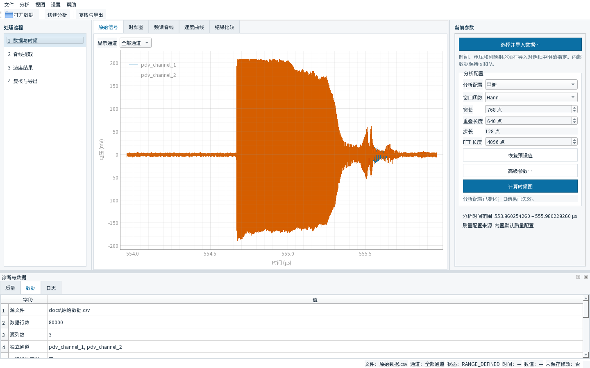

图 1 展示了当前主界面的完整布局。左侧固定为四步：数据与时频、脊线提取、速度结果、复核与导出。

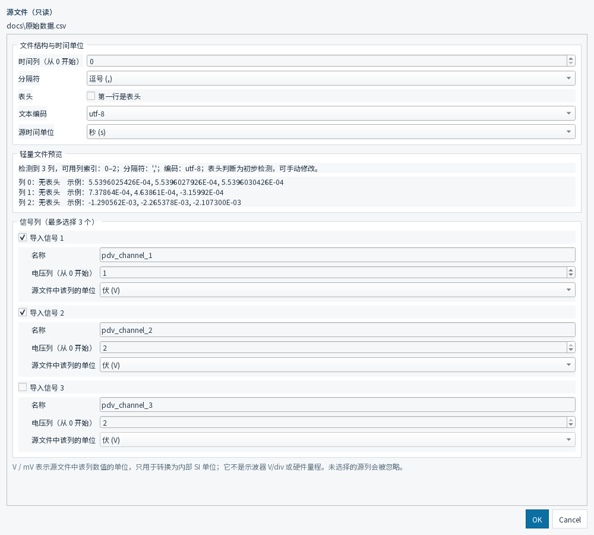

图 2 是真实导入界面。导入前应以原始文件实际格式为准逐项确认。

## 3 界面说明

### 工具栏和菜单

- **打开数据**：打开并解析文本数据。
- **快速分析**：计算 STFT，并在搜索区域确认点暂停。
- **复核与导出**：进入导出页面。
- 菜单中还可以找到全自动分析、视图切换、设置和语言切换。

### 四步工作流

1. **数据与时频**：导入原始数据，查看原始信号和 STFT。
2. **脊线提取**：选择自动或人工范围，限定并提取频谱脊线。
3. **速度结果**：查看速度曲线和修正参数，可选设置起跳时间。
4. **复核与导出**：选择结果来源、时间零点和输出目录，导出文件。

### 中央绘图区和底部诊断

中央标签页包括 **原始信号、时频图、频谱脊线、速度曲线、结果比较**。底部 **质量、数据、日志** 三个标签用于查看质量概况、数据来源和处理日志。底部诊断是复核依据，不是对实验物理真值的自动证明。

## 4 数据导入

### 4.1 支持的文本形式

当前导入界面支持 CSV、TXT、DAT 文件，并可选择以下分隔方式：

- 逗号；
- Tab；
- 空白字符（连续空格或 Tab）；
- 分号；
- 自定义分隔符。

文件扩展名不决定文件内部格式。一个 `.dat` 文件可能是逗号、Tab 或空白分隔文本；请根据文件内容选择分隔符。导入器最多可选择三个信号列。

### 4.2 导入时必须确认的项目

在对话框中确认：

- **时间列索引**：按文件的实际列号填写；
- **是否有表头**：有表头时勾选；
- **编码**：可选 UTF-8、UTF-8-SIG 或 GB18030；
- **原始时间单位**：秒、毫秒、微秒或纳秒；
- **每个信号的电压单位**：V 或 mV；
- **信号名称和列索引**：只启用确实存在的通道。

程序内部按 SI 单位处理时间和电压。导入时的单位选择只是把原始文件正确转换为内部单位，并不等于软件能够自动判断实验单位。错误的单位会直接影响采样率、频率和速度结果。

输入源文件在界面中以只读方式使用；导出结果写入另一个目录，不覆盖原始数据。

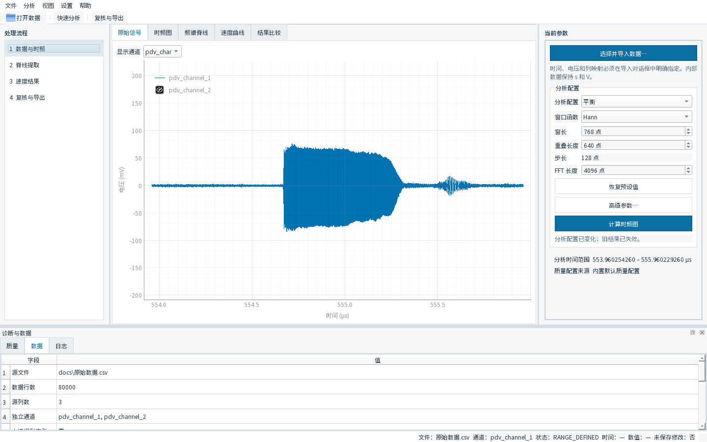

图 3 中横轴是时间，纵轴是电压。通道下拉框只改变显示通道；在图上缩放或平移只改变显示视野，不改变科学分析的搜索区域。

## 5 时频分析

短时傅里叶变换（STFT）把一段时间信号分成相邻时间窗，在每个时间窗内计算频谱，形成时间—频率图。用户主要需要关注窗函数、profile、时间范围和搜索区域。

### 5.1 当前可用 profile

当前 GUI 提供的 profile 包括：

- 平衡（Balanced）；
- 高时间分辨率（High Time Resolution）；
- 极高时间分辨率实验性 profile；
- 高频率分辨率（High Frequency Resolution）；
- 极高频率分辨率实验性 profile。

profile 会联动窗长、重叠、跳步和 FFT 长度等参数。若需要复现实验，建议在导出后的 metadata JSON 中保存并核对这些参数，而不要只记录一个 profile 名称。

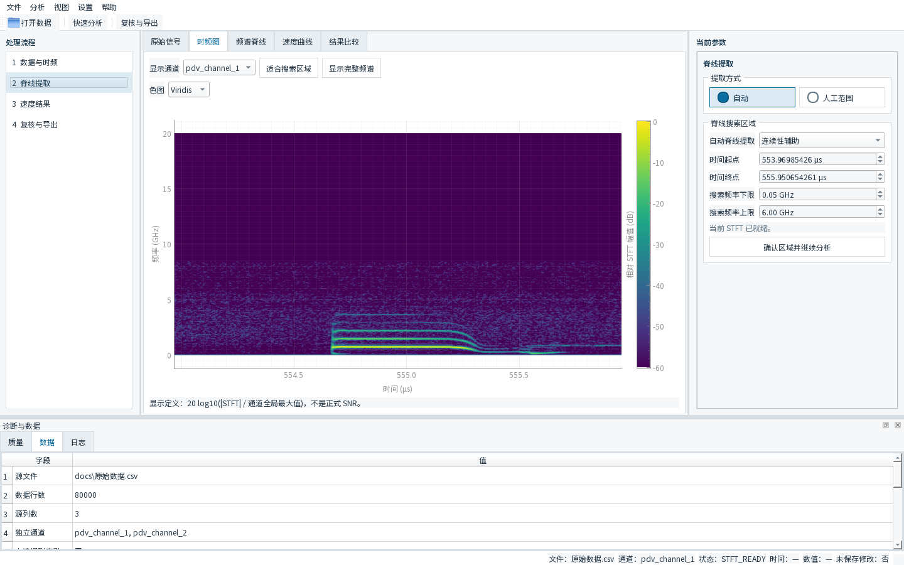

图 4 的横轴是时间，纵轴是频率，颜色表示相对 STFT 强度。当前界面提示的显示量为 `20 log10(|STFT| / 通道全局最大值)`，它不是正式 SNR。

### 5.2 三个分辨率提醒

1. 相邻 STFT 帧的时间间隔（frame spacing）不等于真实时间分辨率；真实时间分辨率还受窗长影响。
2. FFT 频率格点间隔（FFT grid spacing）不等于真实频率分辨能力；频率分辨能力还受有效窗长、窗函数和信号条件影响。
3. 增大 FFT 长度（nfft）可以改变频率采样格点，但不等于提高真实频率分辨率。

因此，不要仅靠把 nfft 调大来判断两个邻近频率是否真的可分辨。参数变化后，应重新查看谱峰形状和质量诊断。

## 6 脊线提取

### 6.1 搜索区域不是显示视野

脊线搜索区域由分析用的时间起止边界、最低频率和最高频率限定。这个区域决定算法在哪个时频矩形内寻找候选峰。

**View Range ≠ Ridge Search Region。** 频谱图上的缩放、平移和“适合搜索区域”按钮主要用于显示；只有修改右侧搜索区域数值、拖动对应边界，或确认新的区域，才会改变科学搜索范围。

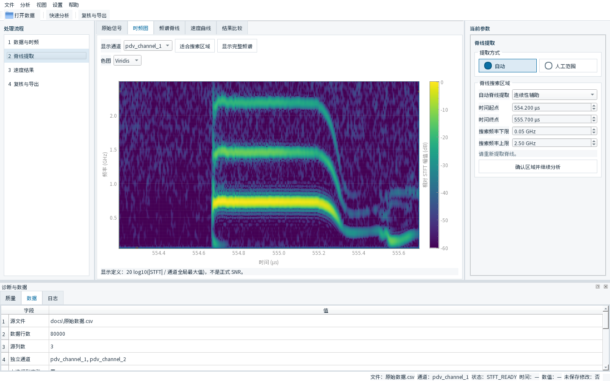

图 5 中右侧显示了当前通道和搜索区域的时间、频率上下限。改变边界后应重新提取脊线，再查看结果。

### 6.2 自动分析和人工引导

- **自动**：默认的脊线选择方式，适合先快速查看结果。
- **人工范围**：通过上边界和下边界控制点给出一个随时间变化的频率范围，再在该范围内运行人工范围分析，适合自动选择不理想的记录。

自动结果和人工范围结果相互独立保存，可以在速度页面的“结果来源”下拉框中切换。人工范围只是在当前搜索区域内提供约束，不会把选中的曲线自动变成实验物理真值。

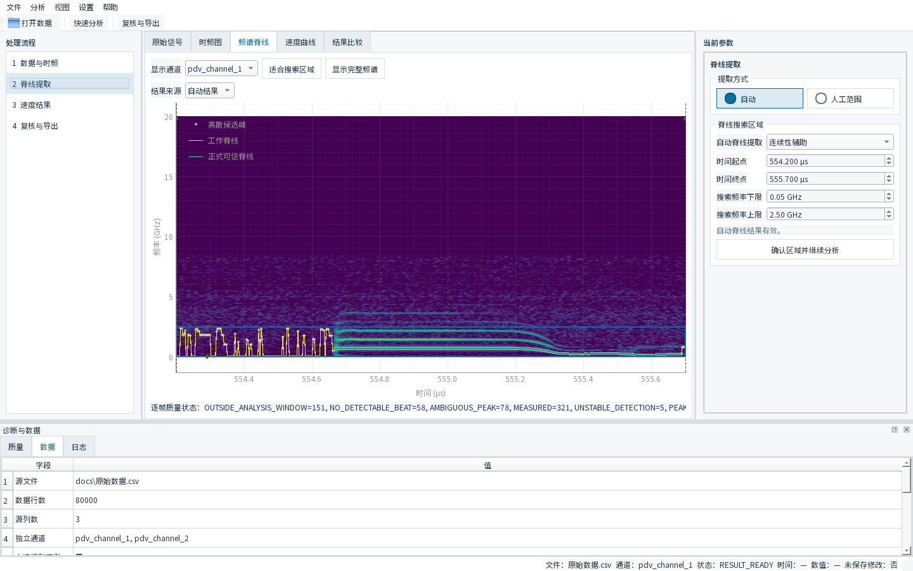

图 6 的图例是当前 GUI 的真实标签：**离散候选峰、工作脊线、正式可信脊线**。候选峰和工作脊线用于算法选择与连续性处理；“正式可信”仍需结合频谱图、实验背景和质量诊断判断。

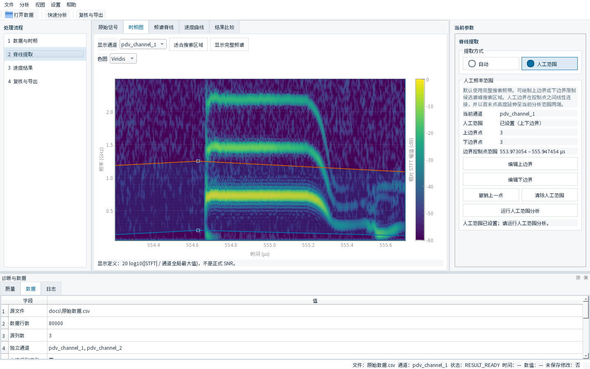

图 7 展示了当前人工范围界面。可分别编辑上边界和下边界，也可以撤销上一个点或清除人工范围。

## 7 速度结果

### 7.1 速度关系

PDV 的表观速度由拍频和真空波长给出：

\[
v_{\mathrm{app}}=\frac{\lambda_0 f_b}{2}.
\]

其中 `λ₀` 是真空波长，`f_b` 是频谱脊线对应的拍频。速度页面还可以按当前设置应用几何观测角度修正和窗口材料修正。

### 7.2 普通用户看哪条曲线

速度页面的主图显示当前选定结果来源的**最终速度**。当前导出器的简洁 CSV 使用显示速度列 `display_velocity_m_s`；它对应连续工作速度结果，并可按用户勾选项包含起跳前的 display-only 平台。这个平台只用于显示和导出，不修改正式测量数组。

详细 CSV 仍保留表观速度、角度修正后的表观速度、正式修正速度、连续工作速度、质量状态等列，供高级复核使用。不要把这些中间列全部当作普通用户必须手工选择的主结果。

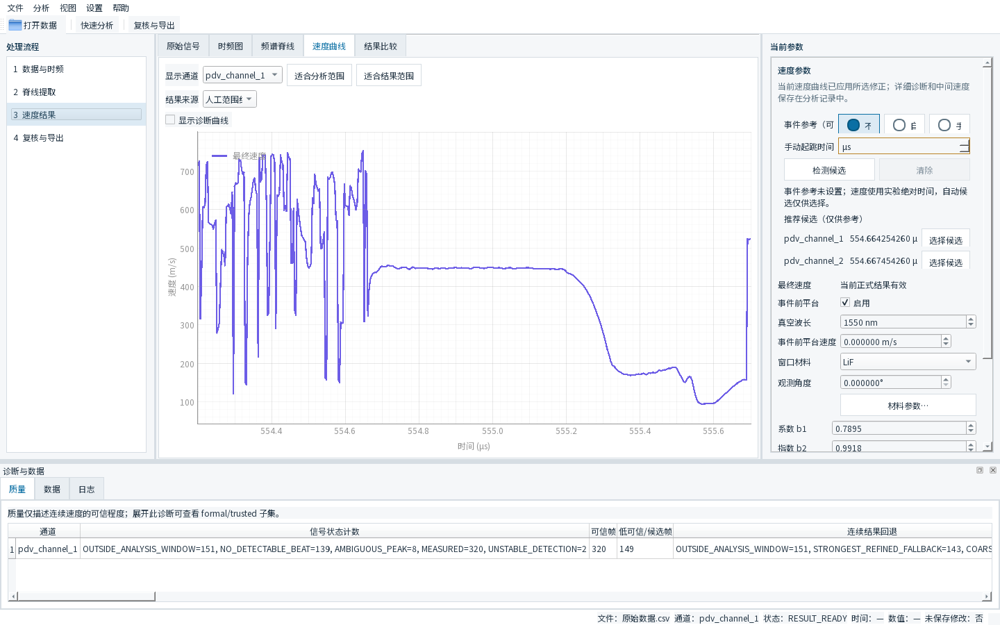

图 8 中可以看到结果来源、起跳参考选项、真空波长、观测角度和 LiF 窗口材料。图中的速度数值只适用于当前数据和当前参数组合。

### 7.3 窗口修正

当前 GUI 的窗口材料下拉框包含 **LiF** 和 **无窗口修正**。选择 LiF 后可以展开材料参数，查看或编辑：

- `b1`；
- `b2`；
- 校准参考波长；
- 当前 GUI 显示的晶体取向等信息。

当前界面显示的默认 provenance 为 Rigg et al. (2014), Eq. (16)，DOI：[10.1063/1.4890714](https://doi.org/10.1063/1.4890714)。这只是当前软件参数来源信息，不是对所有实验条件都适用的保证。请根据实际窗口材料、晶向、波长和实验装配确认是否应使用 LiF 修正；不适用时选择“无窗口修正”。

观测角度的定义是 PDV 测量视线与界面运动法向之间的角度。窗口中的外部装配角可能与此定义不同，不能只凭机械安装角度填写。

## 8 Event Reference / 起跳时间

起跳时间是可选参考，不是得到速度曲线的必要条件。速度页面提供三种方式：

- **不使用**：保留实验绝对时间；
- **自动候选**：显示软件检测出的候选时间；
- **手动**：输入或覆盖用户确认的时间。

自动检测出的时间只是候选，不代表物理真值。用户可以点击某个通道的“选择候选”，也可以手动输入；若无法确认，应保留绝对时间并在实验记录中说明。

设置并采用起跳参考后，导出页面可以选择 **起跳点设为 0**；否则选择 **保留实验绝对时间**。二者只改变导出的时间坐标，不应误解为改变速度本身。

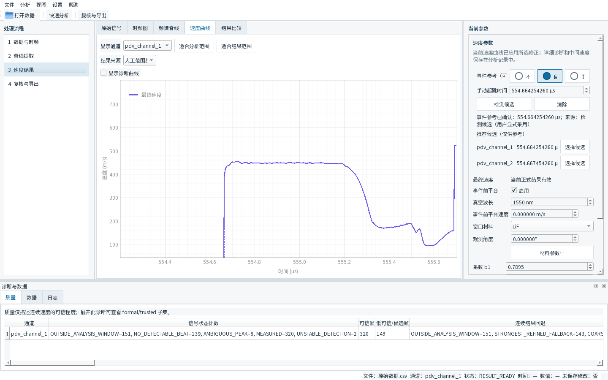

图 9 中的自动候选带有“选择候选”操作。采用候选后，界面会显示其来源；仍建议用原始信号、时频图和实验时序共同确认。

## 9 导出到 Origin

### 9.1 导出页面

在 **复核与导出** 页面检查：

1. **分析结果**：自动分析或人工范围分析；
2. **导出通道**：选择需要的通道；
3. **时间零点**：起跳点设为 0，或保留实验绝对时间；
4. **输出目录**：选择一个新目录或专门的结果目录；
5. **包含事件前 display-only 平台**：只控制显示/导出曲线的事件前部分，不修改正式测量结果。

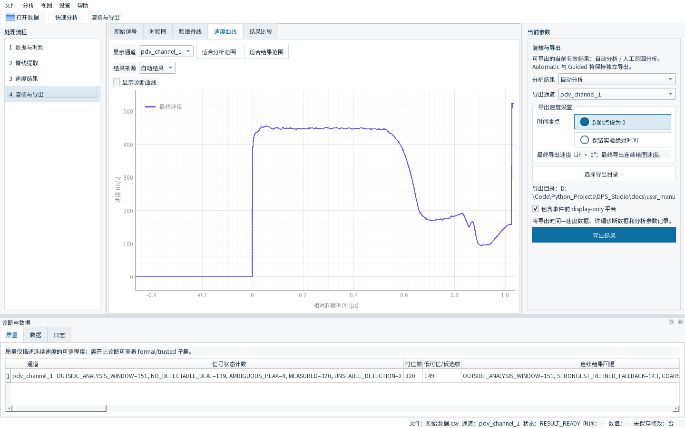

图 10 显示了当前导出控件。自动分析和人工范围分析会分别导出，切换结果来源后再导出即可得到相应结果。

### 9.2 当前 writer 产生的三个文件

当前每个通道一次导出产生三个文件：

| 文件 | 用途 |
|---|---|
| `<源文件>_ch1_auto.csv` | 日常 Origin 作图的简洁两列 CSV |
| `<源文件>_ch1_auto_detail.csv` | 详细时间、频率、速度、质量状态和选择来源 |
| `<源文件>_ch1_auto.metadata.json` | STFT、脊线、质量配置、修正参数和 provenance |

实际示例目录在 [`export_example_manual/`](export_example_manual/)。简洁 CSV 的当前表头为：

```text
time_from_event_s,display_velocity_m_s
```

如果选择保留实验绝对时间，第一列会改为 `time_s`。日常 Origin 绘图只需要导入简洁 CSV：

- X 列：`time_from_event_s`（或 `time_s`）；
- Y 列：`display_velocity_m_s`。

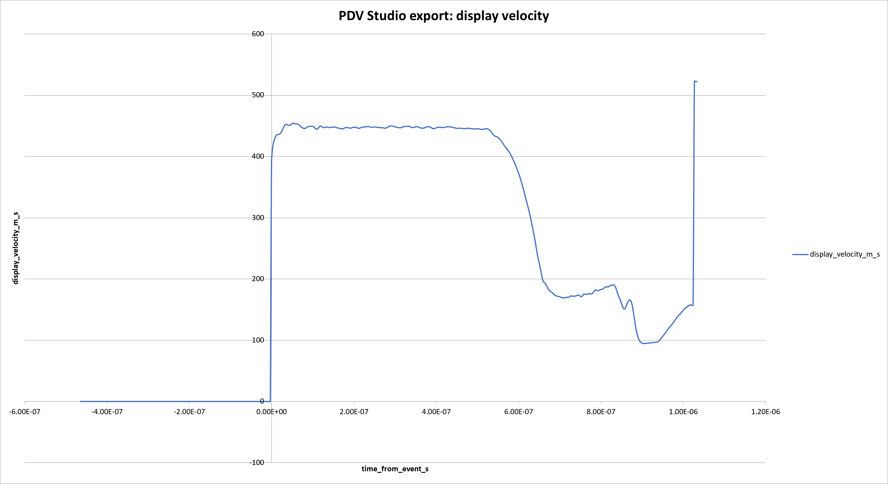

图 11 使用本说明书截图流程实际导出的简洁 CSV 在 Excel 中打开并作图，曲线对应 `time_from_event_s` 与 `display_velocity_m_s` 两列。

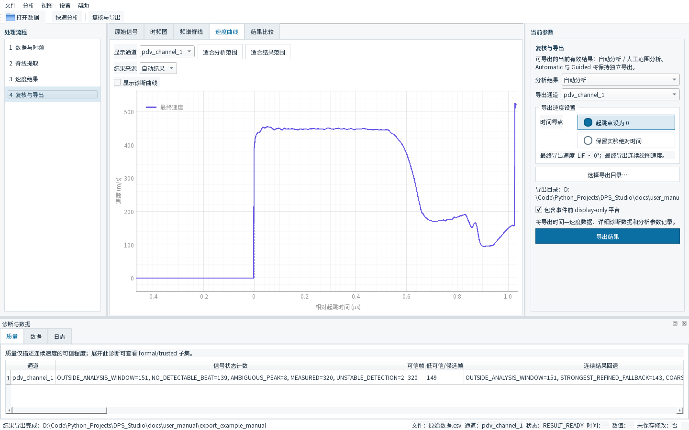

图 12 展示导出完成后的软件状态。导出目录中的 detail CSV 和 metadata JSON 用于诊断与复现，不需要作为 Origin 的普通作图数据导入。

## 10 Quality / 诊断

底部 **质量** 标签用于查看质量概况，**数据** 标签用于确认源文件、行数、列数和通道，**日志** 标签用于查看处理过程。常见质量状态包括：

| 状态 | 用户层面的含义 |
|---|---|
| `MEASURED` | 当前帧通过了相应测量条件 |
| `AMBIGUOUS_PEAK` | 峰选择存在竞争或不确定性 |
| `NO_DETECTABLE_BEAT` | 当前帧没有检测到可用拍频 |
| `OUTSIDE_ANALYSIS_WINDOW` | 当前帧位于设定分析窗口之外 |
| `PEAK_AT_BAND_BOUNDARY` | 峰靠近搜索频带边界，需要检查搜索区域 |
| `UNSTABLE_DETECTION` | 检测稳定性不足，需要结合上下文复核 |

这些状态帮助判断曲线在哪些位置需要回看频谱图。它们是诊断标签，不是实验真值证明。当前导出会保留正式测量值与质量字段；主图/简洁导出的显示速度还可能包含连续工作结果和明确标记的事件前显示平台，因此应同时查看 detail CSV 和 metadata JSON。

## 11 常见问题

**`.dat` 为什么有时能打开、有时不能？**  
扩展名不决定内部格式。请确认文件是逗号、Tab、空白、分号还是其他分隔方式，并在导入对话框选择相同设置；同时检查表头和编码。

**为什么导入时一定要选择单位？**  
软件不能安全猜测实验单位。时间单位影响采样率和 STFT 频率，电压单位影响信号尺度；请按采集系统记录填写。

**为什么频率上限不能超过某个值？**  
频率搜索范围受采样率和 Nyquist 频率限制。改变时间单位或采样数据后，应重新核对采样率和可搜索频带。

**为什么有黄色工作脊线和绿色正式可信脊线？**  
黄色工作脊线是当前连续性选择使用的工作结果，绿色正式可信脊线是通过当前正式质量语义保留下来的结果。二者都需要结合时频图和实验背景判断，不能直接等同于物理真值。

**Automatic 不理想怎么办？**  
先缩小或修正搜索区域，避免把无关谱峰包含进来；仍不理想时切换到人工范围，编辑上下边界并运行人工范围分析。调整参数后应重新查看结果来源和质量状态。

**为什么 Event Reference 可能不准？**  
自动起跳时间只是候选。它可能受信号前沿、噪声和当前分析窗口影响；可以手动覆盖，也可以不使用并保留绝对时间。

**为什么速度结果和旧软件不同？**  
不能仅凭曲线差异判断某一方错误。频率搜索区域、profile、脊线选择、真空波长、观测角度、窗口修正和时间参考都会影响结果。请对照同一实验条件、同一参数和同一导出字段。

## 12 数据安全与实验注意事项

- 原始数据用于只读分析；导出结果写到单独的输出目录，不覆盖 `data/raw`。
- 导入时人工确认时间、电压单位，不要依赖文件扩展名。
- 自动候选、工作脊线和事件候选都不是实验物理真值的自动证明。
- 修改搜索区域会改变脊线搜索结果；修改 profile、窗函数或频率边界后，应重新分析。
- 结果应结合原始信号、时频图、质量诊断和实验背景共同判断。
- 正式实验请保留导出的 detail CSV 和 metadata JSON，便于追溯参数和 provenance。

## 13 English UI

当前 GUI 支持中英文界面。使用菜单 **设置 → Language → English** 切换到 English；界面会提示重启后使语言偏好完整生效。重新启动后，菜单、工具栏、四步工作流和标签页会显示英文。


图 13 是当前源码真实 English UI 的主界面截图；正文仍以中文说明为主。

## 附录：本说明书的复现实验环境

- 启动入口：`python -m dps_studio.gui`；
- 分支：`main`；
- 源码版本：`0.1.0`；
- 截图数据：`docs/原始数据.csv`，80,000 行、3 列，按导入界面选择时间列 0、逗号分隔、无表头、时间单位秒，信号列以 V 导入；
- 截图流程：Balanced profile、Hann 窗、当前默认 STFT 参数，先确认搜索区域，再分别展示自动分析和人工范围分析；
- 导出示例：`docs/user_manual/export_example_manual/`。

本说明书没有把历史文档中与当前源码不一致的旧流程、旧质量输出规则或旧版窗口修正说明写入正文；如旧版软件界面不同，应以当前软件实际显示和导出的 metadata 为准。
